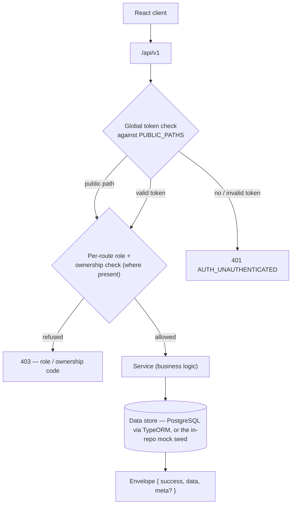

# Architecture — Backend

## App flow

React client → `api/v1` REST (NestJS controllers) → guards (`JwtAuthGuard` → `RolesGuard` → `PermissionsGuard` → tenant scope) → services (business logic) → TypeORM repositories → PostgreSQL (Supabase). Real-time chat/notifications flow over a Socket.io gateway sharing the same HTTP server. Background jobs (emails, reminders) run through BullMQ/Redis. Email jobs render a React Email template to HTML and deliver it through Resend.

Layers: **Controller → Service → TypeORM repository → PostgreSQL**. Controllers never contain business logic; services never touch HTTP objects.

Global concerns are registered once on `AppModule` rather than per controller: `JwtAuthGuard` (token check), **`LoggingInterceptor`** (success log line), `ResponseInterceptor` (success envelope — `{ success, message, data }`, the `message` from `@ResponseMessage()` or a method default), **`CacheControlInterceptor`**, which sets `Cache-Control` on every response — reading the same `@Public()` metadata the guard does, so a public route gets `public, max-age=60` and an authenticated one `private, max-age=5`, before the handler runs (error responses carry it too) — and `AllExceptionsFilter` (error envelope + error log line). Per-user data therefore never enters a shared cache.

## Request logging

One line per outcome, through Nest's `Logger` (contexts `HTTP` and `AllExceptionsFilter`). Every line carries the HTTP method, the full path, the numeric status and its reason phrase:

- **Success** — `LoggingInterceptor` logs once the response `finish` event fires, so the status is final (`@HttpCode` has already been applied, which reading it in `tap` would miss): `POST /api/v1/auth/login 200 OK — AuthController.login — 45ms`. It logs only `< 400`, so errors are never double-reported.
- **Error** — `AllExceptionsFilter` logs **every** failure, because guards and pipes run outside the interceptor chain (a `401` from `JwtAuthGuard` never reaches an interceptor): `POST /api/v1/auth/login 401 Unauthorized — UnauthorizedException: AUTH_INVALID_CREDENTIALS: Invalid email or password`. `4xx` logs at `warn`; `5xx` at `error` with the stack.

So a `401`, `403`, `409` or `500` names the thrown Nest exception class (`BadRequestException`, `NotFoundException`, …), its `code` and its `message`, and a `200`/`201`/`204` names the controller action and its duration — never a bare `Unauthorized` or `Internal server error`.

## Request lifecycle


```mermaid
flowchart TB
  client["React client"] --> api["/api/v1"]
  api --> token{"Global token check<br/>against PUBLIC_PATHS"}
  token -->|public path| role
  token -->|no / invalid token| unauth["401 AUTH_UNAUTHENTICATED"]
  token -->|valid token| role{"Per-route role +<br/>ownership check (where present)"}
  role -->|refused| forbidden["403 — role / ownership code"]
  role -->|allowed| service["Service (business logic)"]
  service --> store[("Data store — PostgreSQL via TypeORM, or the in-repo mock seed")]
  store --> envelope["Envelope { success, data, meta? }"]
```

Today that chain runs against the **in-repo mock adapter** (`frontend/src/services/mockAdapter.ts`), which answers every request from the deterministic seed in `frontend/src/data/*` and returns the real envelope. Its global step is the `PUBLIC_PATHS` set, and only **ten** routes carry a per-route role or ownership check (`PRD.md` §2). A real **NestJS backend replaces the mock behind the same contract** — the same paths, guards, envelopes and error codes — and the route table, ownership rules and error catalogue it must match are in [`Access.md`](./Access.md).

## Folder structure

```
backend/
├── src/
│   ├── main.ts               # Bootstrap: prefix, pipes, filters, helmet, CORS
│   ├── app.module.ts
│   ├── database/             # TypeORM DataSource (global) + entities
│   │   ├── data-source-options.ts  # the one place the connection is declared
│   │   └── entities/               # *.entity.ts — the mapping onto the tables
│   ├── common/               # guards, decorators, filters, interceptors, utils, pipes
│   │   ├── guards/           # jwt-auth, roles, permissions, tenant
│   │   ├── decorators/       # @Roles, @RequirePermission, @CurrentUser, @SchoolId
│   │   ├── filters/          # global exception filter (logs every error)
│   │   ├── interceptors/     # response envelope, cache-control, logging
│   │   └── utils/            # DI-free shared helpers (verification-token.util.ts)
│   ├── auth/                 # strategies, guards, dto + the RBAC catalogue & per-user grants
│   ├── schools/              # registration, OTP, school profile + settings, backup
│   ├── users/                # teachers, students, parents
│   ├── classes/              # classes, the subject catalogue + class-subject assignments
│   ├── attendance/
│   ├── fees/                 # structures + heads, invoices, payments, receipts, reports, concessions
│   ├── homework/
│   ├── timetables/
│   ├── exams/                # exams, results, report cards
│   ├── chat/                 # gateway + conversations + messages
│   ├── notices/              # notices + events
│   ├── ai/                   # 7 AI features (ai_feature enum): quiz, homework help, event plan, notice, chat, report comment, fee reminder
│   ├── materials/            # study material uploads
│   ├── reports/              # analytics + CSV export
│   └── mail/                 # Resend mailer + react-email .tsx templates
├── package.json
└── .env
```

**Naming:** `*.module.ts`, `*.controller.ts`, `*.service.ts`, `*.gateway.ts`; DTOs in `dto/` per module with `create-*.dto.ts` / `update-*.dto.ts`; a service's public types in a sibling `*.interface.ts` (`auth.interface.ts`, `registration.interface.ts`, `health.interface.ts`), so a `*.service.ts` exports only its class. Each feature module owns its routes under `/api/v1/<feature>`.

## Domain-to-module map

Each routing domain and the module that owns it, with the tables the module reads or writes — derived from [`Schema.md`](./Schema.md) §14. `(planned)` marks a table the design target adds; the mock keeps that relationship inline (`Schema.md` §15).

| Domain      | Module           | Tables touched                                                                                             |
| ----------- | ---------------- | ---------------------------------------------------------------------------------------------------------- |
| auth        | AuthModule       | `users`, `permissions`, `user_permissions` (`refresh_tokens` planned)                                      |
| school      | SchoolsModule    | `schools`, `users` (`otps` planned)                                                                        |
| users       | AuthModule       | `users`, `permissions`, `user_permissions` — the `/users/:userId/permissions` routes                       |
| teachers    | UsersModule      | `teachers`, `users`, `teacher_classes`                                                                     |
| students    | UsersModule      | `students`, `users`, `classes`, `parent_students`                                                          |
| parents     | UsersModule      | `parents`, `users`, `parent_students`                                                                      |
| classes     | ClassesModule    | `classes`, `students`, `class_subjects`, `teacher_classes`                                                 |
| subjects    | ClassesModule    | `subjects`, `class_subjects`                                                                               |
| attendance  | AttendanceModule | `attendance`, `classes`, `students`                                                                        |
| homework    | HomeworkModule   | `homework`, `homework_submissions`                                                                         |
| materials   | MaterialsModule  | `study_materials`                                                                                          |
| timetable   | TimetablesModule | `timetables`, `periods`                                                                                    |
| exams       | ExamsModule      | `exams`, `exam_subjects`, `results`, `report_cards`                                                        |
| fees        | FeesModule       | `fee_structures`, `fee_heads`, `fee_invoices`, `fee_payments`, `concessions` (`receipt_sequences` planned) |
| notices     | NoticesModule    | `notices`, `events` (`notice_classes` planned)                                                             |
| chat        | ChatModule       | `conversations`, `messages` (`conversation_participants` planned)                                          |
| ai          | AiModule         | `ai_conversations`                                                                                         |
| reports     | ReportsModule    | none — aggregates over the modules that own tables                                                         |
| progress    | ReportsModule    | none — a projection over `exams`, `exam_subjects`, `results`, `report_cards`                               |
| dashboard   | ReportsModule    | none — aggregates over attendance, fees, exams, classes and people                                         |
| permissions | AuthModule       | `permissions`, `user_permissions`, `users`                                                                 |

The full entity relationships are in [`Erd.md`](./Erd.md); the per-table columns, keys, indexes and constraints in [`Schema.md`](./Schema.md).

## Tech stack

- **NestJS 12 (TypeScript)** — modular framework with DI
- **TypeORM + `pg`** — the data layer: entities in `src/database/entities/` map onto the tables and access is through injected `Repository<T>` classes. `synchronize` is **off** and there are **no migrations** — the ORM never reshapes the database; the schema is applied by hand (Supabase SQL editor). The database itself is PostgreSQL hosted on Supabase, reached over the session-mode pooler
- **Passport.js + JWT** — access (7d) + refresh (7d) auth
- **Socket.io** (`@WebSocketGateway`) — chat and notifications
- **class-validator / class-transformer** — DTO validation via global ValidationPipe
- **BullMQ + Redis** — email/notification queues; `@nestjs/schedule` for cron (fee reminders)
- **Stripe** (international) + **SSLCommerz** (Bangladesh) — payments; **Resend** — transactional email; **Cloudinary** — file storage
- **React Email** (`react-email`) — email templates written as `.tsx` components in `src/mail/templates/`, rendered to HTML with `render()` and sent through Resend; live preview with the `email dev` CLI
- **@nestjs/throttler** — rate limiting; **helmet** — headers
- Deployed on **Render**

## Real-time chat (`ChatModule`)

The split is deliberate: **Socket.io carries live traffic, REST carries history.**

- The gateway (`*.gateway.ts`) authenticates the JWT on `handleConnection`, then `chat:join` subscribes the socket
  to one conversation — only once the allowed-pair check (admin↔teacher, teacher↔student, teacher↔parent) passes.
- `chat:message` **persists first, then fans out**, so a client never sees a message the database has not
  accepted. `chat:typing` is ephemeral and never persisted.
- Read state lives on `conversation_participants.last_read_at`: `chat:read` and `POST /chat/:conversationId/read`
  both stamp it, and the inbox's unread count is derived from it rather than stored on `conversations`.
- `GET /chat/conversations` and `GET /chat/:conversationId/messages` hydrate the client on load and are scoped to
  the caller, so a non-participant gets a 403 instead of a thread.
- Payloads reuse the REST DTO shapes, so one serializer serves both transports.
- Notifications (`notification:new`) ride the same gateway, which is why it is not chat-specific.
