# Database Schema (ERD) — Backend

PostgreSQL (Supabase) schema for School Flow AI, derived from the data models in
[`PRD.md`](./PRD.md) §3 and the feature modules in §4.

**Source of truth:** the actual schema lives in `backend/supabase/migrations/`. This file is the
reference ERD — when you change a table, add a migration **and** update the matching table section
here.

> ⚠️ No migrations exist yet — `backend/` currently holds only `package.json` and docs, so every
> table below is a **design target**, not a description of a live database.

**How to read this file.** Each PRD feature has its own section: a feature-level ERD first, then one
subsection per table with a metadata tag, its full column list, its constraints, and a small ERD of
that table's own relationships. Per-table ERDs show identity + foreign-key columns only — the
authoritative column list is the table immediately above each diagram.

## 1. Conventions

**Identifiers:** `snake_case`, plural table names (`fee_invoices`, `conversation_participants`).

`PRD.md` §3 names models in PascalCase with camelCase fields (`FeeInvoice.schoolId`) because that came
from the original Prisma plan, which was dropped in favour of raw Supabase SQL — see
[`Memory.md`](./Memory.md). Raw SQL identifiers are therefore snake_case. The API stays camelCase per
[`Design.md`](./Design.md), so **services map between the two** — `fee_invoices.fee_structure_id` →
`feeStructureId` in JSON. Never expose column names directly.

| Concept     | Postgres type                                    | Notes                                             |
| ----------- | ------------------------------------------------ | ------------------------------------------------- |
| Primary key | `uuid default gen_random_uuid()`                 | all tables                                        |
| Tenant      | `school_id uuid not null references schools(id)` | every tenant table                                |
| Money       | `integer` (paise)                                | never `float` — `150000` = ₹1,500.00              |
| Timestamps  | `timestamptz`                                    | `created_at default now()`, `updated_at` on write |
| Date only   | `date`                                           | ISO `YYYY-MM-DD`                                  |
| Time of day | `time`                                           | timetable periods, event windows                  |
| Soft delete | `deleted_at timestamptz null`                    | profiles + content only                           |
| Arbitrary   | `jsonb`                                          | `schools.settings`, `ai_conversations.messages`   |
| Fixed sets  | Postgres enum                                    | §2 — values `SCREAMING_SNAKE` per `Design.md`     |
| Arrays      | `text[]` / enum[]                                | rendered `text_array` / enum name in ERDs         |

**Diagram notation:** mermaid ERD supports only `PK`/`FK`/`UK`. Composite unique constraints and
partial indexes cannot be drawn, so they are listed as bullets under each table. Solid lines
(`||--o{`) are enforced foreign keys; dotted lines (`||..o{`) are logical links that are **not**
enforced by a constraint.

**Phases** in the table tags come from [`Phases.md`](./Phases.md). Timetable is the one feature with
no phase assigned — see §16.

## 2. Enums

| Enum                  | Values                                                                                    | Column                          |
| --------------------- | ----------------------------------------------------------------------------------------- | ------------------------------- |
| `role`                | `ADMIN`, `TEACHER`, `STUDENT`, `PARENT`                                                   | `users.role`                    |
| `subscription_status` | `TRIAL`, `ACTIVE`, `SUSPENDED`, `CANCELLED`                                               | `schools.subscription_status`   |
| `record_status`       | `ACTIVE`, `INACTIVE`                                                                      | `teachers`/`students`/`parents` |
| `gender`              | `MALE`, `FEMALE`, `OTHER`                                                                 | `students.gender`               |
| `parent_relation`     | `FATHER`, `MOTHER`, `GUARDIAN`                                                            | `parent_students.relation`      |
| `otp_purpose`         | `REGISTER`, `RESET_PASSWORD`                                                              | `otps.purpose`                  |
| `attendance_status`   | `PRESENT`, `ABSENT`, `LEAVE`, `LATE`                                                      | `attendance.status`             |
| `fee_frequency`       | `MONTHLY`, `QUARTERLY`, `ANNUAL`, `ONE_TIME`                                              | `fee_heads.frequency`           |
| `invoice_status`      | `PENDING`, `PARTIAL`, `PAID`, `OVERDUE`                                                   | `fee_invoices.status`           |
| `payment_status`      | `PENDING`, `PAID`, `FAILED`, `REFUNDED`                                                   | `fee_payments.status`           |
| `payment_provider`    | `STRIPE`, `SSLCOMMERZ`, `MANUAL`                                                          | `fee_payments.provider`         |
| `payment_method`      | `CARD`, `MOBILE_BANKING`, `NET_BANKING`, `CASH`, `CHEQUE`                                 | `fee_payments.method`           |
| `concession_type`     | `PERCENTAGE`, `FIXED`                                                                     | `concessions.type`              |
| `concession_status`   | `PENDING`, `APPROVED`, `REJECTED`                                                         | `concessions.status`            |
| `material_type`       | `PDF`, `NOTES`, `WORKSHEET`, `PAPER`                                                      | `study_materials.type`          |
| `exam_type`           | `UNIT`, `MID`, `FINAL`                                                                    | `exams.type`                    |
| `weekday`             | `MON`, `TUE`, `WED`, `THU`, `FRI`, `SAT`, `SUN`                                           | `timetables.day`                |
| `notice_audience`     | `ALL`, `TEACHERS`, `STUDENTS`, `PARENTS`                                                  | `notices`/`events.audience`     |
| `ai_feature`          | `CHAT`, `REPORT_COMMENT`, `FEE_REMINDER`, `NOTICE`, `EVENT_PLAN`, `HOMEWORK_HELP`, `QUIZ` | `ai_conversations.feature`      |

## 3. Feature ERD — Foundation & Auth

`PRD.md` §4.1 (registration + OTP), §4.2 (auth/RBAC), and the §4.3 profile tables. Phases 1–2.

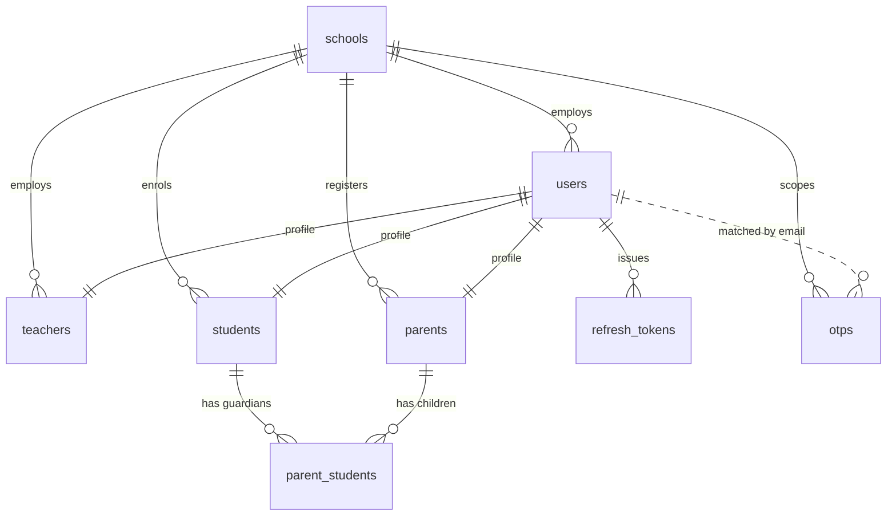
```mermaid
erDiagram
  schools ||--o{ users : "employs"
  schools ||--o{ teachers : "employs"
  schools ||--o{ students : "enrols"
  schools ||--o{ parents : "registers"
  users ||--|| teachers : "profile"
  users ||--|| students : "profile"
  users ||--|| parents : "profile"
  users ||--o{ refresh_tokens : "issues"
  schools ||--o{ otps : "scopes"
  users ||..o{ otps : "matched by email"
  students ||--o{ parent_students : "has guardians"
  parents ||--o{ parent_students : "has children"
```

### `schools`

<!-- table: schools · module: SchoolsModule · prd: §4.1 · phase: 1 · tenant: root · soft-delete: yes -->

Tenant root. One row per registered school; `settings` holds the academic year, grading scheme, fee
heads, and branding. Created in the registration transaction together with the admin `users` row and
the first `otps` row.

| Column                | Type                  | Null | Key | Notes                    |
| --------------------- | --------------------- | ---- | --- | ------------------------ |
| `id`                  | `uuid`                | no   | PK  | `gen_random_uuid()`      |
| `name`                | `text`                | no   |     |                          |
| `slug`                | `text`                | no   | UK  | auto-generated from name |
| `address`             | `text`                | yes  |     |                          |
| `contact_email`       | `text`                | yes  |     |                          |
| `contact_phone`       | `text`                | yes  |     |                          |
| `logo_url`            | `text`                | yes  |     | Cloudinary               |
| `subscription_status` | `subscription_status` | no   |     | default `TRIAL`          |
| `settings`            | `jsonb`               | no   |     | default `'{}'`           |
| `created_at`          | `timestamptz`         | no   |     | default `now()`          |
| `updated_at`          | `timestamptz`         | no   |     | trigger                  |
| `deleted_at`          | `timestamptz`         | yes  |     | soft delete              |

**Constraints & indexes**

- `unique (slug)`.
- The only table without `school_id` — it _is_ the tenant.

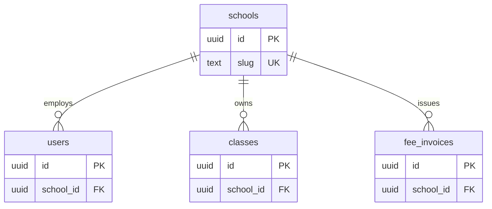
```mermaid
erDiagram
  schools ||--o{ users : "employs"
  schools ||--o{ classes : "owns"
  schools ||--o{ fee_invoices : "issues"
  schools {
    uuid id PK
    text slug UK
  }
  users {
    uuid id PK
    uuid school_id FK
  }
  classes {
    uuid id PK
    uuid school_id FK
  }
  fee_invoices {
    uuid id PK
    uuid school_id FK
  }
```

_Every other tenant table also references `schools`; only a sample is drawn here._

### `users`

<!-- table: users · module: AuthModule · prd: §4.2 · phase: 1 · tenant: yes · soft-delete: yes -->

Authentication identity for all four roles. Profile data lives in `teachers` / `students` /
`parents`; this table holds credentials and RBAC only. `password_hash` (bcrypt, 12 rounds) must never
appear in a response — strip it via select/serializer.

| Column          | Type          | Null | Key | Notes             |
| --------------- | ------------- | ---- | --- | ----------------- |
| `id`            | `uuid`        | no   | PK  |                   |
| `school_id`     | `uuid`        | no   | FK  | → `schools.id`    |
| `email`         | `text`        | no   | UK  | globally unique   |
| `password_hash` | `text`        | no   |     | bcrypt, 12 rounds |
| `role`          | `role`        | no   |     | `ADMIN`…`PARENT`  |
| `is_verified`   | `boolean`     | no   |     | default `false`   |
| `last_login_at` | `timestamptz` | yes  |     |                   |
| `created_at`    | `timestamptz` | no   |     |                   |
| `updated_at`    | `timestamptz` | no   |     |                   |
| `deleted_at`    | `timestamptz` | yes  |     | soft delete       |

**Constraints & indexes**

- `unique (email)` — global (`PRD.md` §3). Per-school uniqueness is the alternative in §16.
- Index `(school_id, role)` for roster listing.
- `is_verified` gates login until the registration OTP is confirmed.

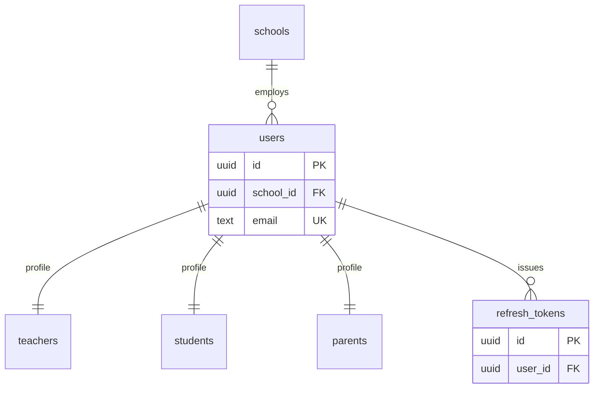
```mermaid
erDiagram
  schools ||--o{ users : "employs"
  users ||--|| teachers : "profile"
  users ||--|| students : "profile"
  users ||--|| parents : "profile"
  users ||--o{ refresh_tokens : "issues"
  users {
    uuid id PK
    uuid school_id FK
    text email UK
  }
  refresh_tokens {
    uuid id PK
    uuid user_id FK
  }
```

### `otps`

<!-- table: otps · module: SchoolsModule · prd: §4.1 · phase: 1 · tenant: yes · soft-delete: no -->

One-time codes for registration and password reset, stored bcrypt-hashed. Ephemeral: 10-minute
expiry, max 5 attempts, 60-second resend cooldown, and rows are purged once expired.

| Column        | Type          | Null | Key | Notes                       |
| ------------- | ------------- | ---- | --- | --------------------------- |
| `id`          | `uuid`        | no   | PK  |                             |
| `school_id`   | `uuid`        | yes  | FK  | → `schools.id`              |
| `email`       | `text`        | no   |     | matched, not FK'd           |
| `code_hash`   | `text`        | no   |     | bcrypt                      |
| `purpose`     | `otp_purpose` | no   |     | `REGISTER`/`RESET_PASSWORD` |
| `attempts`    | `integer`     | no   |     | default `0`, max 5          |
| `expires_at`  | `timestamptz` | no   |     | created + 10 min            |
| `consumed_at` | `timestamptz` | yes  |     | set on success              |
| `created_at`  | `timestamptz` | no   |     |                             |

**Constraints & indexes**

- Index `(email, purpose)` — the verify/resend lookup path.
- `school_id` is nullable because a reset OTP can be issued before the linkage is confirmed.
- A row is usable only while `consumed_at is null and expires_at > now()`.

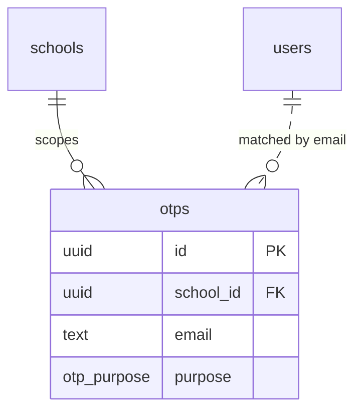
```mermaid
erDiagram
  schools ||--o{ otps : "scopes"
  users ||..o{ otps : "matched by email"
  otps {
    uuid id PK
    uuid school_id FK
    text email
    otp_purpose purpose
  }
```

### `refresh_tokens`

<!-- table: refresh_tokens · module: AuthModule · prd: §4.2 · phase: 1 · tenant: via user · soft-delete: no -->

Server-side store for refresh tokens. Only the hash is persisted; rotation revokes the old row and
inserts a new one, so a replayed token fails.

| Column       | Type          | Null | Key | Notes           |
| ------------ | ------------- | ---- | --- | --------------- |
| `id`         | `uuid`        | no   | PK  |                 |
| `user_id`    | `uuid`        | no   | FK  | → `users.id`    |
| `token_hash` | `text`        | no   | UK  |                 |
| `expires_at` | `timestamptz` | no   |     | issued + 7d     |
| `revoked_at` | `timestamptz` | yes  |     | set on rotation |
| `user_agent` | `text`        | yes  |     | audit           |
| `ip_address` | `text`        | yes  |     | audit           |
| `created_at` | `timestamptz` | no   |     |                 |

**Constraints & indexes**

- `unique (token_hash)`; index `(user_id, expires_at)`.
- Not in `PRD.md` §3 — added because §4.2 requires server-side refresh storage (§16).

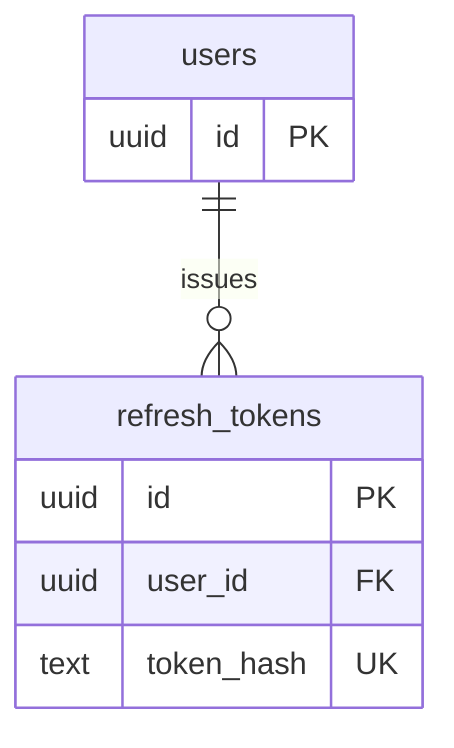
```mermaid
erDiagram
  users ||--o{ refresh_tokens : "issues"
  refresh_tokens {
    uuid id PK
    uuid user_id FK
    text token_hash UK
  }
  users {
    uuid id PK
  }
```

### `teachers`

<!-- table: teachers · module: UsersModule · prd: §4.3 · phase: 2 · tenant: yes · soft-delete: yes -->

Teacher profile, 1:1 with `users`. `employee_no` comes from a per-school sequence. Referenced as
class teacher, subject teacher, and homework author.

| Column          | Type            | Null | Key | Notes               |
| --------------- | --------------- | ---- | --- | ------------------- |
| `id`            | `uuid`          | no   | PK  |                     |
| `school_id`     | `uuid`          | no   | FK  | → `schools.id`      |
| `user_id`       | `uuid`          | no   | FK  | → `users.id`, 1:1   |
| `employee_no`   | `text`          | no   | UK  | per-school sequence |
| `first_name`    | `text`          | no   |     |                     |
| `last_name`     | `text`          | no   |     |                     |
| `phone`         | `text`          | yes  |     |                     |
| `qualification` | `text`          | yes  |     |                     |
| `joined_at`     | `date`          | yes  |     |                     |
| `status`        | `record_status` | no   |     | default `ACTIVE`    |
| `created_at`    | `timestamptz`   | no   |     |                     |
| `updated_at`    | `timestamptz`   | no   |     |                     |
| `deleted_at`    | `timestamptz`   | yes  |     | soft delete         |

**Constraints & indexes**

- `unique (user_id)` — enforces 1:1 with `users`.
- `unique (school_id, employee_no)`; index `(school_id, status)` for roster filters.

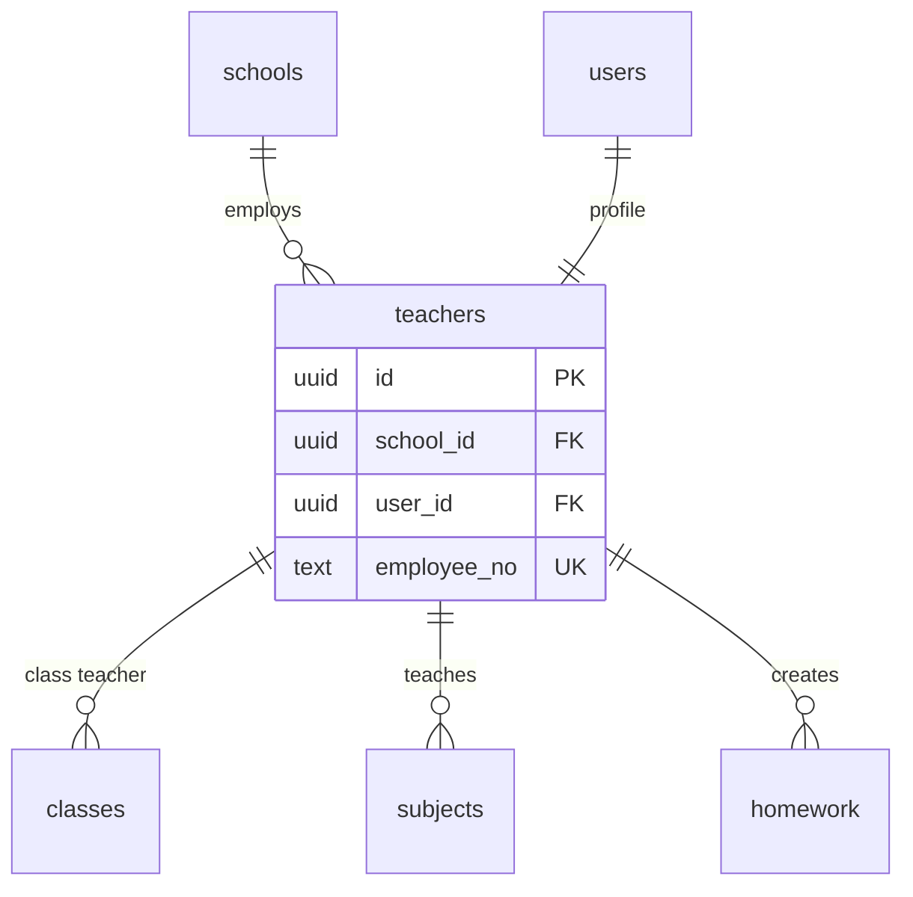
```mermaid
erDiagram
  schools ||--o{ teachers : "employs"
  users ||--|| teachers : "profile"
  teachers ||--o{ classes : "class teacher"
  teachers ||--o{ subjects : "teaches"
  teachers ||--o{ homework : "creates"
  teachers {
    uuid id PK
    uuid school_id FK
    uuid user_id FK
    text employee_no UK
  }
```

### `students`

<!-- table: students · module: UsersModule · prd: §4.3 · phase: 2 · tenant: yes · soft-delete: yes -->

Student profile, 1:1 with `users`. `class_id` is the student's **current** class — the roster.
`admission_no` comes from a per-school sequence.

| Column          | Type            | Null | Key | Notes                    |
| --------------- | --------------- | ---- | --- | ------------------------ |
| `id`            | `uuid`          | no   | PK  |                          |
| `school_id`     | `uuid`          | no   | FK  | → `schools.id`           |
| `user_id`       | `uuid`          | no   | FK  | → `users.id`, 1:1        |
| `class_id`      | `uuid`          | yes  | FK  | → `classes.id`, nullable |
| `admission_no`  | `text`          | no   | UK  | per-school sequence      |
| `first_name`    | `text`          | no   |     |                          |
| `last_name`     | `text`          | no   |     |                          |
| `date_of_birth` | `date`          | yes  |     |                          |
| `gender`        | `gender`        | yes  |     |                          |
| `status`        | `record_status` | no   |     | default `ACTIVE`         |
| `created_at`    | `timestamptz`   | no   |     |                          |
| `updated_at`    | `timestamptz`   | no   |     |                          |
| `deleted_at`    | `timestamptz`   | yes  |     | soft delete              |

**Constraints & indexes**

- `unique (user_id)`; `unique (school_id, admission_no)`.
- Index `(class_id)` for the class roster; `(school_id, status)` for user-list filters.
- `POST /classes/:id/assign-students` sets `class_id` on many students. Per-year enrollment history
  would need a join table — see §16.

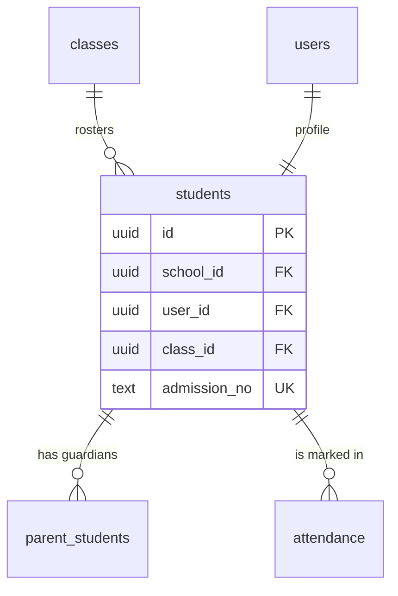
```mermaid
erDiagram
  classes ||--o{ students : "rosters"
  users ||--|| students : "profile"
  students ||--o{ parent_students : "has guardians"
  students ||--o{ attendance : "is marked in"
  students {
    uuid id PK
    uuid school_id FK
    uuid user_id FK
    uuid class_id FK
    text admission_no UK
  }
```

### `parents`

<!-- table: parents · module: UsersModule · prd: §4.3 · phase: 2 · tenant: yes · soft-delete: yes -->

Parent/guardian profile, 1:1 with `users`. Linked to children through `parent_students`.

| Column       | Type            | Null | Key | Notes             |
| ------------ | --------------- | ---- | --- | ----------------- |
| `id`         | `uuid`          | no   | PK  |                   |
| `school_id`  | `uuid`          | no   | FK  | → `schools.id`    |
| `user_id`    | `uuid`          | no   | FK  | → `users.id`, 1:1 |
| `first_name` | `text`          | no   |     |                   |
| `last_name`  | `text`          | no   |     |                   |
| `phone`      | `text`          | yes  |     |                   |
| `occupation` | `text`          | yes  |     |                   |
| `status`     | `record_status` | no   |     | default `ACTIVE`  |
| `created_at` | `timestamptz`   | no   |     |                   |
| `updated_at` | `timestamptz`   | no   |     |                   |
| `deleted_at` | `timestamptz`   | yes  |     | soft delete       |

**Constraints & indexes**

- `unique (user_id)` — 1:1 with `users`.
- Index `(school_id, status)`.

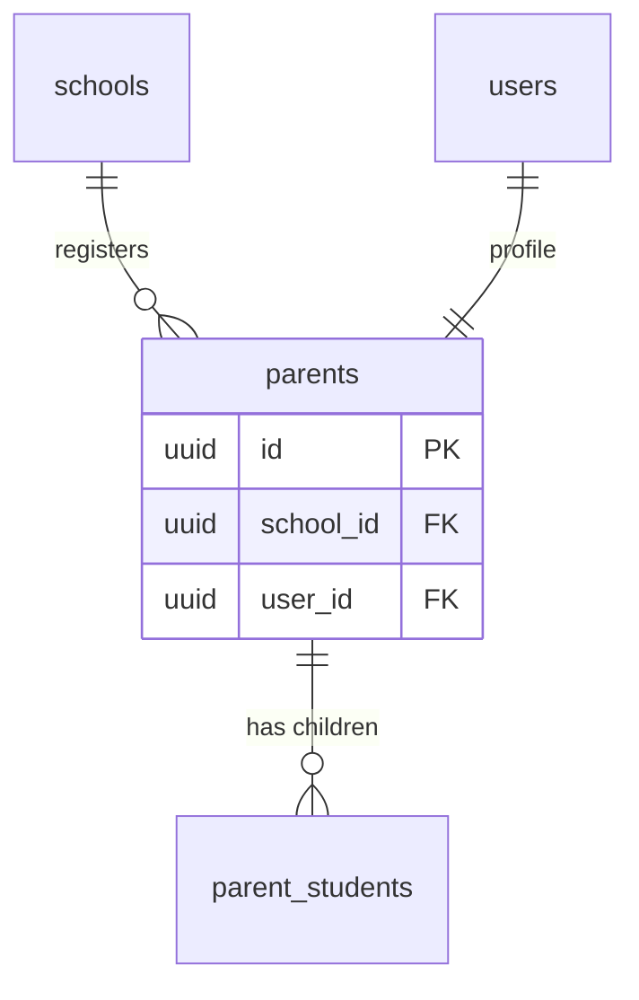
```mermaid
erDiagram
  schools ||--o{ parents : "registers"
  users ||--|| parents : "profile"
  parents ||--o{ parent_students : "has children"
  parents {
    uuid id PK
    uuid school_id FK
    uuid user_id FK
  }
```

### `parent_students`

<!-- table: parent_students · module: UsersModule · prd: §4.3 · phase: 2 · tenant: yes · soft-delete: no -->

Join table resolving parent ↔ child (many-to-many). Drives the parent dashboard: attendance, fees,
homework, and results for each linked child.

| Column       | Type              | Null | Key | Notes               |
| ------------ | ----------------- | ---- | --- | ------------------- |
| `id`         | `uuid`            | no   | PK  |                     |
| `school_id`  | `uuid`            | no   | FK  | → `schools.id`      |
| `parent_id`  | `uuid`            | no   | FK  | → `parents.id`      |
| `student_id` | `uuid`            | no   | FK  | → `students.id`     |
| `relation`   | `parent_relation` | no   |     | `FATHER`…`GUARDIAN` |
| `is_primary` | `boolean`         | no   |     | default `false`     |
| `created_at` | `timestamptz`     | no   |     |                     |

**Constraints & indexes**

- `unique (parent_id, student_id)`; index `(student_id)`.
- Partial unique index on `(student_id)` where `is_primary` — one primary contact per student.

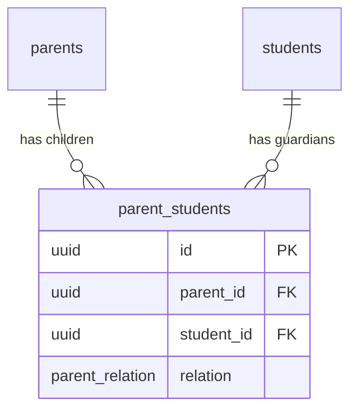
```mermaid
erDiagram
  parents ||--o{ parent_students : "has children"
  students ||--o{ parent_students : "has guardians"
  parent_students {
    uuid id PK
    uuid parent_id FK
    uuid student_id FK
    parent_relation relation
  }
```

## 4. Feature ERD — Classes & Subjects

`PRD.md` §4.4. Phase 2.

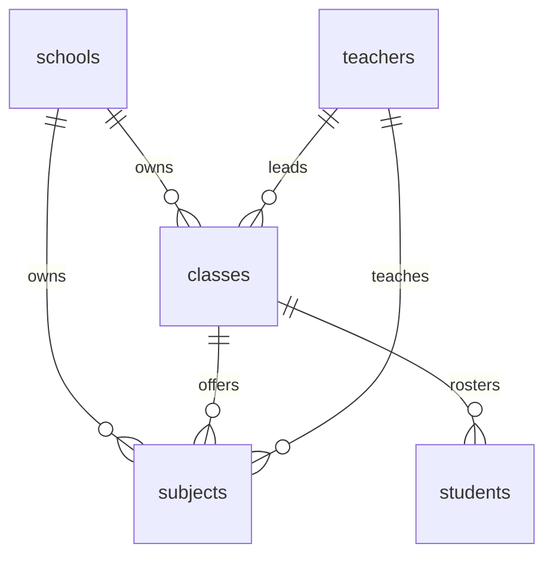
```mermaid
erDiagram
  schools ||--o{ classes : "owns"
  schools ||--o{ subjects : "owns"
  teachers ||--o{ classes : "leads"
  classes ||--o{ subjects : "offers"
  teachers ||--o{ subjects : "teaches"
  classes ||--o{ students : "rosters"
```

### `classes`

<!-- table: classes · module: ClassesModule · prd: §4.4 · phase: 2 · tenant: yes · soft-delete: no -->

A grade + section for one academic year (e.g. grade 5, section A, 2026). The class teacher is
assignable after creation; students attach via `students.class_id`.

| Column             | Type          | Null | Key | Notes           |
| ------------------ | ------------- | ---- | --- | --------------- |
| `id`               | `uuid`        | no   | PK  |                 |
| `school_id`        | `uuid`        | no   | FK  | → `schools.id`  |
| `class_teacher_id` | `uuid`        | yes  | FK  | → `teachers.id` |
| `academic_year`    | `text`        | no   |     | e.g. `2026`     |
| `grade`            | `integer`     | no   |     | e.g. `5`        |
| `section`          | `text`        | no   |     | e.g. `A`        |
| `created_at`       | `timestamptz` | no   |     |                 |
| `updated_at`       | `timestamptz` | no   |     |                 |

**Constraints & indexes**

- `unique (school_id, grade, section, academic_year)` — no duplicate classes per year.
- `class_teacher_id` is nullable; index `(class_teacher_id)`.

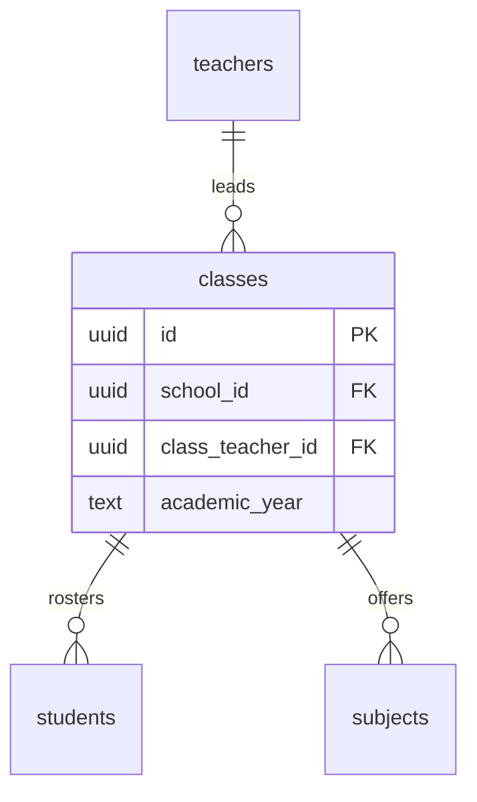
```mermaid
erDiagram
  classes ||--o{ students : "rosters"
  classes ||--o{ subjects : "offers"
  teachers ||--o{ classes : "leads"
  classes {
    uuid id PK
    uuid school_id FK
    uuid class_teacher_id FK
    text academic_year
  }
```

### `subjects`

<!-- table: subjects · module: ClassesModule · prd: §4.4 · phase: 2 · tenant: yes · soft-delete: no -->

A subject taught to one class by one teacher. Timetable periods, homework, exams, and results all
hang off `subjects`.

| Column       | Type          | Null | Key | Notes           |
| ------------ | ------------- | ---- | --- | --------------- |
| `id`         | `uuid`        | no   | PK  |                 |
| `school_id`  | `uuid`        | no   | FK  | → `schools.id`  |
| `class_id`   | `uuid`        | no   | FK  | → `classes.id`  |
| `teacher_id` | `uuid`        | yes  | FK  | → `teachers.id` |
| `name`       | `text`        | no   |     |                 |
| `code`       | `text`        | no   |     | e.g. `MATH-5A`  |
| `created_at` | `timestamptz` | no   |     |                 |
| `updated_at` | `timestamptz` | no   |     |                 |

**Constraints & indexes**

- `unique (school_id, class_id, code)`.
- Index `(class_id)`, `(teacher_id)`.

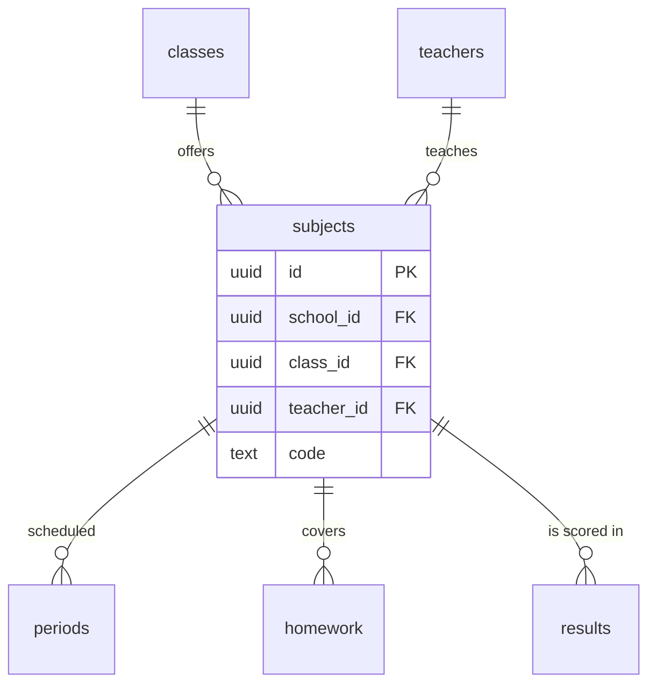
```mermaid
erDiagram
  classes ||--o{ subjects : "offers"
  teachers ||--o{ subjects : "teaches"
  subjects ||--o{ periods : "scheduled"
  subjects ||--o{ homework : "covers"
  subjects ||--o{ results : "is scored in"
  subjects {
    uuid id PK
    uuid school_id FK
    uuid class_id FK
    uuid teacher_id FK
    text code
  }
```

## 5. Feature ERD — Attendance

`PRD.md` §4.5. Phase 3.

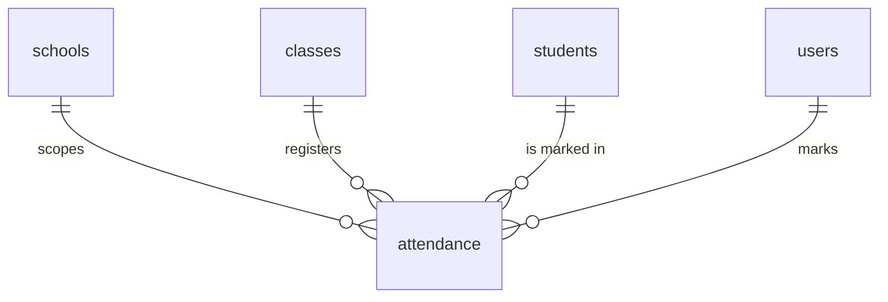
```mermaid
erDiagram
  schools ||--o{ attendance : "scopes"
  classes ||--o{ attendance : "registers"
  students ||--o{ attendance : "is marked in"
  users ||--o{ attendance : "marks"
```

### `attendance`

<!-- table: attendance · module: AttendanceModule · prd: §4.5 · phase: 3 · tenant: yes · soft-delete: no -->

One row per student per class per day. Bulk marking upserts on the unique key, so re-marking the same
register is idempotent. Monthly %/defaulters are aggregations, not stored columns.

| Column            | Type                | Null | Key | Notes             |
| ----------------- | ------------------- | ---- | --- | ----------------- |
| `id`              | `uuid`              | no   | PK  |                   |
| `school_id`       | `uuid`              | no   | FK  | → `schools.id`    |
| `class_id`        | `uuid`              | no   | FK  | → `classes.id`    |
| `student_id`      | `uuid`              | no   | FK  | → `students.id`   |
| `marked_by_id`    | `uuid`              | no   | FK  | → `users.id`      |
| `attendance_date` | `date`              | no   |     |                   |
| `status`          | `attendance_status` | no   |     | `PRESENT`…`LATE`  |
| `note`            | `text`              | yes  |     | leave/late reason |
| `created_at`      | `timestamptz`       | no   |     |                   |
| `updated_at`      | `timestamptz`       | no   |     |                   |

**Constraints & indexes**

- `unique (class_id, student_id, attendance_date)` — the duplicate guard from `PRD.md` §4.5.
- Index `(school_id, attendance_date)`, `(class_id, attendance_date)`, `(student_id, attendance_date)`.
- `class_id` is stored **in addition to** `students.class_id` on purpose: history must stay correct
  after a student changes class mid-year.
- Writes emit `attendance:marked` over Socket.io to linked parents.

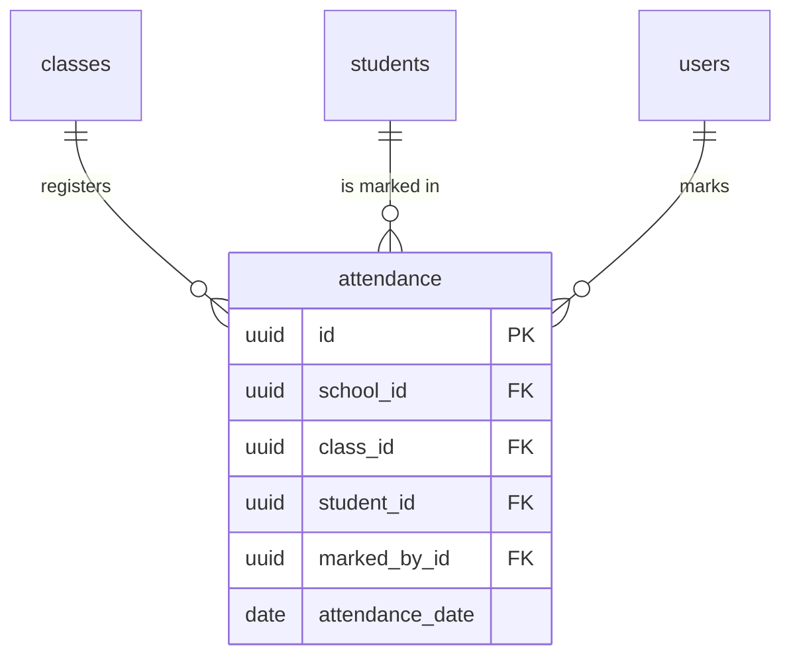
```mermaid
erDiagram
  classes ||--o{ attendance : "registers"
  students ||--o{ attendance : "is marked in"
  users ||--o{ attendance : "marks"
  attendance {
    uuid id PK
    uuid school_id FK
    uuid class_id FK
    uuid student_id FK
    uuid marked_by_id FK
    date attendance_date
  }
```

## 6. Feature ERD — Homework & Study Materials

`PRD.md` §4.7 and §4.13. Phase 3.

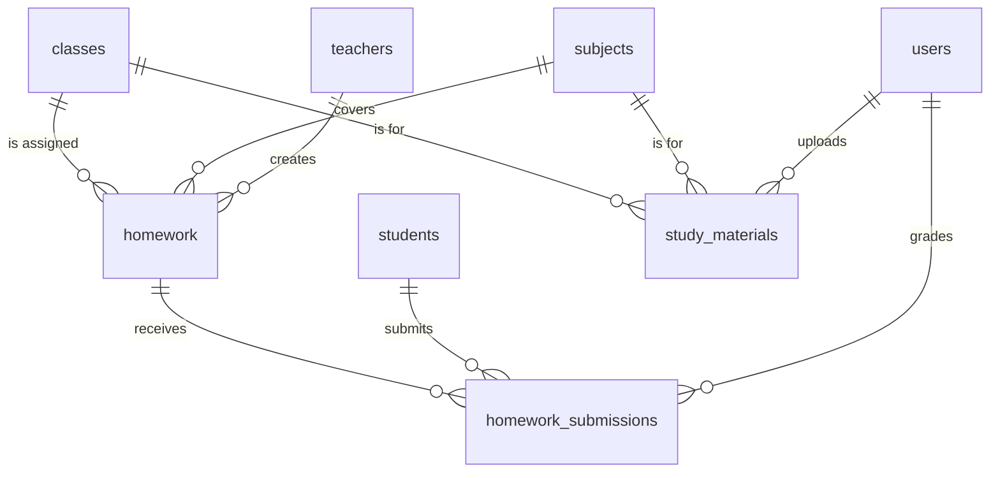
```mermaid
erDiagram
  classes ||--o{ homework : "is assigned"
  subjects ||--o{ homework : "covers"
  teachers ||--o{ homework : "creates"
  homework ||--o{ homework_submissions : "receives"
  students ||--o{ homework_submissions : "submits"
  users ||--o{ homework_submissions : "grades"
  classes ||--o{ study_materials : "is for"
  subjects ||--o{ study_materials : "is for"
  users ||--o{ study_materials : "uploads"
```

### `homework`

<!-- table: homework · module: HomeworkModule · prd: §4.7 · phase: 3 · tenant: yes · soft-delete: yes -->

An assignment posted by a teacher to one class + subject. `attachments` holds Cloudinary URLs;
`due_date` is the late-submission boundary.

| Column        | Type          | Null | Key | Notes           |
| ------------- | ------------- | ---- | --- | --------------- |
| `id`          | `uuid`        | no   | PK  |                 |
| `school_id`   | `uuid`        | no   | FK  | → `schools.id`  |
| `class_id`    | `uuid`        | no   | FK  | → `classes.id`  |
| `subject_id`  | `uuid`        | no   | FK  | → `subjects.id` |
| `teacher_id`  | `uuid`        | no   | FK  | → `teachers.id` |
| `title`       | `text`        | no   |     |                 |
| `description` | `text`        | yes  |     |                 |
| `due_date`    | `date`        | no   |     |                 |
| `attachments` | `text[]`      | no   |     | default `'{}'`  |
| `created_at`  | `timestamptz` | no   |     |                 |
| `updated_at`  | `timestamptz` | no   |     |                 |
| `deleted_at`  | `timestamptz` | yes  |     | soft delete     |

**Constraints & indexes**

- Index `(class_id, subject_id, due_date)` — the listing path.
- Deletion is soft so submissions keep their parent.

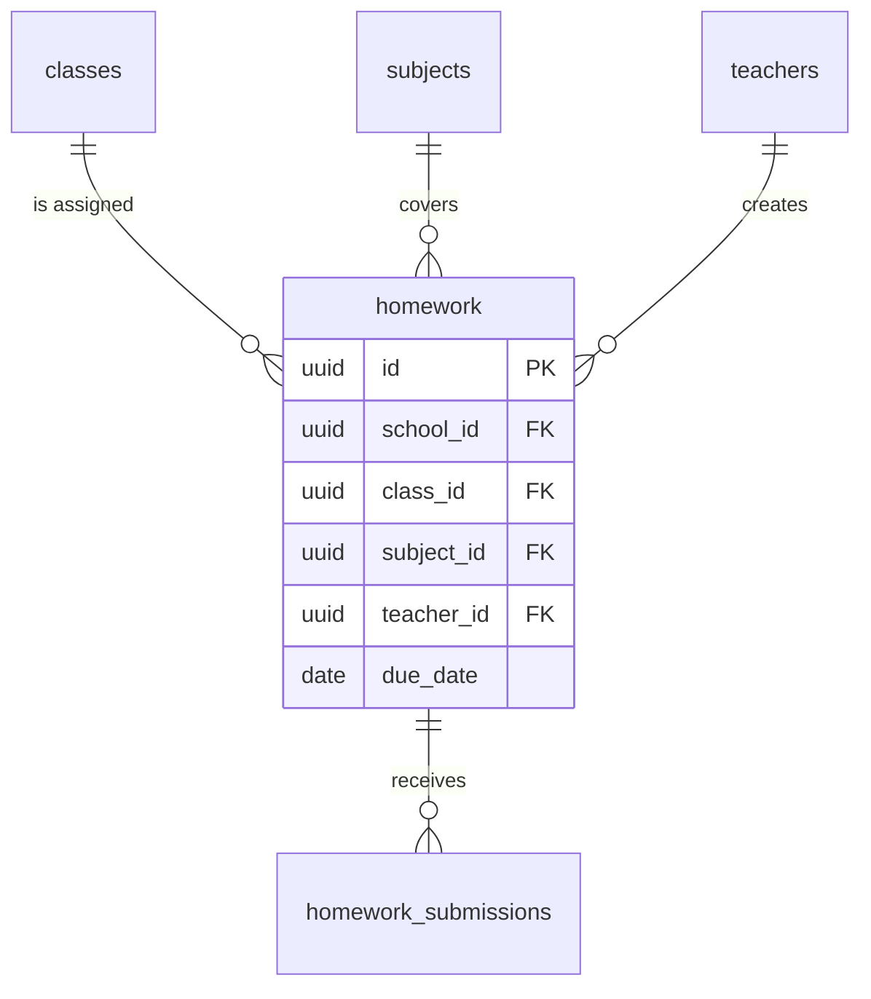
```mermaid
erDiagram
  classes ||--o{ homework : "is assigned"
  subjects ||--o{ homework : "covers"
  teachers ||--o{ homework : "creates"
  homework ||--o{ homework_submissions : "receives"
  homework {
    uuid id PK
    uuid school_id FK
    uuid class_id FK
    uuid subject_id FK
    uuid teacher_id FK
    date due_date
  }
```

### `homework_submissions`

<!-- table: homework_submissions · module: HomeworkModule · prd: §4.7 · phase: 3 · tenant: yes · soft-delete: no -->

A student's answer to one assignment. `is_late` is computed on insert against `homework.due_date`.
Teacher tracking (submitted vs pending) is a count aggregate over this table.

| Column         | Type          | Null | Key | Notes           |
| -------------- | ------------- | ---- | --- | --------------- |
| `id`           | `uuid`        | no   | PK  |                 |
| `school_id`    | `uuid`        | no   | FK  | → `schools.id`  |
| `homework_id`  | `uuid`        | no   | FK  | → `homework.id` |
| `student_id`   | `uuid`        | no   | FK  | → `students.id` |
| `files`        | `text[]`      | no   |     | default `'{}'`  |
| `submitted_at` | `timestamptz` | no   |     |                 |
| `is_late`      | `boolean`     | no   |     | default `false` |
| `grade`        | `text`        | yes  |     |                 |
| `remarks`      | `text`        | yes  |     |                 |
| `graded_by_id` | `uuid`        | yes  | FK  | → `users.id`    |
| `graded_at`    | `timestamptz` | yes  |     |                 |
| `created_at`   | `timestamptz` | no   |     |                 |
| `updated_at`   | `timestamptz` | no   |     |                 |

**Constraints & indexes**

- `unique (homework_id, student_id)` — one submission per student per assignment.
- Index `(student_id)`; `(homework_id)`.

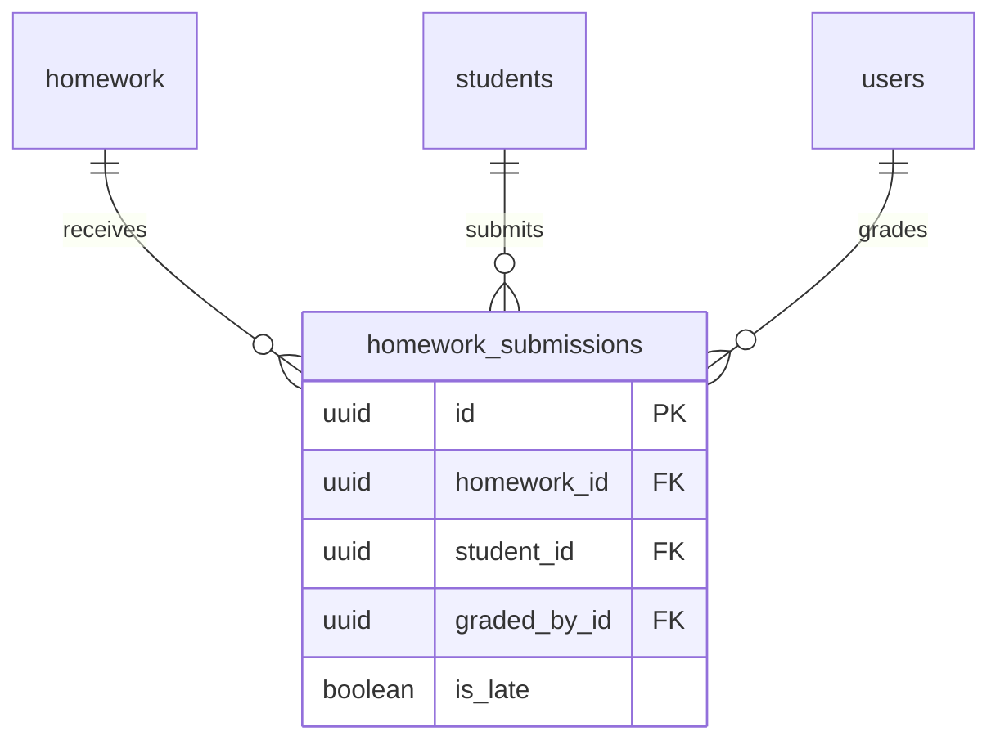
```mermaid
erDiagram
  homework ||--o{ homework_submissions : "receives"
  students ||--o{ homework_submissions : "submits"
  users ||--o{ homework_submissions : "grades"
  homework_submissions {
    uuid id PK
    uuid homework_id FK
    uuid student_id FK
    uuid graded_by_id FK
    boolean is_late
  }
```

### `study_materials`

<!-- table: study_materials · module: MaterialsModule · prd: §4.13 · phase: 3 · tenant: yes · soft-delete: yes -->

Uploaded learning resources (PDFs, notes, worksheets, previous-year papers). Files are validated to
PDF/JPG/PNG/DOCX ≤ 10MB and stored in Cloudinary; this table keeps the `file_url` and metadata.

| Column            | Type            | Null | Key | Notes           |
| ----------------- | --------------- | ---- | --- | --------------- |
| `id`              | `uuid`          | no   | PK  |                 |
| `school_id`       | `uuid`          | no   | FK  | → `schools.id`  |
| `class_id`        | `uuid`          | no   | FK  | → `classes.id`  |
| `subject_id`      | `uuid`          | no   | FK  | → `subjects.id` |
| `uploaded_by_id`  | `uuid`          | no   | FK  | → `users.id`    |
| `title`           | `text`          | no   |     |                 |
| `description`     | `text`          | yes  |     |                 |
| `type`            | `material_type` | no   |     | `PDF`…`PAPER`   |
| `file_url`        | `text`          | no   |     | Cloudinary      |
| `file_size_bytes` | `integer`       | yes  |     | ≤ 10MB          |
| `created_at`      | `timestamptz`   | no   |     |                 |
| `updated_at`      | `timestamptz`   | no   |     |                 |
| `deleted_at`      | `timestamptz`   | yes  |     | soft delete     |

**Constraints & indexes**

- Index `(class_id, subject_id, type)` — the filtered listing.
- `DELETE /materials/:id` removes the stored asset as well as the row.

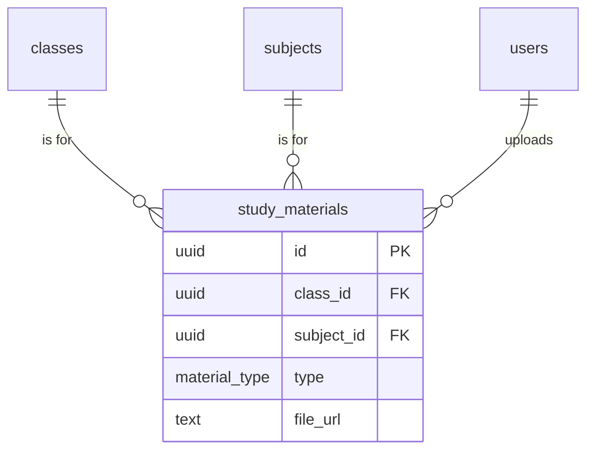
```mermaid
erDiagram
  classes ||--o{ study_materials : "is for"
  subjects ||--o{ study_materials : "is for"
  users ||--o{ study_materials : "uploads"
  study_materials {
    uuid id PK
    uuid class_id FK
    uuid subject_id FK
    material_type type
    text file_url
  }
```

## 7. Feature ERD — Timetable

`PRD.md` §4.8. **No phase assigned in `Phases.md`** — see §16.

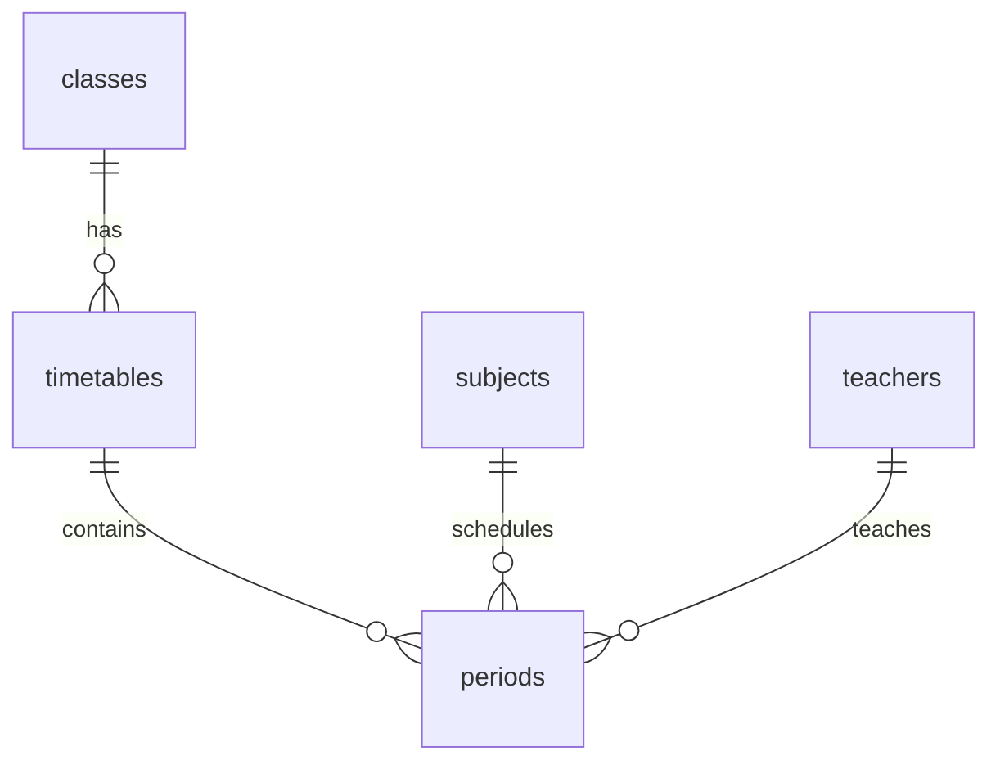
```mermaid
erDiagram
  classes ||--o{ timetables : "has"
  timetables ||--o{ periods : "contains"
  subjects ||--o{ periods : "schedules"
  teachers ||--o{ periods : "teaches"
```

### `timetables`

<!-- table: timetables · module: TimetablesModule · prd: §4.8 · phase: none · tenant: yes · soft-delete: no -->

One weekly timetable per class per academic year. A day's periods are created nested; the parent row
is the conflict-detection boundary.

| Column          | Type          | Null | Key | Notes          |
| --------------- | ------------- | ---- | --- | -------------- |
| `id`            | `uuid`        | no   | PK  |                |
| `school_id`     | `uuid`        | no   | FK  | → `schools.id` |
| `class_id`      | `uuid`        | no   | FK  | → `classes.id` |
| `academic_year` | `text`        | no   |     |                |
| `day`           | `weekday`     | no   |     | `MON`…`SUN`    |
| `created_at`    | `timestamptz` | no   |     |                |
| `updated_at`    | `timestamptz` | no   |     |                |

**Constraints & indexes**

- `unique (class_id, day, academic_year)`.
- Teacher double-booking is validated in the service before save (spans rows, not expressible as a
  constraint).

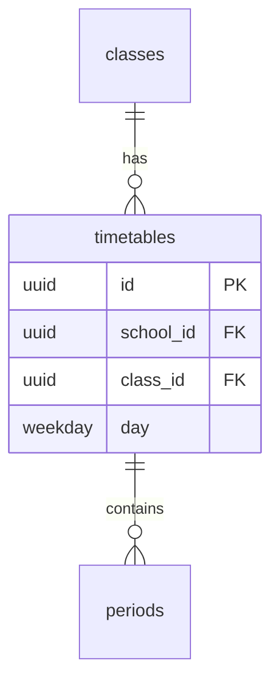
```mermaid
erDiagram
  classes ||--o{ timetables : "has"
  timetables ||--o{ periods : "contains"
  timetables {
    uuid id PK
    uuid school_id FK
    uuid class_id FK
    weekday day
  }
```

### `periods`

<!-- table: periods · module: TimetablesModule · prd: §4.8 · phase: none · tenant: yes · soft-delete: no -->

A single slot inside a day. Break rows carry `is_break = true` with no subject or teacher.

| Column         | Type      | Null | Key | Notes                    |
| -------------- | --------- | ---- | --- | ------------------------ |
| `id`           | `uuid`    | no   | PK  |                          |
| `school_id`    | `uuid`    | no   | FK  | → `schools.id`           |
| `timetable_id` | `uuid`    | no   | FK  | → `timetables.id`        |
| `subject_id`   | `uuid`    | yes  | FK  | → `subjects.id`          |
| `teacher_id`   | `uuid`    | yes  | FK  | → `teachers.id`          |
| `start_time`   | `time`    | no   |     |                          |
| `end_time`     | `time`    | no   |     |                          |
| `is_break`     | `boolean` | no   |     | default `false`          |
| `order_index`  | `integer` | no   |     | display order within day |
| `room`         | `text`    | yes  |     |                          |

**Constraints & indexes**

- Index `(timetable_id, order_index)`, `(teacher_id)` for the teacher view.
- `subject_id` / `teacher_id` are required unless `is_break`.

```mermaid
erDiagram
  timetables ||--o{ periods : "contains"
  subjects ||--o{ periods : "schedules"
  teachers ||--o{ periods : "teaches"
  periods {
    uuid id PK
    uuid timetable_id FK
    uuid subject_id FK
    uuid teacher_id FK
    time start_time
  }
```

## 8. Feature ERD — Fees

`PRD.md` §4.6. Phase 4.

```mermaid
erDiagram
  schools ||--o{ fee_structures : "defines"
  classes ||--o{ fee_structures : "applies to"
  fee_structures ||--o{ fee_heads : "composed of"
  students ||--o{ fee_invoices : "is billed"
  fee_structures ||--o{ fee_invoices : "generates"
  fee_invoices ||--o{ fee_payments : "is settled by"
  students ||--o{ fee_payments : "pays"
  users ||--o{ fee_payments : "records"
  students ||--o{ concessions : "is granted"
  fee_heads ||--o{ concessions : "discounts"
  users ||--o{ concessions : "approves"
  schools ||--o{ receipt_sequences : "numbers"
```

### `fee_structures`

<!-- table: fee_structures · module: FeesModule · prd: §4.6 · phase: 4 · tenant: yes · soft-delete: no -->

A named fee plan for one class in one academic year (e.g. "Grade 5 — 2026"). Its heads define what
is charged; invoices are generated from it per student.

| Column          | Type          | Null | Key | Notes          |
| --------------- | ------------- | ---- | --- | -------------- |
| `id`            | `uuid`        | no   | PK  |                |
| `school_id`     | `uuid`        | no   | FK  | → `schools.id` |
| `class_id`      | `uuid`        | no   | FK  | → `classes.id` |
| `academic_year` | `text`        | no   |     |                |
| `name`          | `text`        | no   |     |                |
| `created_at`    | `timestamptz` | no   |     |                |
| `updated_at`    | `timestamptz` | no   |     |                |

**Constraints & indexes**

- `unique (school_id, class_id, academic_year, name)`.

```mermaid
erDiagram
  classes ||--o{ fee_structures : "applies to"
  fee_structures ||--o{ fee_heads : "composed of"
  fee_structures ||--o{ fee_invoices : "generates"
  fee_structures {
    uuid id PK
    uuid school_id FK
    uuid class_id FK
    text academic_year
  }
```

### `fee_heads`

<!-- table: fee_heads · module: FeesModule · prd: §4.6 · phase: 4 · tenant: yes · soft-delete: no -->

A line item inside a structure — tuition, transport, lab, etc. A **child table** rather than the
JSONB array `PRD.md` §3 allowed, so collection reports can group by head.

| Column             | Type            | Null | Key | Notes                 |
| ------------------ | --------------- | ---- | --- | --------------------- |
| `id`               | `uuid`          | no   | PK  |                       |
| `school_id`        | `uuid`          | no   | FK  | → `schools.id`        |
| `fee_structure_id` | `uuid`          | no   | FK  | → `fee_structures.id` |
| `name`             | `text`          | no   |     |                       |
| `amount_paise`     | `integer`       | no   |     | paise                 |
| `frequency`        | `fee_frequency` | no   |     | `MONTHLY`…`ONE_TIME`  |
| `created_at`       | `timestamptz`   | no   |     |                       |

**Constraints & indexes**

- `unique (fee_structure_id, name)`; `check (amount_paise >= 0)`.
- Index `(fee_structure_id)`.

```mermaid
erDiagram
  fee_structures ||--o{ fee_heads : "composed of"
  fee_heads ||--o{ concessions : "discounts"
  fee_heads {
    uuid id PK
    uuid fee_structure_id FK
    text name
    integer amount_paise
    fee_frequency frequency
  }
```

### `fee_invoices`

<!-- table: fee_invoices · module: FeesModule · prd: §4.6 · phase: 4 · tenant: yes · soft-delete: no -->

A billable demand for one student, generated in bulk per class. `paid_paise` accumulates across
payments so `PARTIAL` can be topped up; `receipt_no` is assigned on the first successful payment from
`receipt_sequences` inside the payment transaction.

| Column             | Type             | Null | Key | Notes                    |
| ------------------ | ---------------- | ---- | --- | ------------------------ |
| `id`               | `uuid`           | no   | PK  |                          |
| `school_id`        | `uuid`           | no   | FK  | → `schools.id`           |
| `student_id`       | `uuid`           | no   | FK  | → `students.id`          |
| `fee_structure_id` | `uuid`           | no   | FK  | → `fee_structures.id`    |
| `amount_paise`     | `integer`        | no   |     | gross, before concession |
| `discount_paise`   | `integer`        | no   |     | default `0`              |
| `paid_paise`       | `integer`        | no   |     | default `0`              |
| `due_date`         | `date`           | no   |     |                          |
| `status`           | `invoice_status` | no   |     | default `PENDING`        |
| `receipt_no`       | `text`           | yes  |     | null until first payment |
| `issued_at`        | `timestamptz`    | yes  |     |                          |
| `created_at`       | `timestamptz`    | no   |     |                          |
| `updated_at`       | `timestamptz`    | no   |     |                          |

**Constraints & indexes**

- `unique (school_id, receipt_no)` where `receipt_no is not null`.
- `check (paid_paise <= amount_paise - discount_paise)`.
- Index `(student_id, status)` — the pending/history path — and `(school_id, status, due_date)`.

```mermaid
erDiagram
  students ||--o{ fee_invoices : "is billed"
  fee_structures ||--o{ fee_invoices : "generates"
  fee_invoices ||--o{ fee_payments : "is settled by"
  receipt_sequences ||..o{ fee_invoices : "numbers"
  fee_invoices {
    uuid id PK
    uuid student_id FK
    uuid fee_structure_id FK
    invoice_status status
    text receipt_no
  }
```

### `fee_payments`

<!-- table: fee_payments · module: FeesModule · prd: §4.6 · phase: 4 · tenant: yes · soft-delete: no -->

A settlement against an invoice — online via Stripe/SSLCommerz, or offline recorded by an admin
(`MANUAL`, with `recorded_by_id`). Webhook confirmation updates the invoice in one transaction.

| Column              | Type               | Null | Key | Notes                     |
| ------------------- | ------------------ | ---- | --- | ------------------------- |
| `id`                | `uuid`             | no   | PK  |                           |
| `school_id`         | `uuid`             | no   | FK  | → `schools.id`            |
| `invoice_id`        | `uuid`             | no   | FK  | → `fee_invoices.id`       |
| `student_id`        | `uuid`             | no   | FK  | → `students.id`           |
| `recorded_by_id`    | `uuid`             | yes  | FK  | → `users.id`, manual only |
| `amount_paise`      | `integer`          | no   |     |                           |
| `provider`          | `payment_provider` | no   |     | `STRIPE`…`MANUAL`         |
| `method`            | `payment_method`   | no   |     | `CARD`…`CHEQUE`           |
| `provider_order_id` | `text`             | yes  |     | checkout session/order    |
| `provider_txn_id`   | `text`             | yes  |     | webhook transaction id    |
| `status`            | `payment_status`   | no   |     | default `PENDING`         |
| `paid_at`           | `timestamptz`      | yes  |     |                           |
| `created_at`        | `timestamptz`      | no   |     |                           |
| `updated_at`        | `timestamptz`      | no   |     |                           |

**Constraints & indexes**

- `unique (provider, provider_txn_id)` where `provider_txn_id is not null` — **webhook idempotency**;
  a replayed event must not double-credit the invoice.
- Index `(invoice_id)`, `(provider_order_id)`.

```mermaid
erDiagram
  fee_invoices ||--o{ fee_payments : "is settled by"
  students ||--o{ fee_payments : "pays"
  users ||--o{ fee_payments : "records"
  fee_payments {
    uuid id PK
    uuid invoice_id FK
    uuid student_id FK
    payment_provider provider
    payment_status status
  }
```

### `concessions`

<!-- table: concessions · module: FeesModule · prd: §4.6 · phase: 4 · tenant: yes · soft-delete: no -->

A discount/scholarship for a student, scoped to one fee head, with an admin approval flow. Applied as
`fee_invoices.discount_paise` at generation time.

| Column           | Type                | Null | Key | Notes                |
| ---------------- | ------------------- | ---- | --- | -------------------- |
| `id`             | `uuid`              | no   | PK  |                      |
| `school_id`      | `uuid`              | no   | FK  | → `schools.id`       |
| `student_id`     | `uuid`              | no   | FK  | → `students.id`      |
| `fee_head_id`    | `uuid`              | yes  | FK  | → `fee_heads.id`     |
| `type`           | `concession_type`   | no   |     | `PERCENTAGE`/`FIXED` |
| `percentage`     | `numeric`           | yes  |     | 0–100, 2dp           |
| `amount_paise`   | `integer`           | yes  |     | when `FIXED`         |
| `reason`         | `text`              | yes  |     |                      |
| `status`         | `concession_status` | no   |     | default `PENDING`    |
| `approved_by_id` | `uuid`              | yes  | FK  | → `users.id`         |
| `approved_at`    | `timestamptz`       | yes  |     |                      |
| `created_at`     | `timestamptz`       | no   |     |                      |
| `updated_at`     | `timestamptz`       | no   |     |                      |

**Constraints & indexes**

- `check` — exactly one of `percentage` / `amount_paise` set, matching `type`.
- `approved_by_id` / `approved_at` are null while `status = PENDING`.
- Index `(student_id, status)` for the approval queue.

```mermaid
erDiagram
  students ||--o{ concessions : "is granted"
  fee_heads ||--o{ concessions : "discounts"
  users ||--o{ concessions : "approves"
  concessions {
    uuid id PK
    uuid student_id FK
    uuid fee_head_id FK
    concession_type type
    concession_status status
  }
```

### `receipt_sequences`

<!-- table: receipt_sequences · module: FeesModule · prd: §4.6 · phase: 4 · tenant: yes · soft-delete: no -->

Per-school receipt counter, locked with `select … for update` inside the payment transaction so
receipt numbers never collide — the "receipt number sequence (transactional)" requirement.

| Column        | Type          | Null | Key | Notes          |
| ------------- | ------------- | ---- | --- | -------------- |
| `id`          | `uuid`        | no   | PK  |                |
| `school_id`   | `uuid`        | no   | FK  | → `schools.id` |
| `fiscal_year` | `text`        | no   |     | reset boundary |
| `last_number` | `integer`     | no   |     | default `0`    |
| `updated_at`  | `timestamptz` | no   |     |                |

**Constraints & indexes**

- `unique (school_id, fiscal_year)`.
- Not in `PRD.md` §3 — added to make the receipt sequence atomic (§16).

```mermaid
erDiagram
  schools ||--o{ receipt_sequences : "numbers"
  receipt_sequences ||..o{ fee_invoices : "numbers"
  receipt_sequences {
    uuid id PK
    uuid school_id FK
    text fiscal_year
    integer last_number
  }
```

## 9. Feature ERD — Exams & Report Cards

`PRD.md` §4.9. Phase 4.

```mermaid
erDiagram
  classes ||--o{ exams : "sits"
  exams ||--o{ exam_subjects : "schedules"
  subjects ||--o{ exam_subjects : "is examined"
  exams ||--o{ results : "records"
  students ||--o{ results : "achieves"
  subjects ||--o{ results : "is scored in"
  users ||--o{ results : "enters"
  exams ||--o{ report_cards : "issues"
  students ||--o{ report_cards : "receives"
```

### `exams`

<!-- table: exams · module: ExamsModule · prd: §4.9 · phase: 4 · tenant: yes · soft-delete: no -->

An exam window for one class. `is_published` is the lock: once true, results are read-only and report
cards exist. Publishing is one transaction (results → report cards → notifications).

| Column         | Type          | Null | Key | Notes                |
| -------------- | ------------- | ---- | --- | -------------------- |
| `id`           | `uuid`        | no   | PK  |                      |
| `school_id`    | `uuid`        | no   | FK  | → `schools.id`       |
| `class_id`     | `uuid`        | no   | FK  | → `classes.id`       |
| `name`         | `text`        | no   |     |                      |
| `type`         | `exam_type`   | no   |     | `UNIT`/`MID`/`FINAL` |
| `start_date`   | `date`        | no   |     |                      |
| `end_date`     | `date`        | no   |     |                      |
| `is_published` | `boolean`     | no   |     | default `false`      |
| `published_at` | `timestamptz` | yes  |     |                      |
| `created_at`   | `timestamptz` | no   |     |                      |
| `updated_at`   | `timestamptz` | no   |     |                      |

**Constraints & indexes**

- Index `(class_id, type, start_date)`; `check (end_date >= start_date)`.

```mermaid
erDiagram
  classes ||--o{ exams : "sits"
  exams ||--o{ exam_subjects : "schedules"
  exams ||--o{ results : "records"
  exams ||--o{ report_cards : "issues"
  exams {
    uuid id PK
    uuid school_id FK
    uuid class_id FK
    exam_type type
    boolean is_published
  }
```

### `exam_subjects`

<!-- table: exam_subjects · module: ExamsModule · prd: §4.9 · phase: 4 · tenant: yes · soft-delete: no -->

Which subjects are examined, when, and for how many marks. `max_marks` bounds
`results.obtained_marks` and feeds percentage computation.

| Column       | Type      | Null | Key | Notes               |
| ------------ | --------- | ---- | --- | ------------------- |
| `id`         | `uuid`    | no   | PK  |                     |
| `school_id`  | `uuid`    | no   | FK  | → `schools.id`      |
| `exam_id`    | `uuid`    | no   | FK  | → `exams.id`        |
| `subject_id` | `uuid`    | no   | FK  | → `subjects.id`     |
| `exam_date`  | `date`    | no   |     |                     |
| `max_marks`  | `integer` | no   |     |                     |
| `pass_marks` | `integer` | yes  |     | default from scheme |

**Constraints & indexes**

- `unique (exam_id, subject_id)`.
- `check (pass_marks <= max_marks)`.

```mermaid
erDiagram
  exams ||--o{ exam_subjects : "schedules"
  subjects ||--o{ exam_subjects : "is examined"
  exam_subjects {
    uuid id PK
    uuid exam_id FK
    uuid subject_id FK
    integer max_marks
  }
```

### `results`

<!-- table: results · module: ExamsModule · prd: §4.9 · phase: 4 · tenant: yes · soft-delete: no -->

One student's mark in one subject of one exam. Bulk marks entry upserts on the unique key.

| Column           | Type          | Null | Key | Notes                       |
| ---------------- | ------------- | ---- | --- | --------------------------- |
| `id`             | `uuid`        | no   | PK  |                             |
| `school_id`      | `uuid`        | no   | FK  | → `schools.id`              |
| `exam_id`        | `uuid`        | no   | FK  | → `exams.id`                |
| `student_id`     | `uuid`        | no   | FK  | → `students.id`             |
| `subject_id`     | `uuid`        | no   | FK  | → `subjects.id`             |
| `obtained_marks` | `numeric`     | no   |     | ≤ `exam_subjects.max_marks` |
| `is_absent`      | `boolean`     | no   |     | default `false`             |
| `entered_by_id`  | `uuid`        | yes  | FK  | → `users.id`                |
| `created_at`     | `timestamptz` | no   |     |                             |
| `updated_at`     | `timestamptz` | no   |     |                             |

**Constraints & indexes**

- `unique (exam_id, student_id, subject_id)` — the upsert key.
- `check (obtained_marks >= 0)`; the upper bound against `max_marks` is validated in the service.
- Index `(student_id, exam_id)` for the student result view.

```mermaid
erDiagram
  exams ||--o{ results : "records"
  students ||--o{ results : "achieves"
  subjects ||--o{ results : "is scored in"
  users ||--o{ results : "enters"
  results {
    uuid id PK
    uuid exam_id FK
    uuid student_id FK
    uuid subject_id FK
    numeric obtained_marks
  }
```

### `report_cards`

<!-- table: report_cards · module: ExamsModule · prd: §4.9 · phase: 4 · tenant: yes · soft-delete: no -->

The computed summary per student per exam — totals, percentage, grade, and class rank — plus
`ai_comment` from `POST /ai/report-comment`. Written at publish time, not on every mark edit.

| Column           | Type          | Null | Key | Notes                   |
| ---------------- | ------------- | ---- | --- | ----------------------- |
| `id`             | `uuid`        | no   | PK  |                         |
| `school_id`      | `uuid`        | no   | FK  | → `schools.id`          |
| `exam_id`        | `uuid`        | no   | FK  | → `exams.id`            |
| `student_id`     | `uuid`        | no   | FK  | → `students.id`         |
| `total_marks`    | `numeric`     | no   |     | sum of max marks taken  |
| `obtained_marks` | `numeric`     | no   |     | sum of results          |
| `percentage`     | `numeric`     | no   |     | 0–100, 2dp              |
| `grade`          | `text`        | no   |     | from `schools.settings` |
| `rank`           | `integer`     | yes  |     | within class            |
| `ai_comment`     | `text`        | yes  |     | AI-generated            |
| `published_at`   | `timestamptz` | yes  |     |                         |
| `created_at`     | `timestamptz` | no   |     |                         |
| `updated_at`     | `timestamptz` | no   |     |                         |

**Constraints & indexes**

- `unique (exam_id, student_id)`; index `(student_id, exam_id)`.
- Grade bands come from `schools.settings` (JSONB), so `grade` is `text` — schools configure their own.

```mermaid
erDiagram
  exams ||--o{ report_cards : "issues"
  students ||--o{ report_cards : "receives"
  report_cards {
    uuid id PK
    uuid exam_id FK
    uuid student_id FK
    numeric percentage
    text grade
    integer rank
  }
```

## 10. Feature ERD — Real-Time Chat

`PRD.md` §4.10. Phase 5.

```mermaid
erDiagram
  schools ||--o{ conversations : "scopes"
  conversations ||--o{ conversation_participants : "includes"
  users ||--o{ conversation_participants : "joins"
  conversations ||--o{ messages : "contains"
  users ||--o{ messages : "sends"
```

### `conversations`

<!-- table: conversations · module: ChatModule · prd: §4.10 · phase: 5 · tenant: yes · soft-delete: no -->

A 1:1 thread between two users of permitted role pairs. `last_message_at` is denormalised so the
conversation list sorts without touching `messages`.

| Column            | Type          | Null | Key | Notes           |
| ----------------- | ------------- | ---- | --- | --------------- |
| `id`              | `uuid`        | no   | PK  |                 |
| `school_id`       | `uuid`        | no   | FK  | → `schools.id`  |
| `created_by_id`   | `uuid`        | yes  | FK  | → `users.id`    |
| `last_message_at` | `timestamptz` | yes  |     | updated on send |
| `created_at`      | `timestamptz` | no   |     |                 |
| `updated_at`      | `timestamptz` | no   |     |                 |

**Constraints & indexes**

- Index `(school_id, last_message_at desc)` for the inbox.
- Allowed pairs (admin↔teacher, teacher↔student, teacher↔parent) are enforced in the service, not a
  constraint — see §16.

```mermaid
erDiagram
  conversations ||--o{ conversation_participants : "includes"
  conversations ||--o{ messages : "contains"
  conversations {
    uuid id PK
    uuid school_id FK
    uuid created_by_id FK
    timestamptz last_message_at
  }
```

### `conversation_participants`

<!-- table: conversation_participants · module: ChatModule · prd: §4.10 · phase: 5 · tenant: yes · soft-delete: no -->

Membership + read state for a conversation. `last_read_at` drives the unread badge; `chat:read`
updates it over the gateway.

| Column            | Type          | Null | Key | Notes                |
| ----------------- | ------------- | ---- | --- | -------------------- |
| `id`              | `uuid`        | no   | PK  |                      |
| `school_id`       | `uuid`        | no   | FK  | → `schools.id`       |
| `conversation_id` | `uuid`        | no   | FK  | → `conversations.id` |
| `user_id`         | `uuid`        | no   | FK  | → `users.id`         |
| `last_read_at`    | `timestamptz` | yes  |     | unread marker        |
| `joined_at`       | `timestamptz` | no   |     |                      |

**Constraints & indexes**

- `unique (conversation_id, user_id)`; typically exactly 2 rows per conversation.
- Index `(user_id)` for the user's conversation list.

```mermaid
erDiagram
  conversations ||--o{ conversation_participants : "includes"
  users ||--o{ conversation_participants : "joins"
  conversation_participants {
    uuid id PK
    uuid conversation_id FK
    uuid user_id FK
    timestamptz last_read_at
  }
```

### `messages`

<!-- table: messages · module: ChatModule · prd: §4.10 · phase: 5 · tenant: yes · soft-delete: yes -->

Persisted chat message. `read_at` is the receipt for the single recipient. Ordering is by `created_at`
within a conversation.

| Column            | Type          | Null | Key | Notes                |
| ----------------- | ------------- | ---- | --- | -------------------- |
| `id`              | `uuid`        | no   | PK  |                      |
| `school_id`       | `uuid`        | no   | FK  | → `schools.id`       |
| `conversation_id` | `uuid`        | no   | FK  | → `conversations.id` |
| `sender_id`       | `uuid`        | no   | FK  | → `users.id`         |
| `body`            | `text`        | no   |     |                      |
| `read_at`         | `timestamptz` | yes  |     | receipt              |
| `created_at`      | `timestamptz` | no   |     |                      |
| `updated_at`      | `timestamptz` | no   |     |                      |
| `deleted_at`      | `timestamptz` | yes  |     | soft delete          |

**Constraints & indexes**

- Index `(conversation_id, created_at desc)` — the pagination path from `PRD.md` §3.
- Payloads mirror the REST DTO shapes (`Design.md`), so the same serializer is reused.

```mermaid
erDiagram
  conversations ||--o{ messages : "contains"
  users ||--o{ messages : "sends"
  messages {
    uuid id PK
    uuid conversation_id FK
    uuid sender_id FK
    text body
    timestamptz read_at
  }
```

## 11. Feature ERD — Notices & Events

`PRD.md` §4.11. Phase 5.

```mermaid
erDiagram
  schools ||--o{ notices : "publishes"
  users ||--o{ notices : "authors"
  notices ||--o{ notice_classes : "targets"
  classes ||--o{ notice_classes : "is targeted"
  schools ||--o{ events : "hosts"
  users ||--o{ events : "creates"
```

### `notices`

<!-- table: notices · module: NoticesModule · prd: §4.11 · phase: 5 · tenant: yes · soft-delete: yes -->

An announcement. `audience` selects role groups; class narrowing lives in `notice_classes`.
Publishing broadcasts over Socket.io and queues email via BullMQ.

| Column            | Type                | Null | Key | Notes             |
| ----------------- | ------------------- | ---- | --- | ----------------- |
| `id`              | `uuid`              | no   | PK  |                   |
| `school_id`       | `uuid`              | no   | FK  | → `schools.id`    |
| `published_by_id` | `uuid`              | no   | FK  | → `users.id`      |
| `title`           | `text`              | no   |     |                   |
| `body`            | `text`              | no   |     |                   |
| `audience`        | `notice_audience[]` | no   |     | default `'{ALL}'` |
| `published_at`    | `timestamptz`       | yes  |     | null = draft      |
| `expires_at`      | `timestamptz`       | yes  |     | auto-hide         |
| `created_at`      | `timestamptz`       | no   |     |                   |
| `updated_at`      | `timestamptz`       | no   |     |                   |
| `deleted_at`      | `timestamptz`       | yes  |     | soft delete       |

**Constraints & indexes**

- Index `(school_id, published_at desc)`.
- `audience` is an enum array (`PRD.md` §3 allowed "enum[] or JSONB") — see §16 on why class scope is
  a join table instead of a UUID array.

```mermaid
erDiagram
  users ||--o{ notices : "authors"
  notices ||--o{ notice_classes : "targets"
  notices {
    uuid id PK
    uuid school_id FK
    uuid published_by_id FK
    notice_audience audience
    timestamptz published_at
  }
```

### `notice_classes`

<!-- table: notice_classes · module: NoticesModule · prd: §4.11 · phase: 5 · tenant: yes · soft-delete: no -->

Class-scoped targeting for a notice. Absent rows mean the notice applies to every class matching
`notices.audience`.

| Column      | Type   | Null | Key | Notes          |
| ----------- | ------ | ---- | --- | -------------- |
| `notice_id` | `uuid` | no   | FK  | → `notices.id` |
| `class_id`  | `uuid` | no   | FK  | → `classes.id` |
| `school_id` | `uuid` | no   | FK  | → `schools.id` |

**Constraints & indexes**

- Primary key `(notice_id, class_id)`.
- Index `(class_id)` — "notices for my class".

```mermaid
erDiagram
  notices ||--o{ notice_classes : "targets"
  classes ||--o{ notice_classes : "is targeted"
  notice_classes {
    uuid notice_id PK
    uuid class_id PK
    uuid school_id FK
  }
```

### `events`

<!-- table: events · module: NoticesModule · prd: §4.11 · phase: 5 · tenant: yes · soft-delete: yes -->

Calendar entries (exam week, sports day, holidays) with the same audience model as notices and an
optional time window.

| Column          | Type                | Null | Key | Notes             |
| --------------- | ------------------- | ---- | --- | ----------------- |
| `id`            | `uuid`              | no   | PK  |                   |
| `school_id`     | `uuid`              | no   | FK  | → `schools.id`    |
| `created_by_id` | `uuid`              | no   | FK  | → `users.id`      |
| `title`         | `text`              | no   |     |                   |
| `description`   | `text`              | yes  |     |                   |
| `event_date`    | `date`              | no   |     |                   |
| `start_time`    | `time`              | yes  |     |                   |
| `end_time`      | `time`              | yes  |     |                   |
| `audience`      | `notice_audience[]` | no   |     | default `'{ALL}'` |
| `created_at`    | `timestamptz`       | no   |     |                   |
| `updated_at`    | `timestamptz`       | no   |     |                   |
| `deleted_at`    | `timestamptz`       | yes  |     | soft delete       |

**Constraints & indexes**

- Index `(school_id, event_date)`.

```mermaid
erDiagram
  users ||--o{ events : "creates"
  events {
    uuid id PK
    uuid school_id FK
    uuid created_by_id FK
    date event_date
    notice_audience audience
  }
```

## 12. Feature ERD — AI Assistant

`PRD.md` §4.12. Phase 5.

```mermaid
erDiagram
  schools ||--o{ ai_conversations : "scopes"
  users ||--o{ ai_conversations : "starts"
```

### `ai_conversations`

<!-- table: ai_conversations · module: AiModule · prd: §4.12 · phase: 5 · tenant: yes · soft-delete: no -->

History per user per AI feature. `messages` is a JSONB array of `{ role, content, createdAt }` turns.
Prompts are server-side templates, so raw user input is never forwarded to the LLM.

| Column       | Type          | Null | Key | Notes                 |
| ------------ | ------------- | ---- | --- | --------------------- |
| `id`         | `uuid`        | no   | PK  |                       |
| `school_id`  | `uuid`        | no   | FK  | → `schools.id`        |
| `user_id`    | `uuid`        | no   | FK  | → `users.id`          |
| `feature`    | `ai_feature`  | no   |     | one of the 7 features |
| `title`      | `text`        | yes  |     | derived label         |
| `messages`   | `jsonb`       | no   |     | default `'[]'`        |
| `created_at` | `timestamptz` | no   |     |                       |
| `updated_at` | `timestamptz` | no   |     |                       |

**Constraints & indexes**

- Index `(user_id, feature, created_at desc)` — the per-feature history view.
- Rate limits are per user via `@Throttle`, not a column.

```mermaid
erDiagram
  users ||--o{ ai_conversations : "starts"
  ai_conversations {
    uuid id PK
    uuid user_id FK
    ai_feature feature
    jsonb messages
  }
```

## 13. Table Inventory

All 33 tables, with the section that documents each one.

| #   | Table                       | Feature section | PRD   | Phase |
| --- | --------------------------- | --------------- | ----- | ----- |
| 1   | `schools`                   | §3 Foundation   | §4.1  | 1     |
| 2   | `users`                     | §3 Foundation   | §4.2  | 1     |
| 3   | `otps`                      | §3 Foundation   | §4.1  | 1     |
| 4   | `refresh_tokens`            | §3 Foundation   | §4.2  | 1     |
| 5   | `teachers`                  | §3 Foundation   | §4.3  | 2     |
| 6   | `students`                  | §3 Foundation   | §4.3  | 2     |
| 7   | `parents`                   | §3 Foundation   | §4.3  | 2     |
| 8   | `parent_students`           | §3 Foundation   | §4.3  | 2     |
| 9   | `classes`                   | §4 Classes      | §4.4  | 2     |
| 10  | `subjects`                  | §4 Classes      | §4.4  | 2     |
| 11  | `attendance`                | §5 Attendance   | §4.5  | 3     |
| 12  | `homework`                  | §6 Homework     | §4.7  | 3     |
| 13  | `homework_submissions`      | §6 Homework     | §4.7  | 3     |
| 14  | `study_materials`           | §6 Homework     | §4.13 | 3     |
| 15  | `timetables`                | §7 Timetable    | §4.8  | —     |
| 16  | `periods`                   | §7 Timetable    | §4.8  | —     |
| 17  | `fee_structures`            | §8 Fees         | §4.6  | 4     |
| 18  | `fee_heads`                 | §8 Fees         | §4.6  | 4     |
| 19  | `fee_invoices`              | §8 Fees         | §4.6  | 4     |
| 20  | `fee_payments`              | §8 Fees         | §4.6  | 4     |
| 21  | `concessions`               | §8 Fees         | §4.6  | 4     |
| 22  | `receipt_sequences`         | §8 Fees         | §4.6  | 4     |
| 23  | `exams`                     | §9 Exams        | §4.9  | 4     |
| 24  | `exam_subjects`             | §9 Exams        | §4.9  | 4     |
| 25  | `results`                   | §9 Exams        | §4.9  | 4     |
| 26  | `report_cards`              | §9 Exams        | §4.9  | 4     |
| 27  | `conversations`             | §10 Chat        | §4.10 | 5     |
| 28  | `conversation_participants` | §10 Chat        | §4.10 | 5     |
| 29  | `messages`                  | §10 Chat        | §4.10 | 5     |
| 30  | `notices`                   | §11 Notices     | §4.11 | 5     |
| 31  | `notice_classes`            | §11 Notices     | §4.11 | 5     |
| 32  | `events`                    | §11 Notices     | §4.11 | 5     |
| 33  | `ai_conversations`          | §12 AI          | §4.12 | 5     |

## 14. Cross-Cutting Concerns

**Tenancy.** Every tenant table carries a non-null `school_id` and every query is scoped by it via the
tenant guard (`Rules.md`, `Memory.md`). Exceptions: `schools` (it _is_ the tenant) and
`notice_classes` (inherits scope from its notice). The backend connects with the Supabase
**service-role key**, which **bypasses RLS** — so tenant isolation is enforced in application code,
and any RLS policies added later are defence-in-depth, not the primary control.

**`updated_at`.** Maintained by a shared `set_updated_at()` trigger on every table rather than by
application writes.

**Transaction boundaries** (`Rules.md`, `PRD.md`): school registration (school + admin + OTP), bulk
invoice generation, payment confirmation (payment + invoice + receipt number), exam publish
(results → report cards → notifications), and bulk CSV import per batch.

**Reporting views.** `PRD.md` §4.14 calls for aggregations and materialized views. These are read-only
projections, not tables: `mv_attendance_monthly` (attendance % per student/class/month),
`mv_fee_collection` (collected/pending/concessions per period), plus on-demand RPCs for the defaulter
list and `GET /dashboard/admin`.

## 15. Feature Coverage

Every backend feature module from `PRD.md` §4 and `Architecture.md` maps to tables documented above.

| PRD feature               | Feature ERD | Tables                                                                                            |
| ------------------------- | ----------- | ------------------------------------------------------------------------------------------------- |
| §4.1 Registration & OTP   | §3          | `schools`, `users`, `otps`                                                                        |
| §4.2 Auth & RBAC          | §3          | `users`, `refresh_tokens`                                                                         |
| §4.3 User management      | §3          | `teachers`, `students`, `parents`, `parent_students`                                              |
| §4.4 Classes & subjects   | §4          | `classes`, `subjects` (+ `students.class_id`)                                                     |
| §4.5 Attendance           | §5          | `attendance`                                                                                      |
| §4.6 Fees                 | §8          | `fee_structures`, `fee_heads`, `fee_invoices`, `fee_payments`, `concessions`, `receipt_sequences` |
| §4.7 Homework             | §6          | `homework`, `homework_submissions`                                                                |
| §4.8 Timetable            | §7          | `timetables`, `periods`                                                                           |
| §4.9 Exams & report cards | §9          | `exams`, `exam_subjects`, `results`, `report_cards`                                               |
| §4.10 Chat                | §10         | `conversations`, `conversation_participants`, `messages`                                          |
| §4.11 Notices & events    | §11         | `notices`, `notice_classes`, `events`                                                             |
| §4.12 AI assistant        | §12         | `ai_conversations`                                                                                |
| §4.13 Study materials     | §6          | `study_materials`                                                                                 |
| §4.14 Reports & analytics | —           | _views only_ (§14)                                                                                |
| §4.15 Email notifications | —           | _no table — BullMQ queue_                                                                         |

**Module coverage:** `SchoolsModule` §3 · `AuthModule` §3 · `UsersModule` §3 · `ClassesModule` §4 ·
`AttendanceModule` §5 · `HomeworkModule` §6 · `TimetablesModule` §7 · `FeesModule` §8 · `ExamsModule`
§9 · `ChatModule` §10 · `NoticesModule` §11 · `AiModule` §12 · `MaterialsModule` §6 · `ReportsModule`
§14 · `MailModule` — no tables.

## 16. Gaps & Open Questions

Items where the PRD implies something it does not model, or where a decision should be confirmed
before writing migrations:

1. **Refresh tokens** — §4.2 requires "hashed refresh tokens stored server-side" but §3 lists no
   model. Added `refresh_tokens` (§3); confirm the rotation/revocation policy.
2. **Notifications** — the `notification:new` socket event and fee-reminder/result/notice emails
   imply persistence so an offline user still sees them. No table exists. Add a `notifications` table
   (`user_id`, `type`, `payload`, `read_at`) or accept fire-and-forget delivery.
3. **Receipt numbers** — §4.6 wants a transactional receipt sequence. `receipt_sequences` (§8) is the
   proposed mechanism; confirm per-school vs global numbering and the reset boundary (fiscal vs
   academic year).
4. **Timetable has no phase** — `PRD.md` §4.8 and `Architecture.md` both list `timetables/`, but
   `Phases.md` never schedules it, so `timetables` / `periods` cannot be placed in the delivery order.
   This needs a phase.
5. **Class roster history** — `students.class_id` (current class only) was chosen over a
   `class_enrollments` join table. If promotion/academic-year history must be reportable, a join table
   is required instead.
6. **`students.class_id` vs `attendance.class_id`** — deliberate denormalisation for historical
   accuracy. Confirm attendance is always written with the student's class at that date.
7. **Chat allowed pairs** — admin↔teacher, teacher↔student, teacher↔parent is enforced in the
   service. A DB `check` cannot express it; consider a trigger if the rule must be airtight.
8. **AI feature count** — `Architecture.md` and §1.1 say "8 AI assistant features"; §4.12 lists 7
   endpoints and acceptance criterion 8 says "seven". The `ai_feature` enum has the 7 documented
   values.
9. **Global vs per-school email uniqueness** — `users.email` is globally unique. If staff can belong
   to multiple schools, switch to `unique (school_id, email)`.
10. **Audit trail** — `marked_by_id`, `entered_by_id`, `approved_by_id`, `recorded_by_id` cover the
    sensitive writes, but there is no general audit log for edits/deletes of marks, invoices, or
    users. Worth adding given exam marks and payments are involved.
11. **Soft-delete coverage** — `deleted_at` is applied to profiles and content, not to financial or
    attendance rows, which are kept for reporting. Confirm this is intended.
12. **Super-admin / multi-school staff** — no platform-level role exists above `schools`; every user is
    bound to one school.
