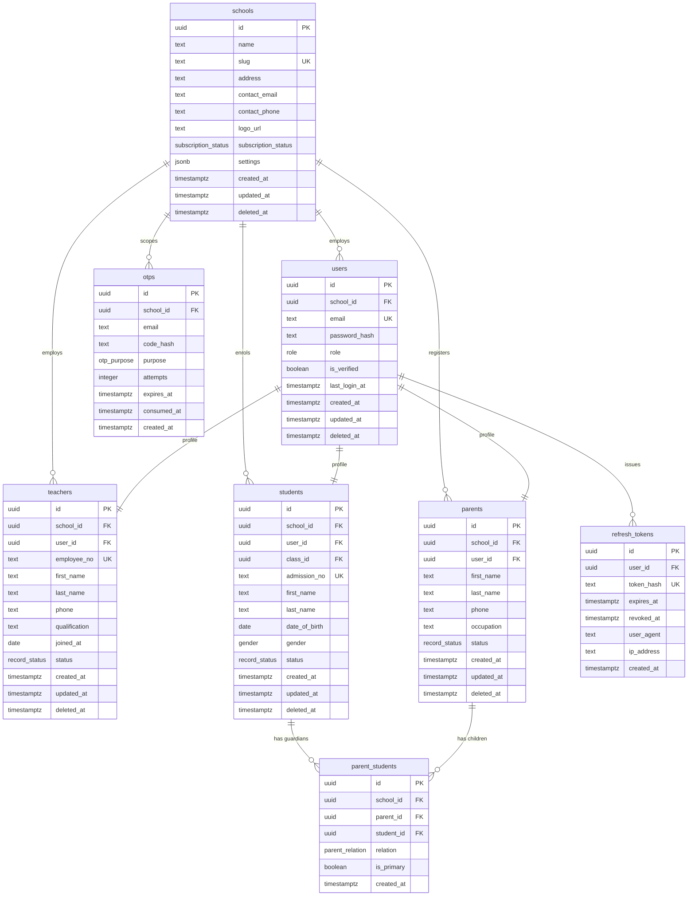
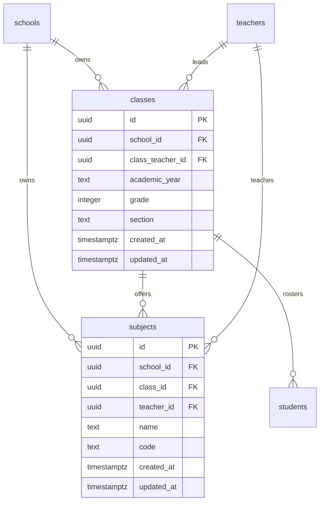
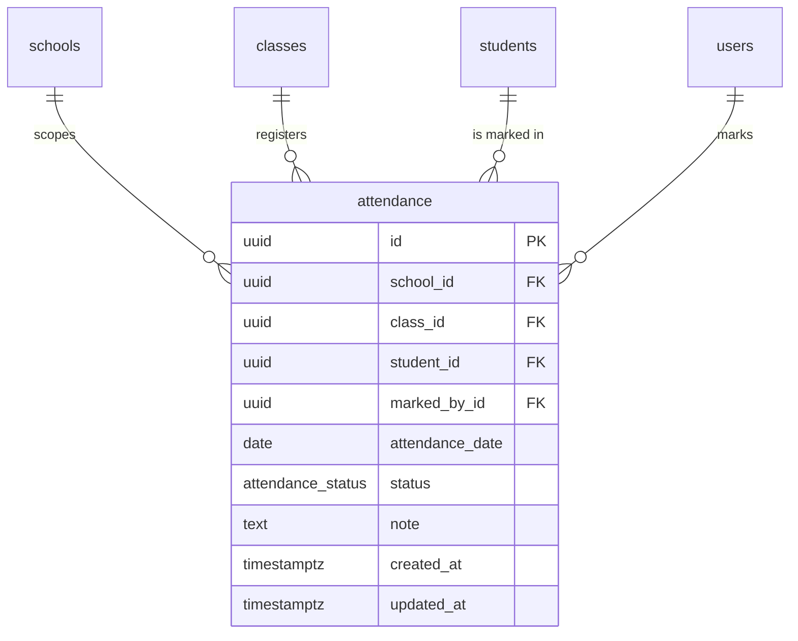
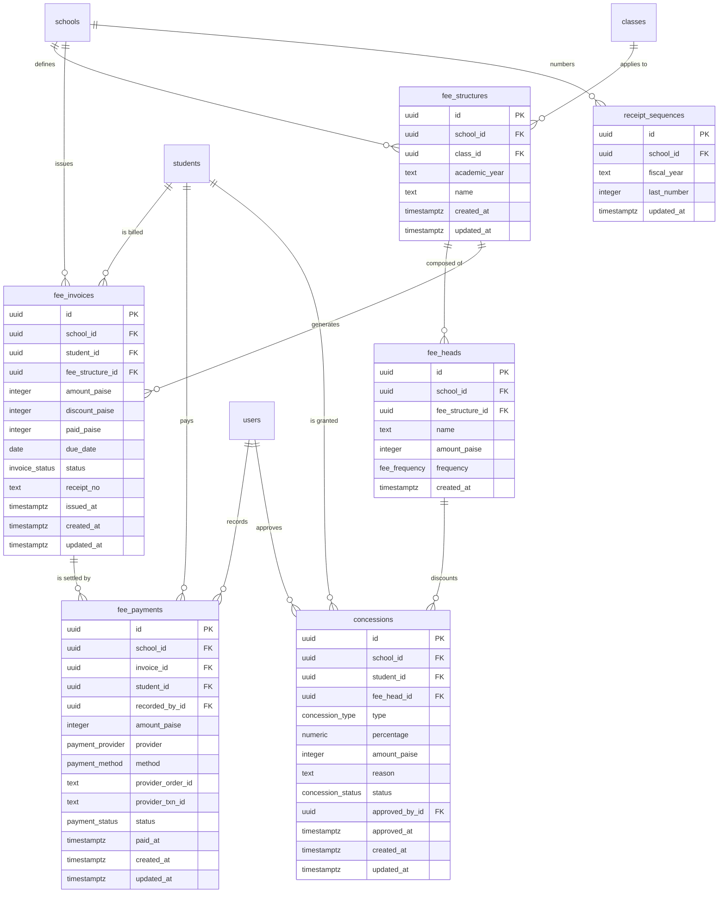
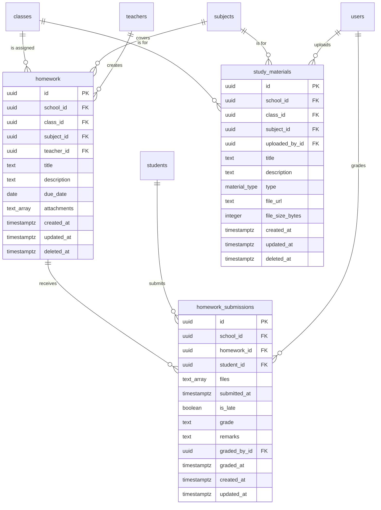
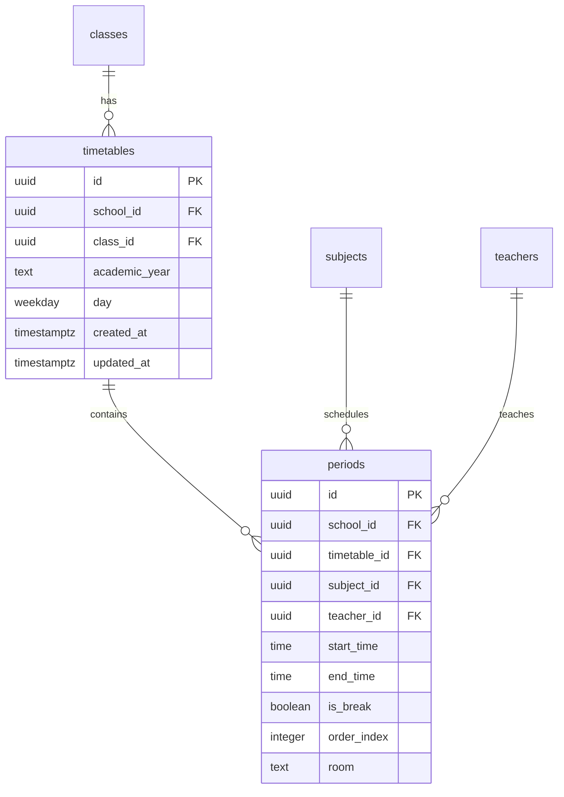
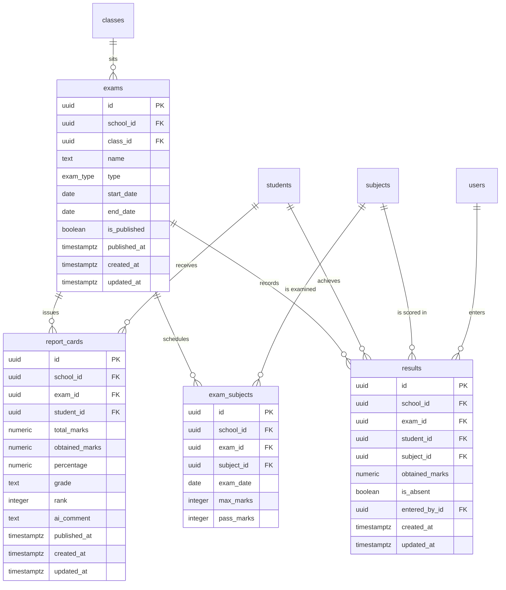
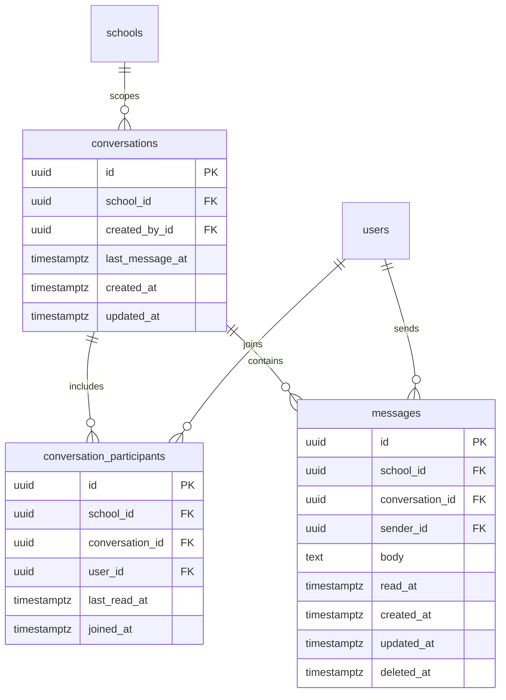
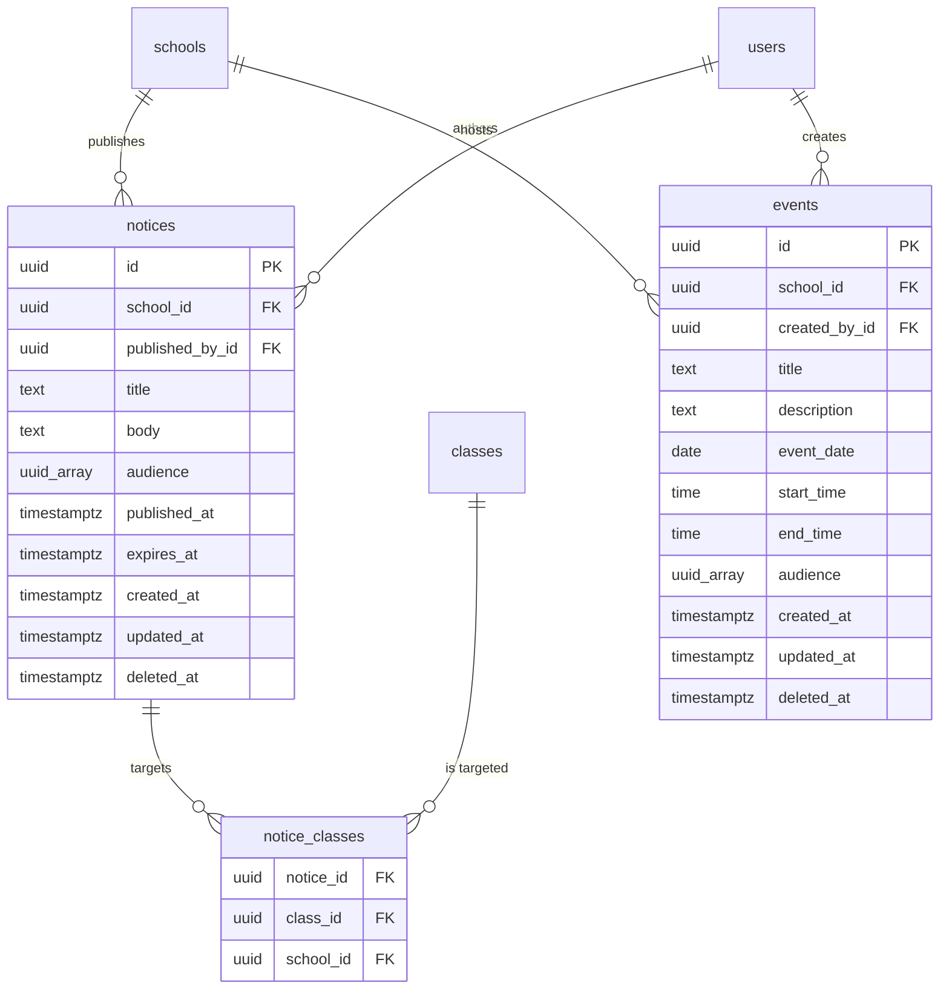
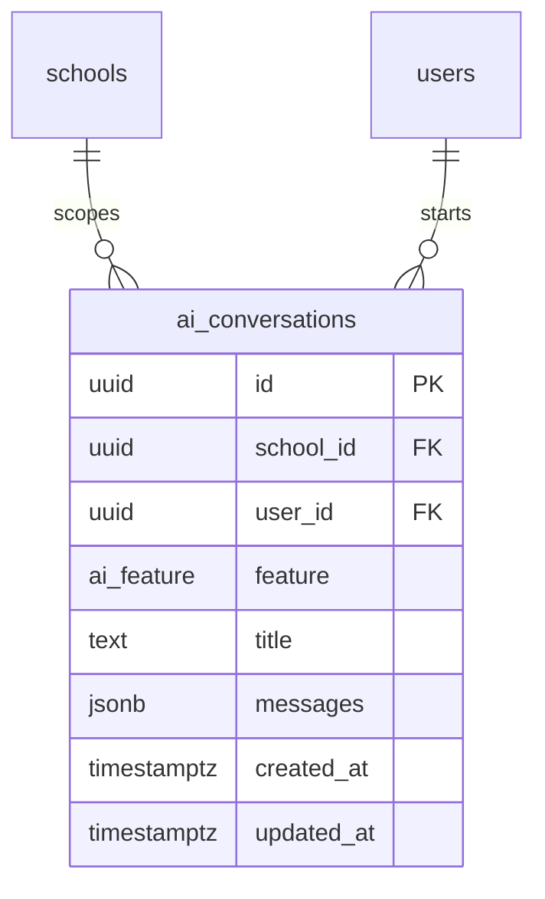

# Database Schema (ERD) — Backend

PostgreSQL (Supabase) schema for School Flow AI, derived from the data models in
[`PRD.md`](./PRD.md) §3 and the feature modules in §4.

**Source of truth:** the actual schema lives in `backend/supabase/migrations/`. This file is the
reference ERD — when you change a table, add a migration **and** update the matching diagram here.

> ⚠️ No migrations exist yet — `backend/` currently holds only `package.json` and docs, so every
> table below is a **design target**, not a description of a live database.

## 1. Conventions

**Identifiers:** `snake_case`, plural table names (`fee_invoices`, `conversation_participants`).

`PRD.md` §3 names models in PascalCase with camelCase fields (`FeeInvoice.schoolId`) because that
came from the original Prisma plan, which was dropped in favour of raw Supabase SQL
([`Memory.md`](./Memory.md) decisions). Raw SQL identifiers are therefore snake_case. The API stays
camelCase per [`Design.md`](./Design.md), so **services map between the two** — e.g.
`fee_invoices.fee_structure_id` → `feeStructureId` in JSON. Never expose column names directly.

| Concept        | Postgres type                                    | Notes                                                   |
| -------------- | ------------------------------------------------ | ------------------------------------------------------- |
| Primary key    | `uuid default gen_random_uuid()`                 | all tables                                              |
| Tenant scope   | `school_id uuid not null references schools(id)` | every tenant table (see §13)                            |
| Money          | `integer` (paise)                                | never `float`/`numeric` — `150000` = ₹1,500.00          |
| Timestamps     | `timestamptz`                                    | `created_at default now()`, `updated_at` on write       |
| Date only      | `date`                                           | ISO `YYYY-MM-DD`                                        |
| Time of day    | `time`                                           | timetable periods                                       |
| Soft delete    | `deleted_at timestamptz null`                    | profile + content tables                                |
| Arbitrary data | `jsonb`                                          | `schools.settings`, `ai_conversations.messages`         |
| Fixed values   | Postgres enum                                    | §2 — values are `SCREAMING_SNAKE` per `Design.md`       |
| Array columns  | `text[]` / `uuid[]`                              | rendered as `text_array` / `uuid_array` in the diagrams |

**Diagram notation:** mermaid ERD supports only `PK`/`FK`/`UK`. Composite unique constraints and
partial indexes cannot be drawn, so they are listed as bullets under each diagram.

## 2. Enums

| Enum                  | Values                                                                                    | Column                                |
| --------------------- | ----------------------------------------------------------------------------------------- | ------------------------------------- |
| `role`                | `ADMIN`, `TEACHER`, `STUDENT`, `PARENT`                                                   | `users.role`                          |
| `subscription_status` | `TRIAL`, `ACTIVE`, `SUSPENDED`, `CANCELLED`                                               | `schools.subscription_status`         |
| `record_status`       | `ACTIVE`, `INACTIVE`                                                                      | `teachers/students/parents.status`    |
| `gender`              | `MALE`, `FEMALE`, `OTHER`                                                                 | `students.gender`                     |
| `parent_relation`     | `FATHER`, `MOTHER`, `GUARDIAN`                                                            | `parent_students.relation`            |
| `otp_purpose`         | `REGISTER`, `RESET_PASSWORD`                                                              | `otps.purpose`                        |
| `attendance_status`   | `PRESENT`, `ABSENT`, `LEAVE`, `LATE`                                                      | `attendance.status`                   |
| `fee_frequency`       | `MONTHLY`, `QUARTERLY`, `ANNUAL`, `ONE_TIME`                                              | `fee_heads.frequency`                 |
| `invoice_status`      | `PENDING`, `PARTIAL`, `PAID`, `OVERDUE`                                                   | `fee_invoices.status`                 |
| `payment_status`      | `PENDING`, `PAID`, `FAILED`, `REFUNDED`                                                   | `fee_payments.status`                 |
| `payment_provider`    | `STRIPE`, `SSLCOMMERZ`, `MANUAL`                                                          | `fee_payments.provider`               |
| `payment_method`      | `CARD`, `MOBILE_BANKING`, `NET_BANKING`, `CASH`, `CHEQUE`                                 | `fee_payments.method`                 |
| `concession_type`     | `PERCENTAGE`, `FIXED`                                                                     | `concessions.type`                    |
| `concession_status`   | `PENDING`, `APPROVED`, `REJECTED`                                                         | `concessions.status`                  |
| `material_type`       | `PDF`, `NOTES`, `WORKSHEET`, `PAPER`                                                      | `study_materials.type`                |
| `exam_type`           | `UNIT`, `MID`, `FINAL`                                                                    | `exams.type`                          |
| `weekday`             | `MON`, `TUE`, `WED`, `THU`, `FRI`, `SAT`, `SUN`                                           | `timetables.day`                      |
| `notice_audience`     | `ALL`, `TEACHERS`, `STUDENTS`, `PARENTS`                                                  | `notices.audience`, `events.audience` |
| `ai_feature`          | `CHAT`, `REPORT_COMMENT`, `FEE_REMINDER`, `NOTICE`, `EVENT_PLAN`, `HOMEWORK_HELP`, `QUIZ` | `ai_conversations.feature`            |

## 3. Foundation & Auth

Covers `PRD.md` §4.1 (school registration + OTP) and §4.2 (auth/RBAC).

**Constraints**

- `schools.slug` unique; generated from the name on registration (`PRD.md` §4.1).
- `users.email` unique **globally** — `PRD.md` §3 says "email (unique)". If a person may belong to
  more than one school later, this becomes `unique (school_id, email)` (§15).
- `users.password_hash` is bcrypt (12 rounds) and **must never** appear in a response
  (`Design.md`, `Rules.md`).
- One profile row per user: `unique (user_id)` on `teachers`, `students`, `parents`.
- Per-school human numbers: `unique (school_id, employee_no)`, `unique (school_id, admission_no)`.
- `parent_students`: `unique (parent_id, student_id)`; `students.class_id` is the current class and
  is nullable until assigned.
- `otps` is matched by `email`, not by a FK — a registration OTP precedes the admin's first login.
  `unique (email, purpose)` active-row index; `expires_at` = +10 min, `attempts` max 5, resend
  cooldown 60s (`PRD.md` §4.1).
- `refresh_tokens.token_hash` unique — rotation revokes the old row and inserts a new one.

**Indexes:** `users (school_id, role)`, `users (email)`, `refresh_tokens (user_id, expires_at)`,
`otps (email, purpose)`.

## 4. Classes & Subjects

Covers `PRD.md` §4.4.

**Constraints**

- `classes`: `unique (school_id, grade, section, academic_year)`.
- `subjects`: `unique (school_id, class_id, code)`; `teacher_id` nullable until assigned.
- `classes.class_teacher_id` nullable — a class can exist before a teacher is assigned.

**Roster:** `PRD.md` lists "student roster" and a `POST /classes/:id/assign-students` endpoint, but
no join table. This schema models the roster as `students.class_id` (a student belongs to exactly one
class at a time), which also matches the attendance unique key. See §15 if per-year enrollment
history is required.

## 5. Attendance

Covers `PRD.md` §4.5.

**Constraints**

- `unique (class_id, student_id, attendance_date)` — the duplicate guard from `PRD.md` §4.5; bulk
  marking is an upsert on this key.
- `class_id` is stored **in addition to** `students.class_id` on purpose: attendance must stay
  correct after a student changes class mid-year.
- `marked_by_id` → `users.id` (the teacher or admin who marked the register).

**Indexes:** `(school_id, attendance_date)`, `(class_id, attendance_date)`, `(student_id, attendance_date)`.

**Derived analytics** (monthly %, streaks, defaulters < 75%) are computed with aggregations/RPC —
no stored rollups. `attendance:marked` also emits over Socket.io to parents.

## 6. Fees

Covers `PRD.md` §4.6.

**Constraints**

- `fee_heads` is a **child table**, not a JSONB array. `PRD.md` §3 offers either; the child table
  wins because collection reports must group and aggregate by head.
- `fee_invoices`: `unique (school_id, receipt_no)` where `receipt_no is not null`.
  `paid_paise` tracks cumulative settlement so a `PARTIAL` invoice can be topped up.
- `fee_payments`: `unique (provider, provider_txn_id)` — the webhook idempotency guard. Webhook
  replay must not double-credit an invoice.
- `concessions`: `fee_head_id` scopes the discount to one head; `approved_by_id`/`approved_at` are
  null while `status = PENDING`.
- `receipt_sequences`: `unique (school_id, fiscal_year)`.

**Indexes:** `fee_invoices (student_id, status)`, `fee_invoices (school_id, status, due_date)`,
`fee_payments (invoice_id)`, `fee_payments (provider_order_id)`.

**Transaction boundaries** (`Rules.md`, `PRD.md` §4.6): bulk invoice generation, payment
confirmation (payment row + invoice `status`/`paid_paise` + `receipt_no` drawn from
`receipt_sequences`) and manual payment entry are each a single transaction.

## 7. Homework & Study Materials

Covers `PRD.md` §4.7 and §4.13.

**Constraints**

- `homework_submissions`: `unique (homework_id, student_id)` — one submission per student.
- `is_late` is derived at insert by comparing `submitted_at` with `homework.due_date`.
- `attachments` / `files` are Cloudinary URLs (`text[]`).
- `study_materials.file_url` is a Cloudinary/Supabase Storage URL; uploads are validated to
  PDF/JPG/PNG/DOCX ≤ 10MB before storage (`Design.md`, `PRD.md` §6).

**Indexes:** `homework (class_id, subject_id, due_date)`, `homework_submissions (homework_id)`,
`homework_submissions (student_id)`, `study_materials (class_id, subject_id, type)`.

## 8. Timetable

Covers `PRD.md` §4.8.

**Constraints**

- `timetables`: `unique (class_id, day, academic_year)`.
- `periods.subject_id` / `teacher_id` are nullable when `is_break = true`.
- Teacher double-booking (same teacher, overlapping period) is validated in the service before
  save — it spans rows and is not expressible as a simple constraint (`PRD.md` §4.8).

**Indexes:** `periods (timetable_id, order_index)`, `periods (teacher_id)`.

## 9. Exams & Report Cards

Covers `PRD.md` §4.9.

**Constraints**

- `exam_subjects`: `unique (exam_id, subject_id)`.
- `results`: `unique (exam_id, student_id, subject_id)` — marks entry is an upsert on this key.
- `report_cards`: `unique (exam_id, student_id)`; `percentage` derived from `total_marks`/
  `obtained_marks`; `grade` comes from the school grading scheme in `schools.settings` (JSONB);
  `ai_comment` is written by `POST /ai/report-comment`.
- Results are locked once `exams.is_published = true`; unpublish is admin-only (`PRD.md` §4.9).
- Publishing runs as one transaction: `results` → `report_cards` → notifications.

**Indexes:** `results (student_id, exam_id)`, `report_cards (student_id, exam_id)`,
`exams (class_id, type, start_date)`.

## 10. Real-Time Chat

Covers `PRD.md` §4.10.

**Constraints**

- `conversation_participants`: `unique (conversation_id, user_id)`; typically exactly 2 rows.
- Allowed role pairs (admin↔teacher, teacher↔student, teacher↔parent) are enforced in the service
  when creating a conversation — a cross-table rule, not a constraint (`PRD.md` §4.10).
- `messages.read_at` is the read receipt; `conversations.last_message_at` is denormalised for
  ordering the conversation list.

**Indexes:** `messages (conversation_id, created_at desc)` — the ordering index from `PRD.md` §3 —
and `conversation_participants (user_id)`.

## 11. Notices & Events

Covers `PRD.md` §4.11.

**Constraints**

- `notice_classes`: primary key `(notice_id, class_id)`.
- `audience` is a `notice_audience[]` array (`PRD.md` §3 says "enum[] or JSONB"). Arrays cannot hold
  referential integrity, so **class-scoped targeting lives in `notice_classes`**, not in the array —
  an array of class UUIDs would be unverifiable. See §15.
- Publishing broadcasts over Socket.io and queues email via BullMQ (`PRD.md` §4.11, §4.15).

**Indexes:** `notices (school_id, published_at desc)`, `events (school_id, event_date)`.

## 12. AI Assistant

Covers `PRD.md` §4.12.

**Constraints**

- `messages` is JSONB (`PRD.md` §3) — an array of `{ role, content, createdAt }` turns. A child table
  would be more queryable; JSONB matches the documented model and is sufficient here.
- Rate limits are per user via `@Throttle`; prompt templates are server-side, so raw user prompts
  are never forwarded to the LLM (`PRD.md` §4.12).

**Indexes:** `ai_conversations (user_id, feature, created_at desc)`.

## 13. Cross-Cutting Concerns

**Tenancy.** Every tenant table carries a non-null `school_id` and every query is scoped by it via
the tenant guard (`Rules.md`, `Memory.md`). Exceptions: `schools` (it _is_ the tenant) and
`notice_classes` (inherits scope from its notice). The backend connects with the Supabase
**service-role key**, which **bypasses RLS** — so tenant isolation is enforced in application code,
and any RLS policies added later are defence-in-depth, not the primary control.

**`updated_at`.** Maintained by a shared `set_updated_at()` trigger on every table rather than by
application writes.

**Transaction boundaries.** The multi-write operations named in `Rules.md` and `PRD.md`: school
registration (school + admin + OTP), bulk invoice generation, payment confirmation + receipt
number, exam publish (results → report cards → notifications), and bulk CSV import (batch).

**Reporting views.** `PRD.md` §4.14 calls for aggregations and materialized views. These are
read-only projections — no tables: `mv_attendance_monthly` (attendance % per student/class/month),
`mv_fee_collection` (collected/pending/concessions per period), plus on-demand RPCs for the defaulter
list and `GET /dashboard/admin`.

**Not modelled here.** `PRD.md` §3 does not define tables for notifications, audit logs, or refresh
tokens; of those, only `refresh_tokens` is included above because §4.2 requires server-side storage.
See §15.

## 14. Feature → Table Traceability

| PRD feature               | Tables                                                                                            |
| ------------------------- | ------------------------------------------------------------------------------------------------- |
| §4.1 Registration & OTP   | `schools`, `users`, `otps`                                                                        |
| §4.2 Auth & RBAC          | `users`, `refresh_tokens`                                                                         |
| §4.3 User management      | `teachers`, `students`, `parents`, `parent_students`                                              |
| §4.4 Classes & subjects   | `classes`, `subjects` (+ `students.class_id`)                                                     |
| §4.5 Attendance           | `attendance`                                                                                      |
| §4.6 Fees                 | `fee_structures`, `fee_heads`, `fee_invoices`, `fee_payments`, `concessions`, `receipt_sequences` |
| §4.7 Homework             | `homework`, `homework_submissions`                                                                |
| §4.8 Timetable            | `timetables`, `periods`                                                                           |
| §4.9 Exams & report cards | `exams`, `exam_subjects`, `results`, `report_cards`                                               |
| §4.10 Chat                | `conversations`, `conversation_participants`, `messages`                                          |
| §4.11 Notices & events    | `notices`, `notice_classes`, `events`                                                             |
| §4.12 AI assistant        | `ai_conversations`                                                                                |
| §4.13 Study materials     | `study_materials`                                                                                 |
| §4.14 Reports             | _views only_ (§13)                                                                                |
| §4.15 Email               | _no table — BullMQ queue_                                                                         |

## 15. Gaps & Open Questions

Items where the PRD implies something it does not model, or where a decision should be confirmed
before writing migrations:

1. **Refresh tokens** — §4.2 requires "hashed refresh tokens stored server-side" but §3 lists no
   model. Added `refresh_tokens` here; confirm the rotation/revocation policy.
2. **Notifications** — the `notification:new` socket event and fee-reminder/result/notice emails
   imply persistence so an offline user still sees them. No table exists. Add a `notifications`
   table (`user_id`, `type`, `payload`, `read_at`) or accept fire-and-forget delivery.
3. **Receipt numbers** — §4.6 wants a transactional receipt sequence. `receipt_sequences` is the
   proposed mechanism (`unique (school_id, fiscal_year)` + row lock); confirm per-school vs global
   numbering and the reset boundary (fiscal vs academic year).
4. **Class roster history** — `students.class_id` (current class only) was chosen over a
   `class_enrollments` join table. If promotion/academic-year history must be reportable, a join
   table is required instead.
5. **`students.class_id` vs `attendance.class_id`** — deliberate denormalisation for historical
   accuracy. Confirm that attendance is always written with the student's class at that date.
6. **AI feature count** — `Architecture.md` and §1.1 say "8 AI assistant features"; §4.12 lists 7
   endpoints and acceptance criterion 8 says "seven". The `ai_feature` enum has the 7 documented
   values. Which is correct?
7. **Global vs per-school email uniqueness** — `users.email` is currently globally unique. If staff
   can belong to multiple schools, switch to `unique (school_id, email)`.
8. **Audit trail** — `marked_by_id`, `entered_by_id`, `approved_by_id` cover the sensitive writes,
   but there is no general audit log for edits/deletes of marks, invoices, or users. Worth adding
   given exam marks and payments are involved.
9. **Soft-delete coverage** — `deleted_at` is applied to profiles and content, not to financial or
   attendance rows, which are kept for reporting. Confirm this is intended.
10. **Super-admin / multi-school staff** — no platform-level role exists above `schools`; every user
    is bound to one school.
