# ERD — Backend

Whole-schema entity-relationship reference for the School Flow AI backend, drawn in the crow's-foot
notation Mermaid's `erDiagram` provides: one box per table, the table name as the header, its fields
listed inside, and relationships as crow's-foot lines with the foreign key named `*_id`.

**The mock is the source of truth for this schema.** The frontend's demo adapter
(`frontend/src/services/mockAdapter.ts`) answers every request from the fixed collections under
`frontend/src/data/*`, so it is those collections — not the future Postgres schema sketched in
[`Schema.md`](./Schema.md), which is the per-table reference — that this document describes. Where the
two differ, the mock's shape stands. The canonical set is the **32 tables** grouped below — **28
non-junction** and the **4 junction tables** (`parent_students`, `class_subjects`, `teacher_classes`,
`user_permissions`). They carry **84 enforced foreign keys** (§4); `conversation_participants` and
`notice_classes` are not tables, so the mock keeps those two relationships as embedded arrays — the
schema's **2 logical links** (§5).

## 1. Diagram conventions

Mermaid's ER notation, as used here:

| Marker       | Reading                                                                          |
| ------------ | -------------------------------------------------------------------------------- |
| `\|\|--o{`   | one-to-many — the left row owns zero or more of the right (a solid, enforced FK) |
| `\|\|--\|\|` | one-to-one — a unique foreign key pairs the two rows                             |
| `}o--\|\|`   | many-to-one — the same edge read right to left                                   |
| `\|\|..o{`   | logical link — no constraint; the mock stores the relationship as an array       |

Solid lines are foreign keys the schema enforces; **dotted** lines are links the mock keeps as an
embedded array and that a real migration would normalise into a join table.

Inside each entity block the fields are `type name` lines, and the key marker sits after the name:

| Marker   | Meaning                                                            |
| -------- | ------------------------------------------------------------------ |
| `PK`     | primary key                                                        |
| `FK`     | foreign key (drawn as a solid relationship line to its parent)     |
| `UK`     | unique key                                                         |
| `PK, FK` | the column is both — how a junction row with a composite key reads |

Types are shortened: `uuid`, `text`, `int`, `numeric`, `date`, `time`, `boolean`, `timestamptz`,
`jsonb`, and `text_array` for a `text[]` column. Every entity name, field name and relationship label
is `snake_case`.

## 2. Full schema ERD

The whole schema in one diagram: all 32 tables the mock stores, the two relationships it keeps as
embedded arrays drawn dotted, and each table's primary key, foreign keys and two-to-four most-used
columns.

```mermaid
%%{init: {'theme':'base', 'themeVariables': { 'primaryColor': '#6366F1', 'primaryTextColor': '#1F2233', 'primaryBorderColor': '#4F46E5', 'secondaryColor': '#EEF0FF', 'tertiaryColor': '#EEF0FF', 'mainBkg': '#F8FAFC', 'nodeBorder': '#6366F1', 'lineColor': '#6366F1', 'background': '#FFFFFF', 'fontFamily': 'Inter, system-ui, sans-serif', 'fontSize': '13px' }}}%%
erDiagram
  schools ||--o{ users : scopes
  schools ||--o{ teachers : scopes
  schools ||--o{ students : scopes
  schools ||--o{ parents : scopes
  schools ||--o{ parent_students : scopes
  schools ||--o{ classes : owns
  schools ||--o{ subjects : owns
  schools ||--o{ class_subjects : scopes
  schools ||--o{ attendance : scopes
  schools ||--o{ homework : scopes
  schools ||--o{ homework_submissions : scopes
  schools ||--o{ study_materials : scopes
  schools ||--o{ timetables : scopes
  schools ||--o{ periods : scopes
  schools ||--o{ fee_structures : scopes
  schools ||--o{ fee_heads : scopes
  schools ||--o{ fee_invoices : scopes
  schools ||--o{ fee_payments : scopes
  schools ||--o{ concessions : scopes
  schools ||--o{ exams : scopes
  schools ||--o{ exam_subjects : scopes
  schools ||--o{ results : scopes
  schools ||--o{ report_cards : scopes
  schools ||--o{ conversations : scopes
  schools ||--o{ notices : scopes
  schools ||--o{ events : scopes
  schools ||--o{ ai_conversations : scopes
  schools ||--o{ user_permissions : scopes

  users ||--|| teachers : profile
  users ||--|| students : profile
  users ||--|| parents : profile
  classes ||--o{ students : rosters
  parents ||--o{ parent_students : has_children
  students ||--o{ parent_students : has_guardians
  teachers ||--o{ classes : homeroom_teacher
  classes ||--o{ class_subjects : offers
  subjects ||--o{ class_subjects : offered_as
  teachers ||--o{ class_subjects : teaches
  teachers ||--o{ teacher_classes : assigned_to
  classes ||--o{ teacher_classes : has
  classes ||--o{ attendance : registers
  students ||--o{ attendance : is_marked_in
  users ||--o{ attendance : marks
  classes ||--o{ homework : is_assigned
  subjects ||--o{ homework : covers
  teachers ||--o{ homework : creates
  homework ||--o{ homework_submissions : receives
  students ||--o{ homework_submissions : submits
  users ||--o{ homework_submissions : grades
  classes ||--o{ study_materials : is_for
  subjects ||--o{ study_materials : is_for
  users ||--o{ study_materials : uploads
  classes ||--o{ timetables : has
  timetables ||--o{ periods : contains
  subjects ||--o{ periods : schedules
  teachers ||--o{ periods : teaches
  classes ||--o{ fee_structures : applies_to
  fee_structures ||--o{ fee_heads : composed_of
  students ||--o{ fee_invoices : is_billed
  fee_structures ||--o{ fee_invoices : generates
  fee_heads ||--o{ fee_invoices : billed_as
  fee_invoices ||--o{ fee_payments : is_settled_by
  students ||--o{ fee_payments : pays
  users ||--o{ fee_payments : records
  students ||--o{ concessions : is_granted
  fee_heads ||--o{ concessions : discounts
  users ||--o{ concessions : approves
  classes ||--o{ exams : sits
  exams ||--o{ exam_subjects : schedules
  subjects ||--o{ exam_subjects : is_examined
  exams ||--o{ results : records
  students ||--o{ results : achieves
  subjects ||--o{ results : is_scored_in
  users ||--o{ results : enters
  exams ||--o{ report_cards : issues
  students ||--o{ report_cards : receives
  conversations ||--o{ messages : contains
  users ||--o{ messages : sends
  users ||--o{ notices : authors
  users ||--o{ events : creates
  users ||--o{ ai_conversations : starts
  users ||--o{ user_permissions : holds
  users ||--o{ user_permissions : grants
  permissions ||--o{ user_permissions : granted_as

  users ||..o{ conversations : participant_ids
  classes ||..o{ notices : class_ids

  schools {
    uuid id PK
    text slug UK
    text name
    text subscription_status
    jsonb settings
  }
  users {
    uuid id PK
    uuid school_id FK
    text email UK
    text role
    boolean is_verified
  }
  teachers {
    uuid id PK
    uuid school_id FK
    uuid user_id FK
    text employee_no
    text first_name
    text last_name
    record_status status
  }
  students {
    uuid id PK
    uuid school_id FK
    uuid user_id FK
    uuid class_id FK
    text admission_no
    int roll_no
    gender gender
    record_status status
  }
  parents {
    uuid id PK
    uuid school_id FK
    uuid user_id FK
    text first_name
    text last_name
    text phone
  }
  parent_students {
    uuid id PK
    uuid school_id FK
    uuid parent_id FK
    uuid student_id FK
    parent_relation relation
    boolean is_primary
  }
  classes {
    uuid id PK
    uuid school_id FK
    uuid class_teacher_id FK
    int grade
    text section
    text academic_year
  }
  subjects {
    uuid id PK
    uuid school_id FK
    text name
    text code
    text description
  }
  class_subjects {
    uuid id PK
    uuid school_id FK
    uuid class_id FK
    uuid subject_id FK
    uuid teacher_id FK
  }
  teacher_classes {
    uuid teacher_id PK, FK
    uuid class_id PK, FK
  }
  attendance {
    uuid id PK
    uuid school_id FK
    uuid class_id FK
    uuid student_id FK
    uuid marked_by_id FK
    date attendance_date
    attendance_status status
  }
  homework {
    uuid id PK
    uuid school_id FK
    uuid class_id FK
    uuid subject_id FK
    uuid teacher_id FK
    text title
    date due_date
    int max_marks
    text_array attachments
  }
  homework_submissions {
    uuid id PK
    uuid school_id FK
    uuid homework_id FK
    uuid student_id FK
    uuid graded_by_id FK
    text_array files
    boolean is_late
    text grade
  }
  study_materials {
    uuid id PK
    uuid school_id FK
    uuid class_id FK
    uuid subject_id FK
    uuid uploaded_by_id FK
    text title
    material_type type
    text file_url
  }
  timetables {
    uuid id PK
    uuid school_id FK
    uuid class_id FK
    text academic_year
    weekday day
  }
  periods {
    uuid id PK
    uuid school_id FK
    uuid timetable_id FK
    uuid subject_id FK
    uuid teacher_id FK
    time start_time
    boolean is_break
    int order_index
  }
  fee_structures {
    uuid id PK
    uuid school_id FK
    uuid class_id FK
    text academic_year
    text name
  }
  fee_heads {
    uuid id PK
    uuid school_id FK
    uuid fee_structure_id FK
    text name
    int amount_paise
    fee_frequency frequency
    date due_date
  }
  fee_invoices {
    uuid id PK
    uuid school_id FK
    uuid student_id FK
    uuid fee_structure_id FK
    uuid fee_head_id FK
    int amount_paise
    int paid_paise
    date due_date
    invoice_status status
    text receipt_no
  }
  fee_payments {
    uuid id PK
    uuid school_id FK
    uuid invoice_id FK
    uuid student_id FK
    uuid recorded_by_id FK
    int amount_paise
    payment_provider provider
    payment_method method
    payment_status status
    timestamptz paid_at
  }
  concessions {
    uuid id PK
    uuid school_id FK
    uuid student_id FK
    uuid fee_head_id FK
    uuid approved_by_id FK
    concession_category category
    concession_type type
    concession_status status
  }
  exams {
    uuid id PK
    uuid school_id FK
    uuid class_id FK
    text name
    exam_kind kind
    exam_type type
    date start_date
    date end_date
    boolean is_published
  }
  exam_subjects {
    uuid id PK
    uuid school_id FK
    uuid exam_id FK
    uuid subject_id FK
    date exam_date
    int max_marks
    int pass_marks
    int duration_min
  }
  results {
    uuid id PK
    uuid school_id FK
    uuid exam_id FK
    uuid student_id FK
    uuid subject_id FK
    uuid entered_by_id FK
    numeric obtained_marks
    boolean is_absent
    text remarks
  }
  report_cards {
    uuid id PK
    uuid school_id FK
    uuid exam_id FK
    uuid student_id FK
    numeric total_marks
    numeric obtained_marks
    numeric percentage
    text grade
    int rank
  }
  conversations {
    uuid id PK
    uuid school_id FK
    text_array participant_ids
    timestamptz last_message_at
  }
  messages {
    uuid id PK
    uuid conversation_id FK
    uuid sender_id FK
    text body
    timestamptz read_at
    timestamptz created_at
  }
  notices {
    uuid id PK
    uuid school_id FK
    uuid published_by_id FK
    text title
    notice_priority priority
    notice_audience_array audience
    text_array class_ids
    timestamptz published_at
  }
  events {
    uuid id PK
    uuid school_id FK
    uuid created_by_id FK
    text title
    date event_date
    time start_time
    time end_time
    notice_audience_array audience
  }
  ai_conversations {
    uuid id PK
    uuid school_id FK
    uuid user_id FK
    ai_feature feature
    text title
    jsonb prompt_args
    jsonb messages
  }
  permissions {
    uuid id PK
    text key UK
    permission_group group
    text label
    int sort_order
  }
  user_permissions {
    uuid id PK
    uuid school_id FK
    uuid user_id FK
    uuid permission_id FK
    uuid granted_by_id FK
    timestamptz created_at
  }
```

`messages` and `teacher_classes` carry no `school_id`: the message inherits its tenant through its
`conversation_id`, the assignment through its `class_id`. `permissions` is a platform-wide catalogue
with no tenant column at all.

## 3. Feature sub-diagrams

One diagram per feature group, so each area can be read on its own. Each draws the identity and
foreign-key columns; the full column list is the block in §2.

### Foundation & Auth

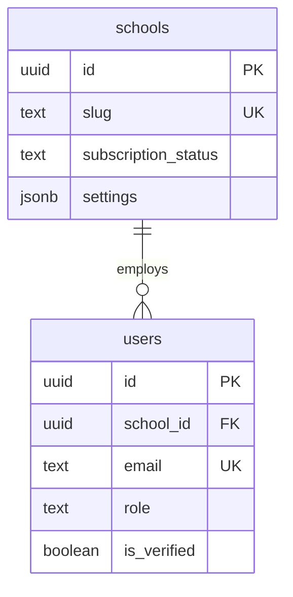

### People

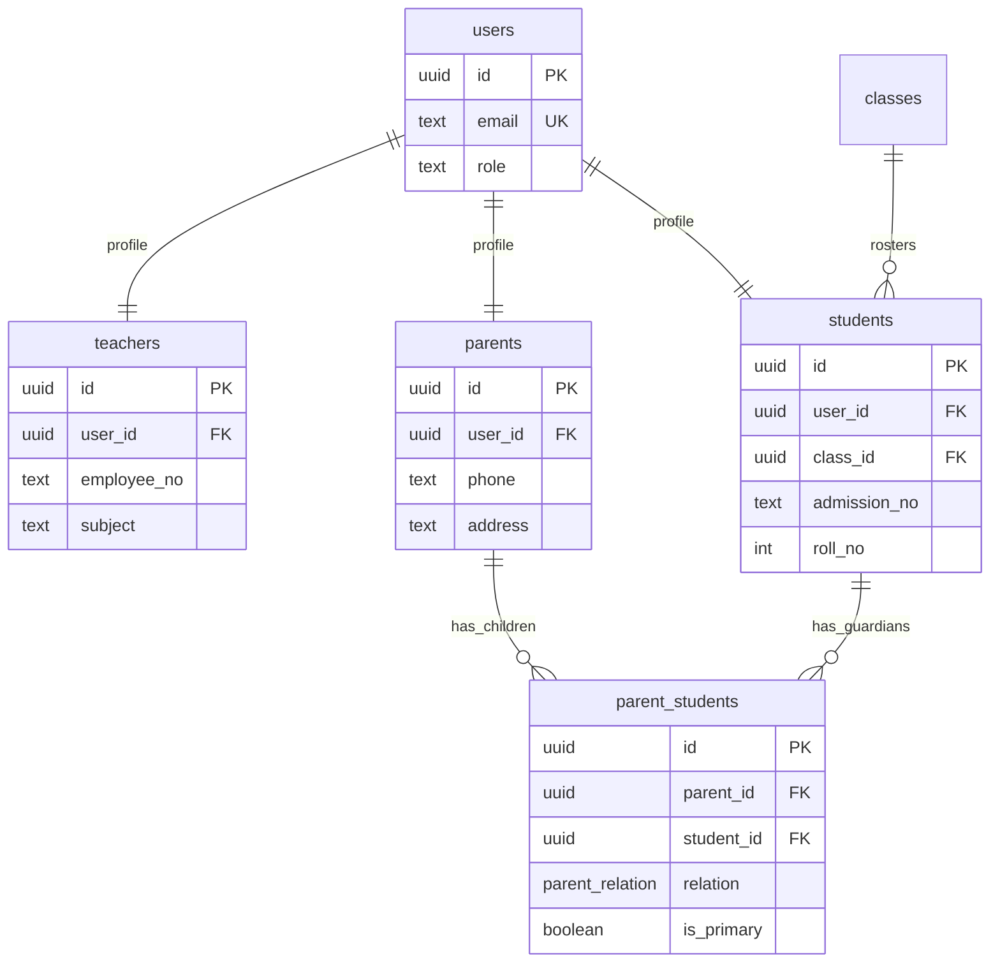

### Classes & Subjects

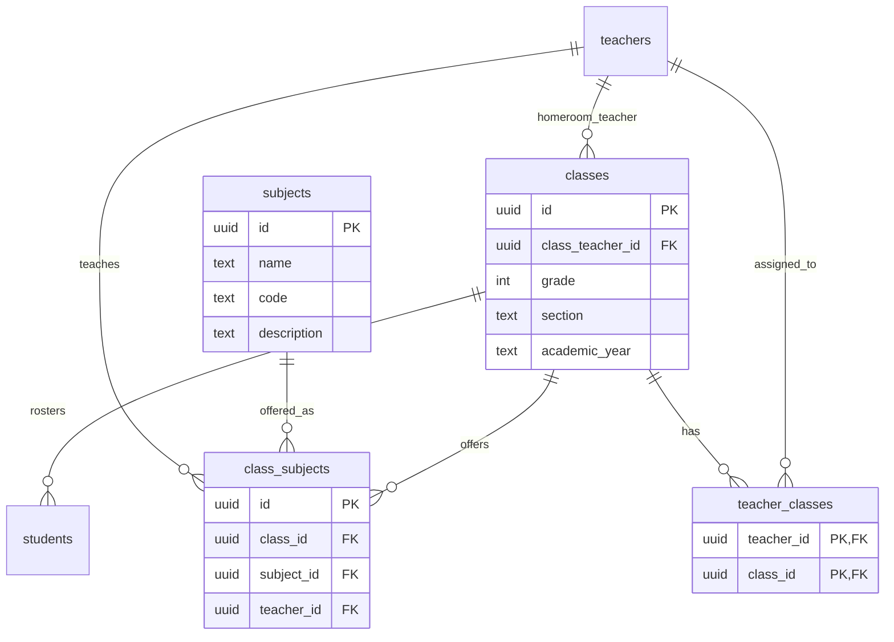

### Attendance

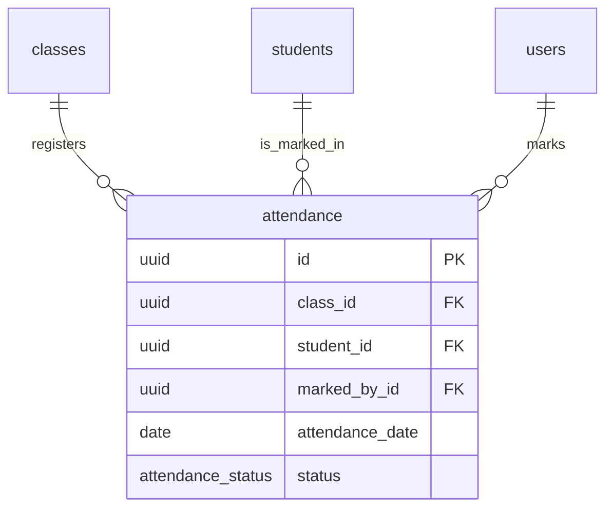

### Homework & Materials

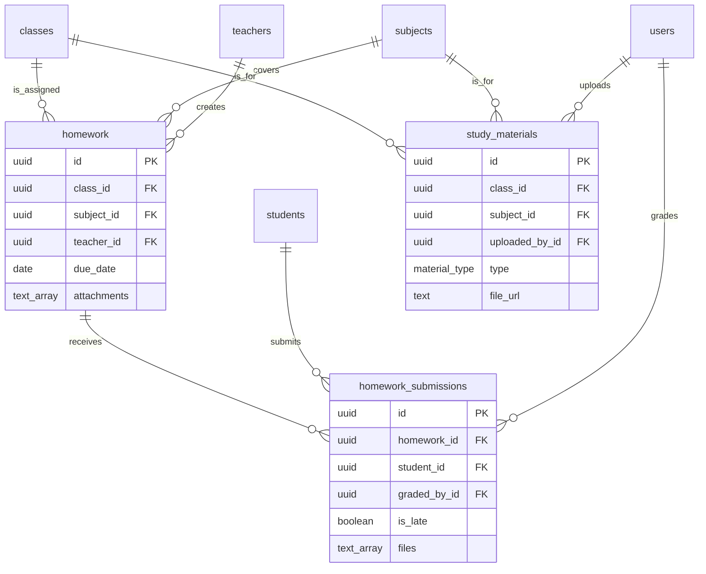

### Timetable

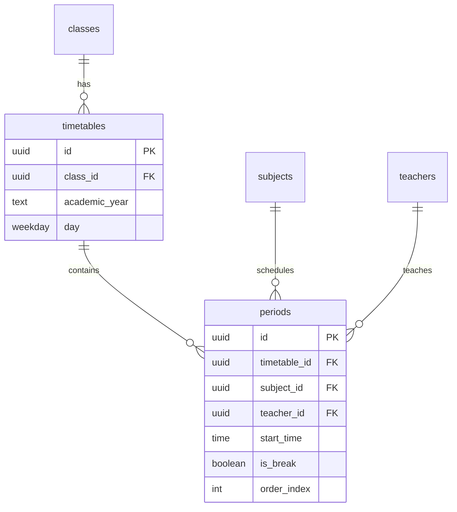

### Fees

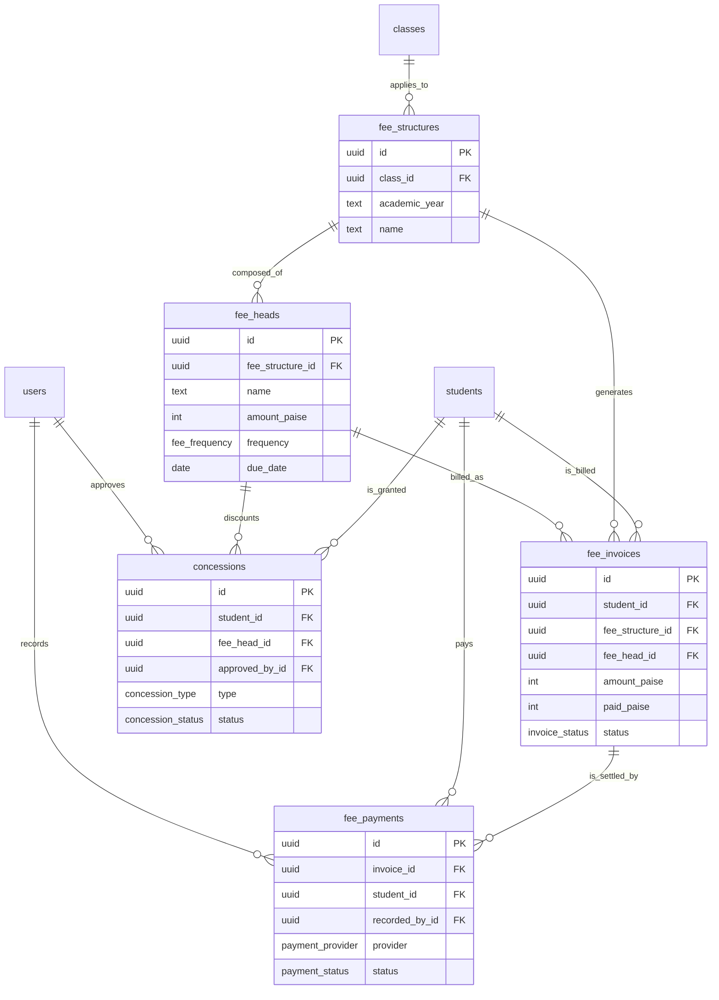

### Exams

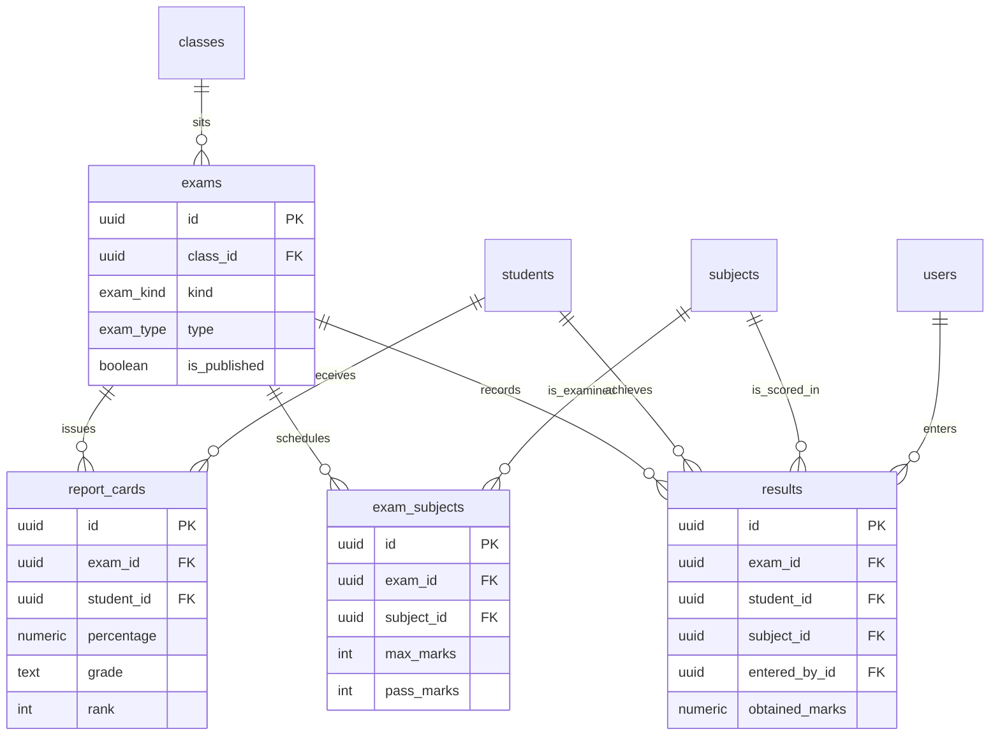

### Chat

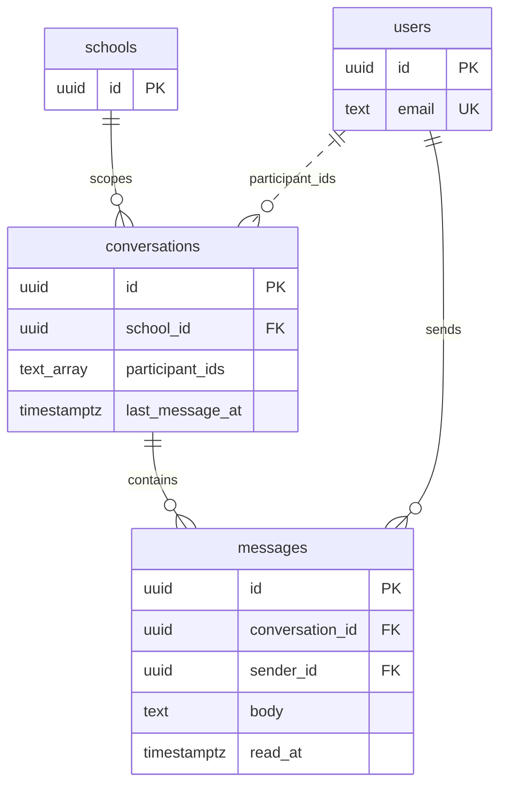

### Notices & Events

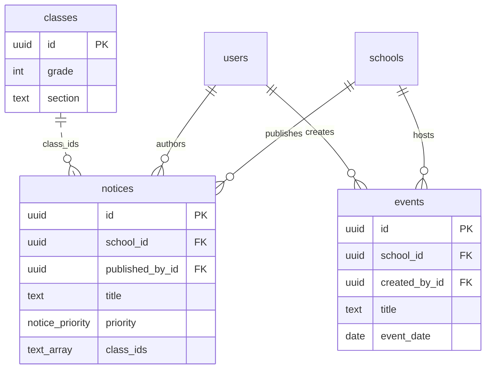

### AI

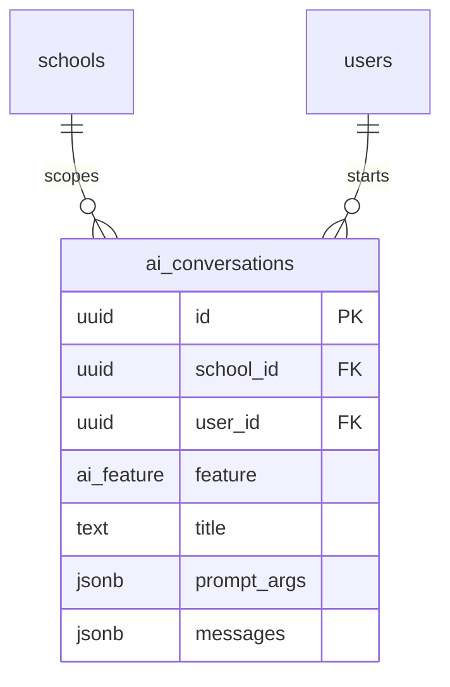

### Permissions

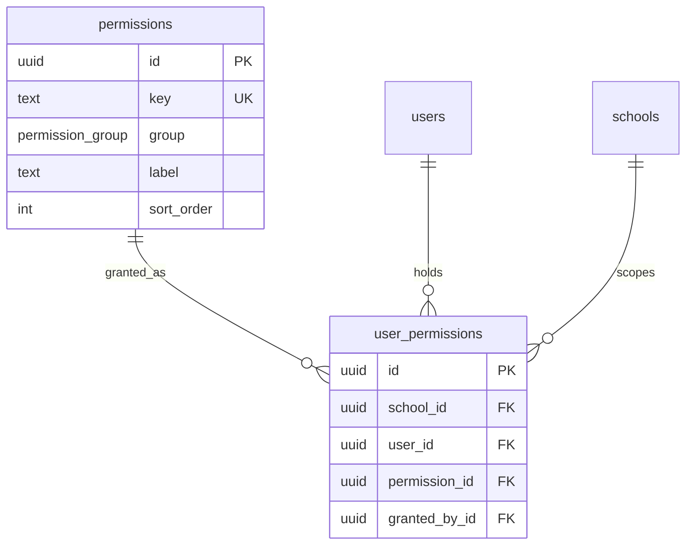

## 4. Foreign key map

Every enforced foreign key, as `Child.column → Parent.column · on delete`. **There are 84** — the
**2 logical links** in §5 are not constraints and are listed separately. The
action policy is the one in [`Database.md`](./Database.md) §1: `restrict` for anything carrying
history (attendance, invoices, marks, results) and for every tenant edge to `schools`; `cascade` only
for rows that cannot exist alone; `set null` for optional links and for nullable attribution columns.

| Child column                        | Parent column         | On delete |
| ----------------------------------- | --------------------- | --------- |
| `users.school_id`                   | → `schools.id`        | restrict  |
| `teachers.school_id`                | → `schools.id`        | restrict  |
| `teachers.user_id`                  | → `users.id`          | cascade   |
| `students.school_id`                | → `schools.id`        | restrict  |
| `students.user_id`                  | → `users.id`          | cascade   |
| `students.class_id`                 | → `classes.id`        | set null  |
| `parents.school_id`                 | → `schools.id`        | restrict  |
| `parents.user_id`                   | → `users.id`          | cascade   |
| `parent_students.school_id`         | → `schools.id`        | restrict  |
| `parent_students.parent_id`         | → `parents.id`        | cascade   |
| `parent_students.student_id`        | → `students.id`       | cascade   |
| `classes.school_id`                 | → `schools.id`        | restrict  |
| `classes.class_teacher_id`          | → `teachers.id`       | set null  |
| `subjects.school_id`                | → `schools.id`        | restrict  |
| `class_subjects.school_id`          | → `schools.id`        | restrict  |
| `class_subjects.class_id`           | → `classes.id`        | cascade   |
| `class_subjects.subject_id`         | → `subjects.id`       | cascade   |
| `class_subjects.teacher_id`         | → `teachers.id`       | set null  |
| `teacher_classes.teacher_id`        | → `teachers.id`       | cascade   |
| `teacher_classes.class_id`          | → `classes.id`        | cascade   |
| `attendance.school_id`              | → `schools.id`        | restrict  |
| `attendance.class_id`               | → `classes.id`        | restrict  |
| `attendance.student_id`             | → `students.id`       | restrict  |
| `attendance.marked_by_id`           | → `users.id`          | restrict  |
| `homework.school_id`                | → `schools.id`        | restrict  |
| `homework.class_id`                 | → `classes.id`        | restrict  |
| `homework.subject_id`               | → `subjects.id`       | restrict  |
| `homework.teacher_id`               | → `teachers.id`       | restrict  |
| `homework_submissions.school_id`    | → `schools.id`        | restrict  |
| `homework_submissions.homework_id`  | → `homework.id`       | cascade   |
| `homework_submissions.student_id`   | → `students.id`       | restrict  |
| `homework_submissions.graded_by_id` | → `users.id`          | set null  |
| `study_materials.school_id`         | → `schools.id`        | restrict  |
| `study_materials.class_id`          | → `classes.id`        | restrict  |
| `study_materials.subject_id`        | → `subjects.id`       | restrict  |
| `study_materials.uploaded_by_id`    | → `users.id`          | restrict  |
| `timetables.school_id`              | → `schools.id`        | restrict  |
| `timetables.class_id`               | → `classes.id`        | cascade   |
| `periods.school_id`                 | → `schools.id`        | restrict  |
| `periods.timetable_id`              | → `timetables.id`     | cascade   |
| `periods.subject_id`                | → `subjects.id`       | set null  |
| `periods.teacher_id`                | → `teachers.id`       | set null  |
| `fee_structures.school_id`          | → `schools.id`        | restrict  |
| `fee_structures.class_id`           | → `classes.id`        | restrict  |
| `fee_heads.school_id`               | → `schools.id`        | restrict  |
| `fee_heads.fee_structure_id`        | → `fee_structures.id` | cascade   |
| `fee_invoices.school_id`            | → `schools.id`        | restrict  |
| `fee_invoices.student_id`           | → `students.id`       | restrict  |
| `fee_invoices.fee_structure_id`     | → `fee_structures.id` | restrict  |
| `fee_invoices.fee_head_id`          | → `fee_heads.id`      | set null  |
| `fee_payments.school_id`            | → `schools.id`        | restrict  |
| `fee_payments.invoice_id`           | → `fee_invoices.id`   | restrict  |
| `fee_payments.student_id`           | → `students.id`       | restrict  |
| `fee_payments.recorded_by_id`       | → `users.id`          | set null  |
| `concessions.school_id`             | → `schools.id`        | restrict  |
| `concessions.student_id`            | → `students.id`       | restrict  |
| `concessions.fee_head_id`           | → `fee_heads.id`      | set null  |
| `concessions.approved_by_id`        | → `users.id`          | set null  |
| `exams.school_id`                   | → `schools.id`        | restrict  |
| `exams.class_id`                    | → `classes.id`        | restrict  |
| `exam_subjects.school_id`           | → `schools.id`        | restrict  |
| `exam_subjects.exam_id`             | → `exams.id`          | cascade   |
| `exam_subjects.subject_id`          | → `subjects.id`       | restrict  |
| `results.school_id`                 | → `schools.id`        | restrict  |
| `results.exam_id`                   | → `exams.id`          | restrict  |
| `results.student_id`                | → `students.id`       | restrict  |
| `results.subject_id`                | → `subjects.id`       | restrict  |
| `results.entered_by_id`             | → `users.id`          | set null  |
| `report_cards.school_id`            | → `schools.id`        | restrict  |
| `report_cards.exam_id`              | → `exams.id`          | cascade   |
| `report_cards.student_id`           | → `students.id`       | restrict  |
| `conversations.school_id`           | → `schools.id`        | restrict  |
| `messages.conversation_id`          | → `conversations.id`  | cascade   |
| `messages.sender_id`                | → `users.id`          | restrict  |
| `notices.school_id`                 | → `schools.id`        | restrict  |
| `notices.published_by_id`           | → `users.id`          | restrict  |
| `events.school_id`                  | → `schools.id`        | restrict  |
| `events.created_by_id`              | → `users.id`          | restrict  |
| `ai_conversations.school_id`        | → `schools.id`        | restrict  |
| `ai_conversations.user_id`          | → `users.id`          | cascade   |
| `user_permissions.school_id`        | → `schools.id`        | restrict  |
| `user_permissions.user_id`          | → `users.id`          | cascade   |
| `user_permissions.permission_id`    | → `permissions.id`    | cascade   |
| `user_permissions.granted_by_id`    | → `users.id`          | set null  |

Eighty-four keys in all: fifty-three `restrict`, nineteen `cascade`, twelve `set null`. The `restrict`
side is the twenty-eight tenant edges plus the twenty-five history columns that are not tenant edges.

## 5. Logical links

Relationships the mock keeps as an embedded array rather than a constraint. Each is drawn dotted, and
each maps to the table a real migration would normalise it into.

| Stored as                          | Mock location                           | Normalised into                                                                                                                                                                                      |
| ---------------------------------- | --------------------------------------- | ---------------------------------------------------------------------------------------------------------------------------------------------------------------------------------------------------- |
| `notices.classIds[]`               | `notices.class_ids`                     | `notice_classes(notice_id, class_id)` — a join row per targeted class; an absent row means every class in `audience`.                                                                                |
| `conversations.participantIds[]`   | `conversations.participant_ids`         | `conversation_participants(conversation_id, user_id, last_read_at)` — membership and the per-user read marker.                                                                                       |
| `ai_conversations.messages[]`      | `ai_conversations.messages` (jsonb)     | An `ai_messages(id, ai_conversation_id, role, content, created_at)` table, one row per stored turn.                                                                                                  |
| `schools.settings.gradingScheme[]` | `schools.settings` (jsonb)              | A `grade_bands(id, school_id, grade, min_percentage, sort_order)` table, one row per band.                                                                                                           |
| `homework.attachments[]`           | `homework.attachments` (`text[]`)       | An `attachments(id, owner_type, owner_id, url, created_at)` table, polymorphic over the owning content row.                                                                                          |
| `homework_submissions.files[]`     | `homework_submissions.files` (`text[]`) | The same `attachments` table, with `owner_type = 'submission'`.                                                                                                                                      |
| `ai_conversations.promptArgs`      | `ai_conversations.prompt_args` (jsonb)  | Left as JSONB: its keys differ per `feature`, so the DTO validates it against each tool's template rather than a table. If normalised, it would be `ai_prompt_args(ai_conversation_id, key, value)`. |

Two of these links join two stored tables directly and so appear as dotted lines in the full diagram:
`users ||..o{ conversations` (the participant array) and `classes ||..o{ notices` (the class-targeting
array). The rest reference data with no table of their own — a grade band, an attachment, an AI turn —
so they are described here only.

## 6. Cardinality notes

The relationships worth knowing, in the mock's own terms:

- **One user ↔ one profile row.** `teachers`, `students` and `parents` each hold a unique `user_id`, so
  an account maps to exactly one of them; an admin has none.
- **A class has one homeroom teacher.** `classes.class_teacher_id` names a single teacher;
  the same teacher may lead several classes, and `teacher_classes` holds the wider "takes this class"
  set separately from the homeroom.
- **A subject is taught in many classes, each with its own teacher.** `class_subjects` carries the
  teacher, so the same catalogue subject has a different `teacher_id` in every class that offers it.
- **A guardian links to many students and a student to many guardians.** `parent_students` is the
  many-to-many, with `relation` and `is_primary` on the join; a seed guardian carries two children.
- **One exam has many papers and many results.** `exams` fans out to `exam_subjects` (the schedule) and
  to `results` (one mark per student per subject); only a published `EXAM` also produces
  `report_cards`.
- **One invoice has many payments.** `fee_invoices` → `fee_payments` is one-to-many, so a `PARTIAL`
  invoice accumulates rows until it settles.
- **One timetable has many periods.** `timetables` is one day per class per academic year, and its
  `periods` are the day's slots, ordered by `order_index`.
