# Schema — Backend

**The mock adapter is the API of record in this project.** `frontend/src/services/mockAdapter.ts` answers every request the frontend makes, over the deterministic seed in `frontend/src/data/`, and the TypeScript shapes in `frontend/src/types/` are the contract the real NestJS/Supabase backend has to satisfy. This file is the deep, table-by-table reference for **what that mock actually stores**, written as the PostgreSQL/Supabase schema it stands in for. Where the mock's readable ids (`std_1`, `cls_1`) imply a shape, the real primary key is a `uuid` and the readable id is a seed convenience only.

Every table here is one the mock persists today. The five tables the real backend needs but the mock has never had — `otps`, `refresh_tokens`, `receipt_sequences`, `notice_classes`, `conversation_participants` — are catalogued separately in §16; they are planned, not part of the stored schema.

The mock stores **32 tables** — **28 non-junction tables** and **4 junction tables** (`parent_students`, `teacher_classes`, `class_subjects`, `user_permissions`) — one numbered section per feature group in §3–§14 and one flat list in §15. Alongside them sit **2 logical links** the mock keeps as an embedded array rather than as their own table: `conversations.participant_ids[]` stands in for `conversation_participants` and `notices.class_ids[]` stands in for `notice_classes`. The tables carry **84 enforced foreign keys**; the two embedded arrays are logical links, not constraints.

## 1. Conventions

**Identifiers.** `snake_case`, plural table names (`fee_invoices`, `homework_submissions`), singular column names. The API stays camelCase (`feeInvoices.feeStructureId`); services map between the two, and a column name is never exposed directly.

| Concept     | Postgres type                                    | Notes                                                                  |
| ----------- | ------------------------------------------------ | ---------------------------------------------------------------------- |
| Primary key | `uuid default gen_random_uuid()`                 | every table; junctions included                                        |
| Tenant      | `school_id uuid not null references schools(id)` | every tenant table; `schools` and `permissions` are the two exceptions |
| Money       | `integer` (minor unit)                           | never `float`; the column carries a `*Paise` suffix (`amount_paise`)   |
| Instant     | `timestamptz`                                    | `created_at default now()`, `updated_at` on write                      |
| Date only   | `date`                                           | ISO `YYYY-MM-DD`                                                       |
| Clock time  | `time`                                           | `HH:mm` 24-hour — timetable periods, event windows                     |
| Soft delete | `deleted_at timestamptz null`                    | the content tables only (see the per-table tags)                       |
| Embedded    | `jsonb` / `uuid[]` / `text[]`                    | structures the mock keeps in the row rather than in a child table      |
| Fixed sets  | Postgres enum                                    | §2 — values are `SCREAMING_SNAKE`, matching the frontend unions        |

**Money.** Amounts are held in integer minor units and every money column ends in `*Paise` (`amount_paise`, `paid_paise`, `discount_paise`). The seed builds them through `dollars(amount)` in `frontend/src/data/seed.ts`, which multiplies by 100.

> **Open question — currency.** The single demo tenant declares `currency: 'USD'` in `schools.settings`, and the seed helper is literally named `dollars`. Yet the money columns are suffixed `*Paise` and the demo's receipts read like rupee amounts (₹1,500.00 would be stored as `150000`). Either the declared currency is wrong and should be `INR`, or the `*Paise` suffix is wrong and the columns are currency-neutral minor units. This document keeps the mock's column names as they are and flags the mismatch rather than resolving it.

**Primary keys.** Every table has a surrogate `id uuid` primary key, including the four junction tables — `parent_students` (which carries `relation` and `is_primary`) and `user_permissions` both need their own row identity. `teacher_classes` and `class_subjects` do too, so membership can be inserted and removed one row at a time.

**Foreign keys.** Each FK is listed under its table's **Keys** with its `on delete` action; the full map is in [`Erd.md`](./Erd.md) §4. The policy:

| Situation                                                        | Action     | Why                                                              |
| ---------------------------------------------------------------- | ---------- | ---------------------------------------------------------------- |
| `schools.id` from any tenant table                               | `restrict` | a school purge must be deliberate, never an accidental cascade   |
| Attribution columns (`*_by_id`) that are nullable                | `set null` | the row survives its author; history stays intact                |
| Optional links (`class_id`, `class_teacher_id`, `fee_head_id`)   | `set null` | the dependent row is valid without the link                      |
| Composition — the child has no meaning alone                     | `cascade`  | `periods` under `timetables`, `fee_heads` under `fee_structures` |
| Anything carrying history (attendance, invoices, results, marks) | `restrict` | never silently destroy financial or academic records             |

**Indexes.** Every tenant table is indexed on `school_id` — as a single-column index or as the leading column of a composite — which is what a tenant guard needs. Indexes are named `idx_<table>_<columns>`; uniques are named the same way and marked `unique`.

**Soft delete.** `deleted_at timestamptz` sits on the content tables only — `schools`, `users`, `teachers`, `students`, `parents`, `homework`, `study_materials`, `messages`, `notices`, `events`. Financial and academic rows (`fee_invoices`, `fee_payments`, `results`, `report_cards`) are never deleted. Each table's tag states its soft-delete status.

**Diagram notation.** Mermaid ERD supports only `PK`/`FK`/`UK`, so composite and partial keys are listed under each table. A solid line (`||--o{`) is an enforced FK; a dotted line (`||..o{`) is a logical link with no constraint — used for the two embedded arrays (§11, §12).

## 2. Enums

The frontend's string-literal unions become Postgres enums where the value set is fixed and the column is stored. Values are `SCREAMING_SNAKE`.

| Enum                  | Values                                                                                                                 | Used by                                                |
| --------------------- | ---------------------------------------------------------------------------------------------------------------------- | ------------------------------------------------------ |
| `role`                | `ADMIN`, `TEACHER`, `STUDENT`, `PARENT`                                                                                | `users.role`                                           |
| `subscription_status` | `TRIAL`, `ACTIVE`, `SUSPENDED`, `CANCELLED`                                                                            | `schools.subscription_status`                          |
| `record_status`       | `ACTIVE`, `INACTIVE`                                                                                                   | `teachers.status`, `students.status`, `parents.status` |
| `gender`              | `MALE`, `FEMALE`, `OTHER`                                                                                              | `students.gender`                                      |
| `blood_group`         | `A+`, `A-`, `B+`, `B-`, `AB+`, `AB-`, `O+`, `O-`                                                                       | `students.blood_group`                                 |
| `parent_relation`     | `FATHER`, `MOTHER`, `GUARDIAN`                                                                                         | `parent_students.relation`                             |
| `attendance_status`   | `PRESENT`, `ABSENT`, `LEAVE`, `LATE`                                                                                   | `attendance.status`                                    |
| `fee_frequency`       | `MONTHLY`, `QUARTERLY`, `ANNUAL`, `ONE_TIME`                                                                           | `fee_heads.frequency`                                  |
| `invoice_status`      | `PENDING`, `PARTIAL`, `PAID`, `OVERDUE`                                                                                | `fee_invoices.status`                                  |
| `payment_status`      | `PENDING`, `PAID`, `FAILED`, `REFUNDED`                                                                                | `fee_payments.status`                                  |
| `payment_provider`    | `STRIPE`, `SSLCOMMERZ`, `MANUAL`                                                                                       | `fee_payments.provider`                                |
| `payment_method`      | `CARD`, `MOBILE_BANKING`, `NET_BANKING`, `CASH`, `CHEQUE`, `DEMAND_DRAFT`, `ONLINE`                                    | `fee_payments.method`                                  |
| `concession_type`     | `PERCENTAGE`, `FIXED`                                                                                                  | `concessions.type`                                     |
| `concession_category` | `SIBLING`, `MERIT`, `SC_ST`, `CUSTOM`, `STAFF_WARD`                                                                    | `concessions.category`                                 |
| `concession_status`   | `PENDING`, `APPROVED`, `REJECTED`                                                                                      | `concessions.status`                                   |
| `material_type`       | `PDF`, `NOTES`, `WORKSHEET`, `PAPER`                                                                                   | `study_materials.type`                                 |
| `exam_type`           | `UNIT`, `MID`, `FINAL`, `ANNUAL`                                                                                       | `exams.type`                                           |
| `exam_kind`           | `TEST`, `EXAM`                                                                                                         | `exams.kind`                                           |
| `weekday`             | `MON`, `TUE`, `WED`, `THU`, `FRI`, `SAT`, `SUN`                                                                        | `timetables.day`                                       |
| `notice_audience`     | `ALL`, `TEACHERS`, `STUDENTS`, `PARENTS`                                                                               | `notices.audience[]`, `events.audience[]`              |
| `notice_priority`     | `HIGH`, `MEDIUM`, `LOW`                                                                                                | `notices.priority`                                     |
| `permission_group`    | `STUDENTS`, `ATTENDANCE`, `EXAMS`, `HOMEWORK`, `TIMETABLE`, `FEES`, `NOTICES`, `MATERIALS`, `COMMUNICATION`, `REPORTS` | `permissions.group`                                    |
| `ai_feature`          | `CHAT`, `REPORT_COMMENT`, `FEE_REMINDER`, `NOTICE`, `EVENT_PLAN`, `HOMEWORK_HELP`, `QUIZ`                              | `ai_conversations.feature`                             |

**View-only unions — do not make these enums.** Several unions in `frontend/src/types/` describe how the UI renders a row, not a value the database stores. They must stay TypeScript-only: `IconTone` (`dashboard.ts`), `TrendDirection` (`dashboard.ts`), `ClassFeeStatus` (`fees.ts`, `'CLEAR' | InvoiceStatus` — a roll-up over invoices), `HomeworkStatus` (`homework.ts`, derived from `due_date`), `FeeStanding` (`people.ts`, a roster roll-up), `AiToolId` (`ai.ts`, the five assistant screens, a subset of `ai_feature`), and `CalendarEntry['kind']` (`dashboard.ts`, `'EVENT' | 'EXAM'`, derived from two different tables).

Two further unions live **inside `schools.settings`** (JSONB) and are validated in the DTO rather than by a Postgres type: `GradingScale` (`PERCENTAGE | LETTER | GPA`) and `TermStructure` (`SEMESTER | TRIMESTER | ANNUAL`). They are not enums here.

## 3. Foundation & Auth

The tenant root and the login identity. Every other table resolves its `school_id` back to `schools` and its `user_id` back to `users`.

<!-- table: schools · module: SchoolsModule · phase: 1 · tenant: no · soft-delete: yes -->

### `schools`

The tenant root — one row per registered school. The single demo tenant is `sch_brightfuture`, "Bright Future School".

| Column                | Type                  | Null | Default | Notes                                     |
| --------------------- | --------------------- | ---- | ------- | ----------------------------------------- |
| `id`                  | uuid                  | no   | —       | PK                                        |
| `name`                | text                  | no   | —       |                                           |
| `slug`                | text                  | no   | —       | auto-generated from name                  |
| `address`             | text                  | yes  | —       |                                           |
| `contact_email`       | text                  | yes  | —       |                                           |
| `contact_phone`       | text                  | yes  | —       |                                           |
| `logo_url`            | text                  | yes  | —       | Cloudinary                                |
| `subscription_status` | `subscription_status` | no   | `TRIAL` |                                           |
| `settings`            | jsonb                 | no   | `'{}'`  | the whole Settings screen, grouped by tab |
| `created_at`          | timestamptz           | no   | `now()` |                                           |
| `updated_at`          | timestamptz           | no   | —       | trigger                                   |
| `deleted_at`          | timestamptz           | yes  | —       | soft delete                               |

`settings` is one JSONB document and adds no column and no enum type. Its paths: `academicYear` (text, `'2026'`), `gradingScale`, `termStructure`, `passPercentage` (integer, `40`), `currency` (text, `'USD'` — see the open question in §1), `timezone` (`'Asia/Dhaka'`), `gradingScheme` (`{ grade, minPercentage }[]`, A+ → F), `notifications.*` (five booleans) and `security.*` (`sessionTimeoutMinutes` 30, `maxLoginAttempts` 5, `twoFactorEnabled` false). A write **merges** — an absent key keeps its previous value, so the settings tabs cannot overwrite one another.

**Keys** — PK `id` · no foreign keys (this _is_ the tenant) · `unique (slug)`.

**Indexes** — `idx_schools_slug` (`unique`), `idx_schools_subscription_status`.

**Constraints** — the only table without `school_id` besides `permissions`; every other tenant table's `school_id` points here with `on delete restrict`.

**Mock id format** — `sch_brightfuture`. A seed convenience; the real PK is a uuid.

**Diagram**

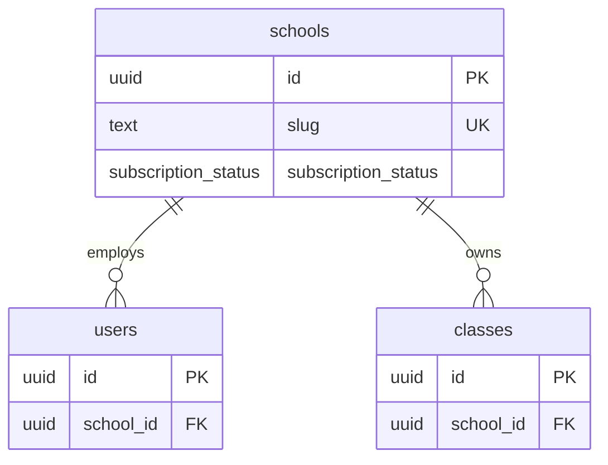
```mermaid
erDiagram
  schools ||--o{ users : "employs"
  schools ||--o{ classes : "owns"
  schools {
    uuid id PK
    text slug UK
    subscription_status subscription_status
  }
  users {
    uuid id PK
    uuid school_id FK
  }
  classes {
    uuid id PK
    uuid school_id FK
  }
```

<!-- table: users · module: AuthModule · phase: 1 · tenant: yes · soft-delete: yes -->

### `users`

Authentication identity for all four roles. One row per login — the demo school has 45 (`usr_admin_1`, eight `usr_tch_n`, 24 `usr_std_n`, twelve `usr_par_n`). `password_hash` (bcrypt) must never appear in a response.

| Column          | Type        | Null | Default | Notes                                                      |
| --------------- | ----------- | ---- | ------- | ---------------------------------------------------------- |
| `id`            | uuid        | no   | —       | PK                                                         |
| `school_id`     | uuid        | no   | —       | → `schools.id`                                             |
| `email`         | text        | no   | —       | globally unique; the login                                 |
| `password_hash` | text        | no   | —       | bcrypt                                                     |
| `role`          | `role`      | no   | —       | `ADMIN`…`PARENT`                                           |
| `is_verified`   | boolean     | no   | `false` | gates login until the invite/OTP is confirmed              |
| `profile_id`    | uuid        | yes  | —       | forward pointer at the profile row; null for admins        |
| `first_name`    | text        | no   | —       | denormalised from the profile (the mock keeps it here too) |
| `last_name`     | text        | no   | —       | denormalised from the profile                              |
| `class_id`      | uuid        | yes  | —       | the student's own class label; null for staff, see below   |
| `last_login_at` | timestamptz | yes  | —       |                                                            |
| `created_at`    | timestamptz | no   | `now()` |                                                            |
| `updated_at`    | timestamptz | no   | —       |                                                            |
| `deleted_at`    | timestamptz | yes  | —       | soft delete                                                |

**Keys** — PK `id` · FK `school_id` → `schools.id` (restrict) · `unique (email)`.

**Indexes** — `idx_users_email` (`unique`), `idx_users_school_id_role`.

**Constraints** — `email` is globally unique: the mock refuses a second account on the same address with 409 `STUDENT_EMAIL_TAKEN` / `TEACHER_EMAIL_TAKEN`. `profile_id` is **not** a single-table FK — it may point at `teachers.id`, `students.id` or `parents.id`, so it is a plain `uuid` whose target table is decided by `role`. `class_id` is the mock's convenience mirror of `students.class_id`; it is not an FK here, because a `users` row is not the owner of a class.

**Mock id format** — `usr_admin_1`, `usr_tch_1`…`usr_tch_8`, `usr_std_1`…`usr_std_24`, `usr_par_1`…`usr_par_12`. A seed convenience; the real PK is a uuid.

**Diagram**

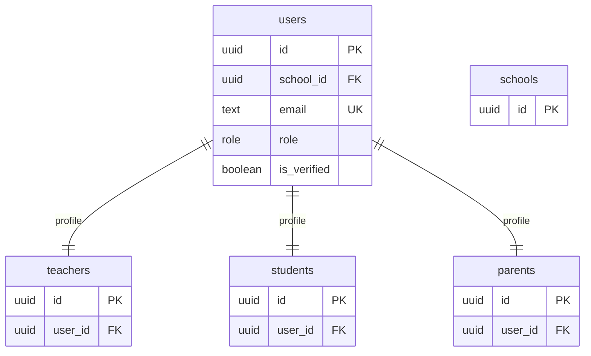
```mermaid
erDiagram
  users ||--|| teachers : "profile"
  users ||--|| students : "profile"
  users ||--|| parents : "profile"
  users {
    uuid id PK
    uuid school_id FK
    text email UK
    role role
    boolean is_verified
  }
  schools {
    uuid id PK
  }
  teachers {
    uuid id PK
    uuid user_id FK
  }
  students {
    uuid id PK
    uuid user_id FK
  }
  parents {
    uuid id PK
    uuid user_id FK
  }
```

## 4. People

The three profile tables — each 1:1 with `users` — plus the parent ↔ child join.

<!-- table: teachers · module: UsersModule · phase: 2 · tenant: yes · soft-delete: yes -->

### `teachers`

Teacher profile, 1:1 with `users`. `employee_no` comes from a per-school sequence. `subject` is the teacher's **primary** subject as free text (their profile, matched against the `subjects` catalogue by name) — not an FK; which classes a teacher takes lives in `teacher_classes`.

| Column             | Type            | Null | Default  | Notes               |
| ------------------ | --------------- | ---- | -------- | ------------------- |
| `id`               | uuid            | no   | —        | PK                  |
| `school_id`        | uuid            | no   | —        | → `schools.id`      |
| `user_id`          | uuid            | no   | —        | → `users.id`, 1:1   |
| `employee_no`      | text            | no   | —        | per-school sequence |
| `first_name`       | text            | no   | —        |                     |
| `last_name`        | text            | no   | —        |                     |
| `phone`            | text            | yes  | —        |                     |
| `qualification`    | text            | yes  | —        |                     |
| `subject`          | text            | yes  | —        | primary subject     |
| `experience_years` | integer         | yes  | —        | whole years         |
| `joined_at`        | date            | yes  | —        |                     |
| `status`           | `record_status` | no   | `ACTIVE` |                     |
| `created_at`       | timestamptz     | no   | `now()`  |                     |
| `updated_at`       | timestamptz     | no   | —        |                     |
| `deleted_at`       | timestamptz     | yes  | —        | soft delete         |

**Keys** — PK `id` · FK `school_id` → `schools.id` (restrict), `user_id` → `users.id` (cascade) · `unique (user_id)` (the 1:1 guard), `unique (school_id, employee_no)`.

**Indexes** — `idx_teachers_user_id` (`unique`), `idx_teachers_school_id_employee_no` (`unique`), `idx_teachers_school_id_status`.

**Constraints** — hard-deleting a `users` row cascades the profile; ordinary removal is the `deleted_at` soft delete. The mock's `tch_8` is seeded `INACTIVE`, so every list filters on `status`.

**Mock id format** — `tch_1`…`tch_8` with `EMP-0001`…`EMP-0008`. A seed convenience; the real PK is a uuid.

**Diagram**

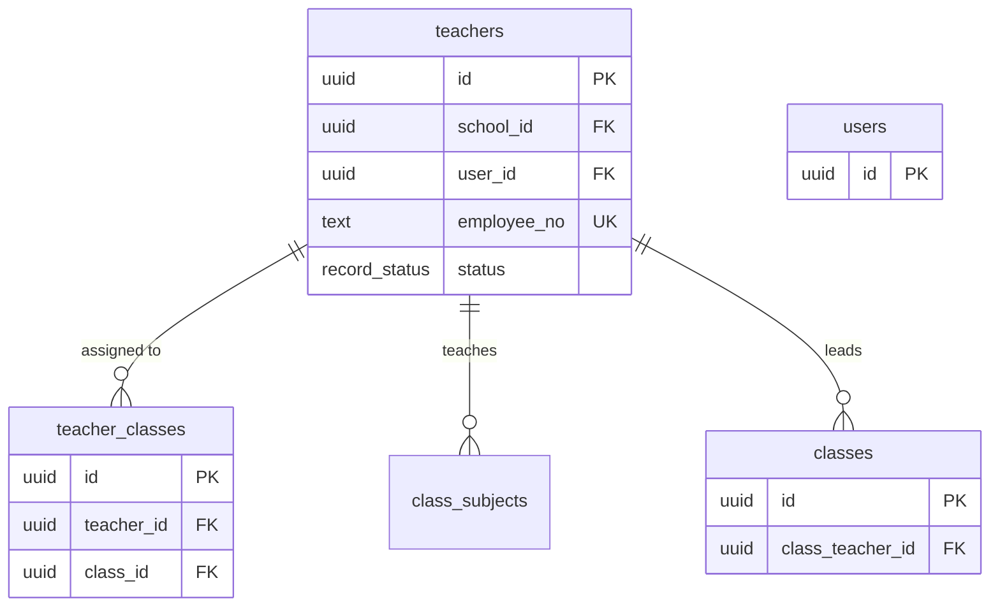
```mermaid
erDiagram
  teachers ||--o{ teacher_classes : "assigned to"
  teachers ||--o{ class_subjects : "teaches"
  teachers ||--o{ classes : "leads"
  teachers {
    uuid id PK
    uuid school_id FK
    uuid user_id FK
    text employee_no UK
    record_status status
  }
  users {
    uuid id PK
  }
  classes {
    uuid id PK
    uuid class_teacher_id FK
  }
  teacher_classes {
    uuid id PK
    uuid teacher_id FK
    uuid class_id FK
  }
```

<!-- table: students · module: UsersModule · phase: 2 · tenant: yes · soft-delete: yes -->

### `students`

Student profile, 1:1 with `users`. `class_id` is the student's **current** class — the roster. `admission_no` comes from a per-school sequence; `roll_no` is the position within their class and restarts with each class.

| Column          | Type            | Null | Default  | Notes                    |
| --------------- | --------------- | ---- | -------- | ------------------------ |
| `id`            | uuid            | no   | —        | PK                       |
| `school_id`     | uuid            | no   | —        | → `schools.id`           |
| `user_id`       | uuid            | no   | —        | → `users.id`, 1:1        |
| `class_id`      | uuid            | yes  | —        | → `classes.id`, nullable |
| `admission_no`  | text            | no   | —        | per-school sequence      |
| `roll_no`       | integer         | no   | —        | unique within the class  |
| `first_name`    | text            | no   | —        |                          |
| `last_name`     | text            | no   | —        |                          |
| `date_of_birth` | date            | yes  | —        |                          |
| `gender`        | `gender`        | yes  | —        | enum, §2                 |
| `blood_group`   | `blood_group`   | yes  | —        | enum, §2                 |
| `status`        | `record_status` | no   | `ACTIVE` |                          |
| `created_at`    | timestamptz     | no   | `now()`  |                          |
| `updated_at`    | timestamptz     | no   | —        |                          |
| `deleted_at`    | timestamptz     | yes  | —        | soft delete              |

**Keys** — PK `id` · FK `school_id` → `schools.id` (restrict), `user_id` → `users.id` (cascade), `class_id` → `classes.id` (set null) · `unique (user_id)`, `unique (school_id, admission_no)`.

**Indexes** — `idx_students_user_id` (`unique`), `idx_students_school_id_admission_no` (`unique`), `idx_students_school_id_status`, `idx_students_class_id`, `idx_students_class_id_roll_no` (`unique`, partial `where deleted_at is null`) — a removed student's roll number frees up without the old row blocking it.

**Constraints** — `roll_no >= 1` and unique within its class; leaving it blank takes the next free slot. The mock enforces this in code (`rollTaken`) and answers 409 `STUDENT_ROLL_TAKEN` rather than letting the index error surface. `status = 'INACTIVE'` is the roster's removal — a "soft-deleted student keeps their row but leaves the roster".

**Mock id format** — `std_1`…`std_24` with `ADM-0001`…`ADM-0024`. A seed convenience; the real PK is a uuid.

**Diagram**

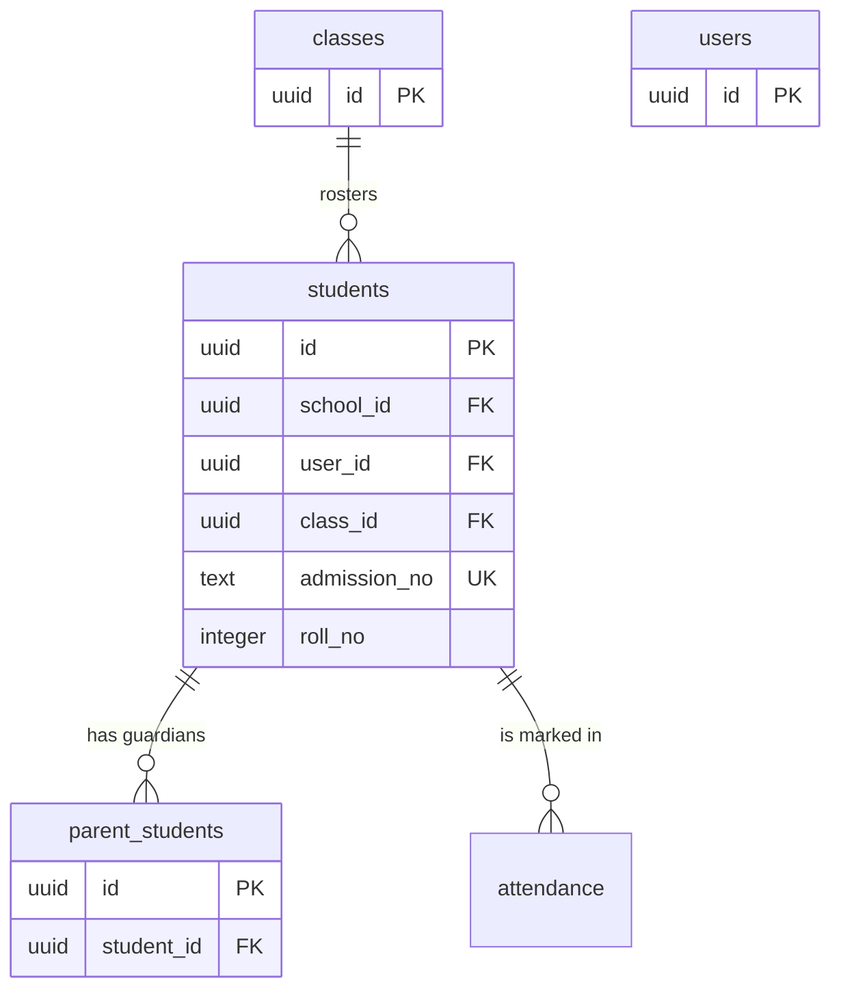
```mermaid
erDiagram
  classes ||--o{ students : "rosters"
  students ||--o{ parent_students : "has guardians"
  students ||--o{ attendance : "is marked in"
  students {
    uuid id PK
    uuid school_id FK
    uuid user_id FK
    uuid class_id FK
    text admission_no UK
    integer roll_no
  }
  users {
    uuid id PK
  }
  classes {
    uuid id PK
  }
  parent_students {
    uuid id PK
    uuid student_id FK
  }
```

<!-- table: parents · module: UsersModule · phase: 2 · tenant: yes · soft-delete: yes -->

### `parents`

Parent/guardian profile, 1:1 with `users`, linked to children through `parent_students`. Unlike the design target, the mock keeps a denormalised `email` on the profile as well as on `users`.

| Column       | Type            | Null | Default  | Notes                 |
| ------------ | --------------- | ---- | -------- | --------------------- |
| `id`         | uuid            | no   | —        | PK                    |
| `school_id`  | uuid            | no   | —        | → `schools.id`        |
| `user_id`    | uuid            | no   | —        | → `users.id`, 1:1     |
| `first_name` | text            | no   | —        |                       |
| `last_name`  | text            | no   | —        |                       |
| `email`      | text            | yes  | —        | copy of `users.email` |
| `phone`      | text            | yes  | —        |                       |
| `address`    | text            | yes  | —        |                       |
| `occupation` | text            | yes  | —        |                       |
| `status`     | `record_status` | no   | `ACTIVE` |                       |
| `created_at` | timestamptz     | no   | `now()`  |                       |
| `updated_at` | timestamptz     | no   | —        |                       |
| `deleted_at` | timestamptz     | yes  | —        | soft delete           |

**Keys** — PK `id` · FK `school_id` → `schools.id` (restrict), `user_id` → `users.id` (cascade) · `unique (user_id)` (1:1).

**Indexes** — `idx_parents_user_id` (`unique`), `idx_parents_school_id_status`, `idx_parents_email`.

**Constraints** — no natural business key; a phone number is not unique across parents. `email` is a non-unique copy of the login address, matched by the mock when an enrolment links an existing guardian (`upsertGuardian`).

**Mock id format** — `par_1`…`par_12`. A seed convenience; the real PK is a uuid.

**Diagram**

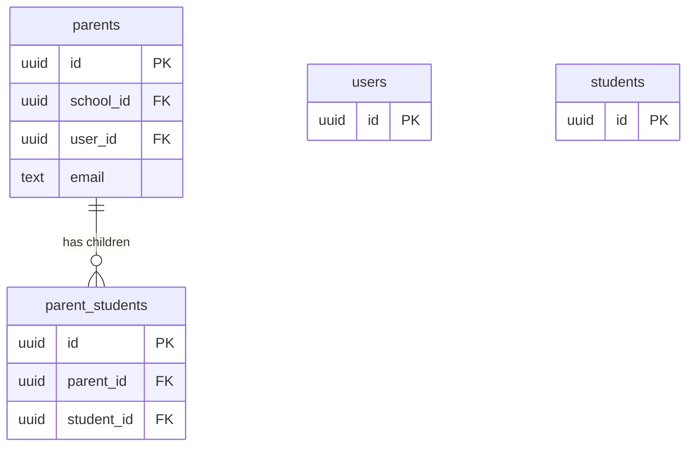
```mermaid
erDiagram
  parents ||--o{ parent_students : "has children"
  parents {
    uuid id PK
    uuid school_id FK
    uuid user_id FK
    text email
  }
  users {
    uuid id PK
  }
  students {
    uuid id PK
  }
  parent_students {
    uuid id PK
    uuid parent_id FK
    uuid student_id FK
  }
```

<!-- table: parent_students · module: UsersModule · phase: 2 · tenant: yes · soft-delete: no -->

### `parent_students` — junction

Join table resolving parent ↔ child (many-to-many). Drives every guardian read: attendance, fees, homework and results for each linked child. The mock seeds twelve guardians, each linked to two children.

| Column       | Type              | Null | Default | Notes               |
| ------------ | ----------------- | ---- | ------- | ------------------- |
| `id`         | uuid              | no   | —       | PK                  |
| `school_id`  | uuid              | no   | —       | → `schools.id`      |
| `parent_id`  | uuid              | no   | —       | → `parents.id`      |
| `student_id` | uuid              | no   | —       | → `students.id`     |
| `relation`   | `parent_relation` | no   | —       | `FATHER`…`GUARDIAN` |
| `is_primary` | boolean           | no   | `false` | the main contact    |
| `created_at` | timestamptz       | no   | `now()` |                     |

**Keys** — PK `id` (surrogate, because the row carries attributes) · FK `school_id` → `schools.id` (restrict), `parent_id` → `parents.id` (cascade), `student_id` → `students.id` (cascade) · `unique (parent_id, student_id)`.

**Indexes** — `idx_parent_students_parent_id_student_id` (`unique`), `idx_parent_students_student_id`, `idx_parent_students_school_id`.

**Constraints** — one primary contact per student: partial unique on `(student_id) where is_primary`. The mock resolves a student's guardian as the link whose `is_primary` is true.

**Mock id format** — `psl_{parentIndex}_{childIndex}`, e.g. `psl_1_1`, `psl_1_13`. A seed convenience; the real PK is a uuid.

**Diagram**

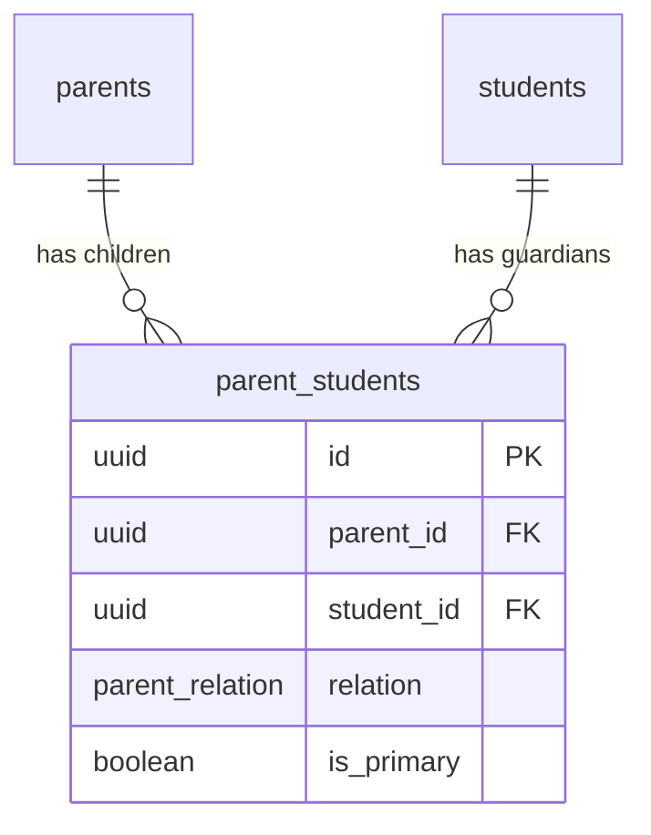
```mermaid
erDiagram
  parents ||--o{ parent_students : "has children"
  students ||--o{ parent_students : "has guardians"
  parent_students {
    uuid id PK
    uuid parent_id FK
    uuid student_id FK
    parent_relation relation
    boolean is_primary
  }
```

## 5. Classes & Subjects

The class roster, the school's subject catalogue, and the two assignment joins between teachers, classes and subjects.

<!-- table: classes · module: ClassesModule · phase: 2 · tenant: yes · soft-delete: no -->

### `classes`

A grade + section for one academic year (grade 5, section A, 2026). The demo school runs grades 1–10, each with an A and a B section — 20 classes. The class teacher is assignable; students attach via `students.class_id`.

| Column             | Type        | Null | Default | Notes           |
| ------------------ | ----------- | ---- | ------- | --------------- |
| `id`               | uuid        | no   | —       | PK              |
| `school_id`        | uuid        | no   | —       | → `schools.id`  |
| `class_teacher_id` | uuid        | yes  | —       | → `teachers.id` |
| `academic_year`    | text        | no   | —       | e.g. `2026`     |
| `grade`            | integer     | no   | —       | e.g. `5`        |
| `section`          | text        | no   | —       | e.g. `A`        |
| `created_at`       | timestamptz | no   | `now()` |                 |
| `updated_at`       | timestamptz | no   | —       |                 |

**Keys** — PK `id` · FK `school_id` → `schools.id` (restrict), `class_teacher_id` → `teachers.id` (set null) · `unique (school_id, grade, section, academic_year)`.

**Indexes** — `idx_classes_school_id_grade_section_academic_year` (`unique`), `idx_classes_school_id`, `idx_classes_class_teacher_id`.

**Constraints** — `class_teacher_id` is nullable so a class can exist before a teacher is assigned. The class list is built from `lib/options.ts` (`CLASS_GRADES`, `CLASS_SECTIONS`), so the catalogue and the classes can never disagree.

**Mock id format** — `cls_1`…`cls_20`, assigned in grade/section order (grade 1 A = `cls_1`). A seed convenience; the real PK is a uuid.

**Diagram**

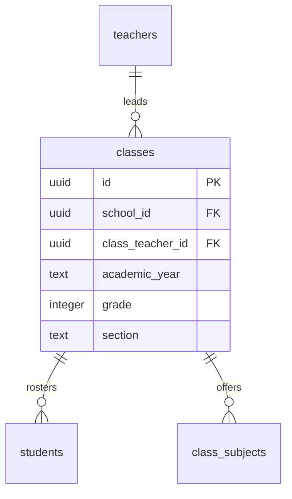
```mermaid
erDiagram
  classes ||--o{ students : "rosters"
  classes ||--o{ class_subjects : "offers"
  teachers ||--o{ classes : "leads"
  classes {
    uuid id PK
    uuid school_id FK
    uuid class_teacher_id FK
    text academic_year
    integer grade
    text section
  }
```

<!-- table: subjects · module: ClassesModule · phase: 2 · tenant: yes · soft-delete: no -->

### `subjects`

The school's **subject catalogue** — school-wide, not a per-class copy. Name and code are the school's own (`MATH`, `ART`), so both are data the admin edits rather than an enum. The demo catalogue holds fifteen subjects.

| Column        | Type        | Null | Default | Notes              |
| ------------- | ----------- | ---- | ------- | ------------------ |
| `id`          | uuid        | no   | —       | PK                 |
| `school_id`   | uuid        | no   | —       | → `schools.id`     |
| `name`        | text        | no   | —       | e.g. `Mathematics` |
| `code`        | text        | no   | —       | e.g. `MATH`        |
| `description` | text        | yes  | —       |                    |
| `created_at`  | timestamptz | no   | `now()` |                    |
| `updated_at`  | timestamptz | no   | —       |                    |

**Keys** — PK `id` · FK `school_id` → `schools.id` (restrict) · `unique (school_id, code)`, `unique (school_id, name)`.

**Indexes** — `idx_subjects_school_id_code` (`unique`), `idx_subjects_school_id_name` (`unique`), `idx_subjects_school_id`.

**Constraints** — `code` is 2–6 alphanumerics (`SUBJECT_CODE_PATTERN` = `/^[A-Za-z0-9]{2,6}$/`); name and code are unique per school and compared **case-insensitively** (`Math` cannot shadow `MATH`), refused with 409 `SUBJECT_NAME_TAKEN` / `SUBJECT_CODE_TAKEN`. A subject still referenced by a `periods`, `homework`, `study_materials`, `exam_subjects` or `results` row cannot be deleted — 409 `SUBJECT_IN_USE` (the `restrict` side of five FKs).

**Mock id format** — `subj_{code-lowercase}`, e.g. `subj_math`, `subj_eng`. A seed convenience; the real PK is a uuid.

**Diagram**

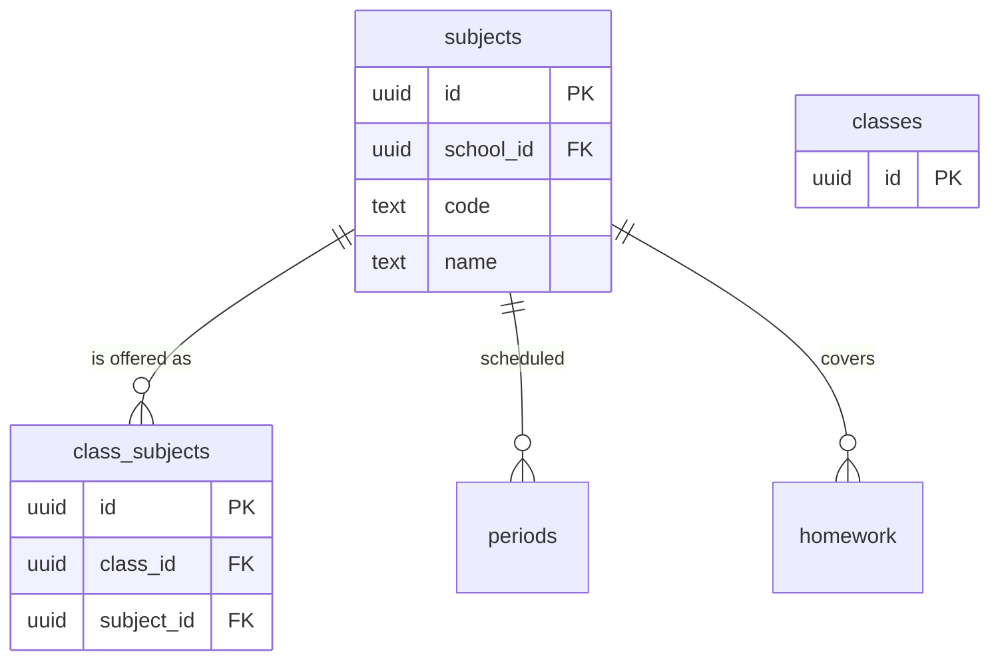
```mermaid
erDiagram
  subjects ||--o{ class_subjects : "is offered as"
  subjects ||--o{ periods : "scheduled"
  subjects ||--o{ homework : "covers"
  subjects {
    uuid id PK
    uuid school_id FK
    text code
    text name
  }
  classes {
    uuid id PK
  }
  class_subjects {
    uuid id PK
    uuid class_id FK
    uuid subject_id FK
  }
```

<!-- table: class_subjects · module: ClassesModule · phase: 2 · tenant: yes · soft-delete: no -->

### `class_subjects` — junction

Which subjects one class runs — the **assignment** the Subjects & Classes module edits. A catalogue subject exists once; every class that teaches it gets a row here. The teacher lives on this row rather than on the subject, because the same subject is taught by different staff in each class.

| Column       | Type        | Null | Default | Notes           |
| ------------ | ----------- | ---- | ------- | --------------- |
| `id`         | uuid        | no   | —       | PK              |
| `school_id`  | uuid        | no   | —       | → `schools.id`  |
| `class_id`   | uuid        | no   | —       | → `classes.id`  |
| `subject_id` | uuid        | no   | —       | → `subjects.id` |
| `teacher_id` | uuid        | yes  | —       | → `teachers.id` |
| `created_at` | timestamptz | no   | `now()` |                 |

**Keys** — PK `id` · FK `school_id` → `schools.id` (restrict), `class_id` → `classes.id` (cascade), `subject_id` → `subjects.id` (cascade), `teacher_id` → `teachers.id` (set null) · `unique (class_id, subject_id)`.

**Indexes** — `idx_class_subjects_class_id_subject_id` (`unique`), `idx_class_subjects_school_id`, `idx_class_subjects_subject_id`, `idx_class_subjects_teacher_id`.

**Constraints** — a class appears at most once per subject. The pair is what every other module validates against: a homework, material, lesson or exam paper on a subject the class does not run is refused with a 400 (`classSubjectFor`). Bulk assignment inserts only the missing pairs, so a repeated run is a no-op — the mock's `addAssignments` skips an existing pair.

**Mock id format** — `cs_{classIndex}_{code-lowercase}`, e.g. `cs_1_math`. A seed convenience; the real PK is a uuid.

**Diagram**

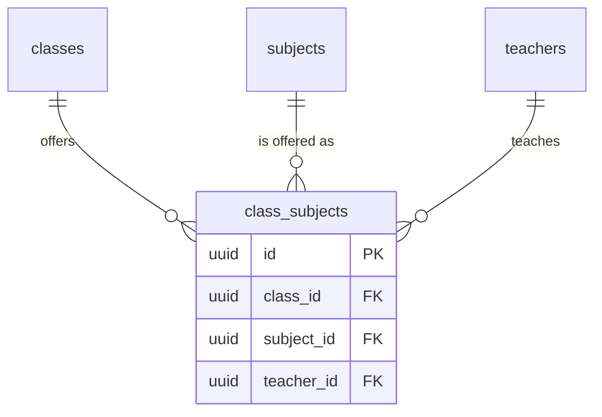
```mermaid
erDiagram
  classes ||--o{ class_subjects : "offers"
  subjects ||--o{ class_subjects : "is offered as"
  teachers ||--o{ class_subjects : "teaches"
  class_subjects {
    uuid id PK
    uuid class_id FK
    uuid subject_id FK
    uuid teacher_id FK
  }
```

<!-- table: teacher_classes · module: UsersModule · phase: 2 · tenant: yes · soft-delete: no -->

### `teacher_classes` — junction

Which classes a teacher takes — separate from `classes.class_teacher_id`, which records the one homeroom teacher per class. A teacher can teach in several classes without leading any of them.

| Column       | Type        | Null | Default | Notes                |
| ------------ | ----------- | ---- | ------- | -------------------- |
| `id`         | uuid        | no   | —       | PK                   |
| `teacher_id` | uuid        | no   | —       | → `teachers.id`      |
| `class_id`   | uuid        | no   | —       | → `classes.id`       |
| `created_at` | timestamptz | no   | `now()` | assignment timestamp |

**Keys** — PK `id` · FK `teacher_id` → `teachers.id` (cascade), `class_id` → `classes.id` (cascade) · `unique (teacher_id, class_id)`.

**Indexes** — `idx_teacher_classes_teacher_id_class_id` (`unique`), `idx_teacher_classes_class_id`.

**Constraints** — a teacher appears at most once per class. Like the mock's `TeacherClass`, the table carries **no `school_id`**: it inherits the tenant through `class_id`. The enrolment form sends the whole set it ended with, so an edit replaces the rows rather than merging them. The mock does not guard against duplicates when it pushes a new pair (`teacherClasses.push({ teacherId, classId })`), so the unique index is a real hardening.

**Mock id format** — none: the seed stores a bare pair `{ teacherId, classId }` with no readable id. The real PK is a uuid.

**Diagram**

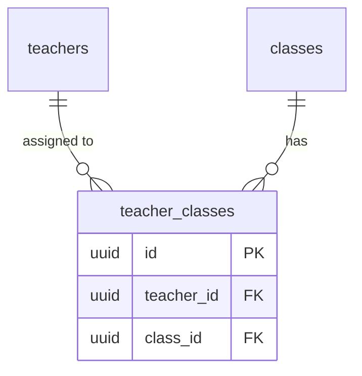
```mermaid
erDiagram
  teachers ||--o{ teacher_classes : "assigned to"
  classes ||--o{ teacher_classes : "has"
  teacher_classes {
    uuid id PK
    uuid teacher_id FK
    uuid class_id FK
  }
```

## 6. Attendance

<!-- table: attendance · module: AttendanceModule · phase: 3 · tenant: yes · soft-delete: no -->

### `attendance`

One row per student per class per day. Bulk marking **upserts** on the unique key, so re-marking the same register is idempotent. Attendance percentages and defaulter lists are aggregations, not stored columns.

| Column            | Type                | Null | Default | Notes             |
| ----------------- | ------------------- | ---- | ------- | ----------------- |
| `id`              | uuid                | no   | —       | PK                |
| `school_id`       | uuid                | no   | —       | → `schools.id`    |
| `class_id`        | uuid                | no   | —       | → `classes.id`    |
| `student_id`      | uuid                | no   | —       | → `students.id`   |
| `marked_by_id`    | uuid                | no   | —       | → `users.id`      |
| `attendance_date` | date                | no   | —       |                   |
| `status`          | `attendance_status` | no   | —       | `PRESENT`…`LATE`  |
| `note`            | text                | yes  | —       | leave/late reason |
| `created_at`      | timestamptz         | no   | `now()` |                   |
| `updated_at`      | timestamptz         | no   | —       |                   |

**Keys** — PK `id` · FK `school_id` → `schools.id` (restrict), `class_id` → `classes.id` (restrict), `student_id` → `students.id` (restrict), `marked_by_id` → `users.id` (restrict) · `unique (class_id, student_id, attendance_date)`.

**Indexes** — `idx_attendance_class_id_student_id_attendance_date` (`unique`), `idx_attendance_school_id_attendance_date`, `idx_attendance_class_id_attendance_date`, `idx_attendance_student_id_attendance_date`.

**Constraints** — **the mock upserts on `(student_id, attendance_date)`** (`POST /attendance` finds an existing row by `studentId` + `attendanceDate` and updates it in place, else pushes a new one); the unique key above is its declared form. A record whose `student_id` is not on the class's roster is refused with 400 `ATTENDANCE_INVALID`, and the whole batch is validated before any write, so a bad record cannot leave the day half-written. `class_id` is stored **in addition to** `students.class_id` on purpose: history must stay correct after a student changes class mid-year. Marking is staff-only (403 `ATTENDANCE_FORBIDDEN`).

**Mock id format** — `att_{studentId}_{date}`, e.g. `att_std_1_2026-05-04`. A seed convenience; the real PK is a uuid.

**Diagram**

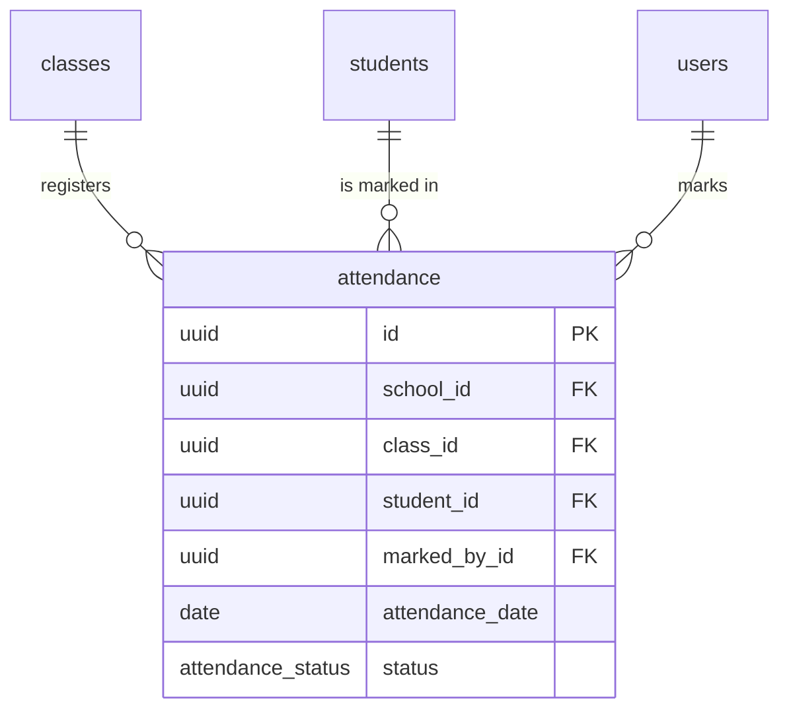
```mermaid
erDiagram
  classes ||--o{ attendance : "registers"
  students ||--o{ attendance : "is marked in"
  users ||--o{ attendance : "marks"
  attendance {
    uuid id PK
    uuid school_id FK
    uuid class_id FK
    uuid student_id FK
    uuid marked_by_id FK
    date attendance_date
    attendance_status status
  }
```

## 7. Homework & Materials

<!-- table: homework · module: HomeworkModule · phase: 3 · tenant: yes · soft-delete: yes -->

### `homework`

An assignment posted by a teacher to one class + subject. `attachments` holds Cloudinary URLs; `due_date` is the late-submission boundary and `max_marks` is the optional ceiling a graded submission is scored against.

| Column        | Type        | Null | Default | Notes           |
| ------------- | ----------- | ---- | ------- | --------------- |
| `id`          | uuid        | no   | —       | PK              |
| `school_id`   | uuid        | no   | —       | → `schools.id`  |
| `class_id`    | uuid        | no   | —       | → `classes.id`  |
| `subject_id`  | uuid        | no   | —       | → `subjects.id` |
| `teacher_id`  | uuid        | no   | —       | → `teachers.id` |
| `title`       | text        | no   | —       |                 |
| `description` | text        | yes  | —       |                 |
| `due_date`    | date        | no   | —       |                 |
| `max_marks`   | integer     | yes  | —       | optional marks  |
| `attachments` | text[]      | no   | `'{}'`  | Cloudinary URLs |
| `created_at`  | timestamptz | no   | `now()` |                 |
| `updated_at`  | timestamptz | no   | —       |                 |
| `deleted_at`  | timestamptz | yes  | —       | soft delete     |

**Keys** — PK `id` · FK `school_id` → `schools.id` (restrict), `class_id` → `classes.id` (restrict), `subject_id` → `subjects.id` (restrict), `teacher_id` → `teachers.id` (restrict).

**Indexes** — `idx_homework_school_id_class_id_due_date`, `idx_homework_class_id_subject_id_due_date`, `idx_homework_teacher_id`.

**Constraints** — `check (max_marks is null or max_marks > 0)`; the mock refuses a non-positive `maxMarks` with 400 `HOMEWORK_INVALID`. The `(class_id, subject_id)` pair must be a `class_subjects` row (mock: `classSubjectFor`). No natural key; deletion is soft so submissions keep their parent, and the list filters on `deleted_at is null`.

**Mock id format** — `hw_1`…`hw_12`. A seed convenience; the real PK is a uuid.

**Diagram**

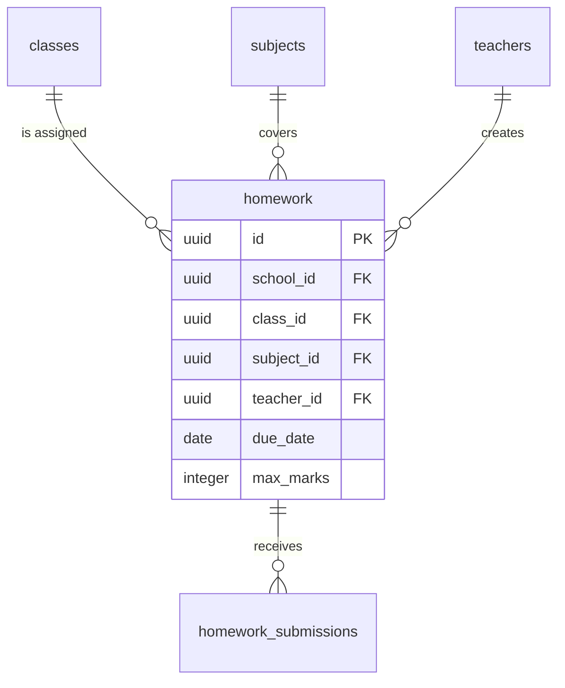
```mermaid
erDiagram
  classes ||--o{ homework : "is assigned"
  subjects ||--o{ homework : "covers"
  teachers ||--o{ homework : "creates"
  homework ||--o{ homework_submissions : "receives"
  homework {
    uuid id PK
    uuid school_id FK
    uuid class_id FK
    uuid subject_id FK
    uuid teacher_id FK
    date due_date
    integer max_marks
  }
```

<!-- table: homework_submissions · module: HomeworkModule · phase: 3 · tenant: yes · soft-delete: no -->

### `homework_submissions`

A student's answer to one assignment. `is_late` is computed on insert against `homework.due_date`. The teacher's submitted-vs-pending count is an aggregate over this table.

| Column         | Type        | Null | Default | Notes           |
| -------------- | ----------- | ---- | ------- | --------------- |
| `id`           | uuid        | no   | —       | PK              |
| `school_id`    | uuid        | no   | —       | → `schools.id`  |
| `homework_id`  | uuid        | no   | —       | → `homework.id` |
| `student_id`   | uuid        | no   | —       | → `students.id` |
| `files`        | text[]      | no   | `'{}'`  | Cloudinary URLs |
| `submitted_at` | timestamptz | no   | —       |                 |
| `is_late`      | boolean     | no   | `false` |                 |
| `grade`        | text        | yes  | —       |                 |
| `remarks`      | text        | yes  | —       |                 |
| `graded_by_id` | uuid        | yes  | —       | → `users.id`    |
| `graded_at`    | timestamptz | yes  | —       |                 |
| `created_at`   | timestamptz | no   | `now()` |                 |
| `updated_at`   | timestamptz | no   | —       |                 |

**Keys** — PK `id` · FK `school_id` → `schools.id` (restrict), `homework_id` → `homework.id` (cascade), `student_id` → `students.id` (restrict), `graded_by_id` → `users.id` (set null) · `unique (homework_id, student_id)`.

**Indexes** — `idx_homework_submissions_homework_id_student_id` (`unique`), `idx_homework_submissions_school_id`, `idx_homework_submissions_student_id`.

**Constraints** — one submission per student per assignment. A child row's `student_id` must equal its parent row's `student_id` roster-wise: the mock grades the student only through the assignment's class pair, so a submission belongs to a student on `homework.class_id`. `grade` / `remarks` / `graded_*` are null until graded.

**Mock id format** — `hws_{homeworkId}_{studentId}`, e.g. `hws_hw_1_std_1`. A seed convenience; the real PK is a uuid.

**Diagram**

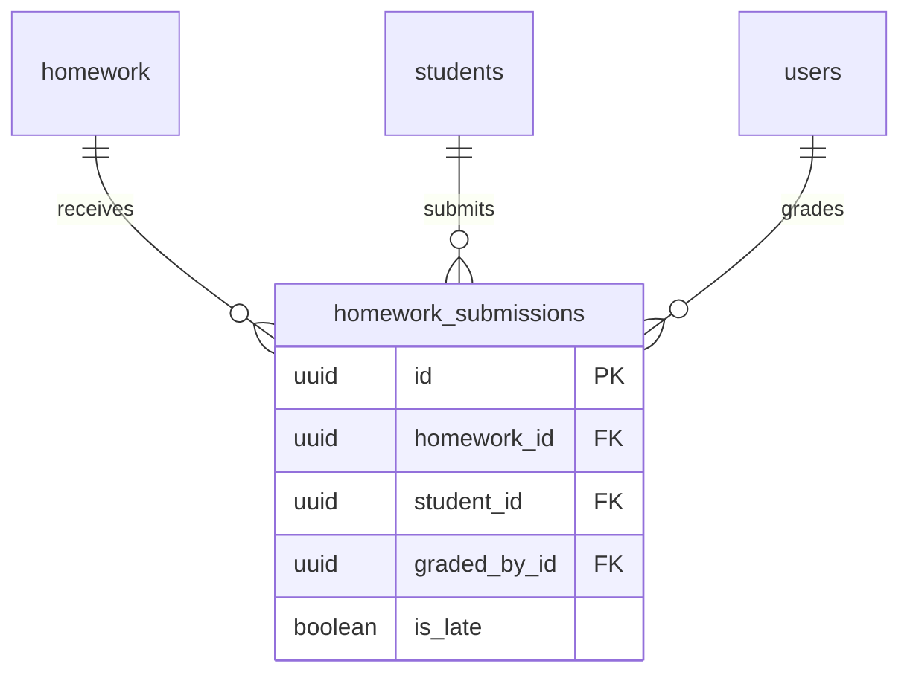
```mermaid
erDiagram
  homework ||--o{ homework_submissions : "receives"
  students ||--o{ homework_submissions : "submits"
  users ||--o{ homework_submissions : "grades"
  homework_submissions {
    uuid id PK
    uuid homework_id FK
    uuid student_id FK
    uuid graded_by_id FK
    boolean is_late
  }
```

<!-- table: study_materials · module: MaterialsModule · phase: 3 · tenant: yes · soft-delete: yes -->

### `study_materials`

Uploaded learning resources (PDFs, notes, worksheets, previous-year papers). Files are validated to PDF/JPG/PNG/DOCX ≤ 10MB and stored in Cloudinary; this table keeps the `file_url` and metadata.

| Column            | Type            | Null | Default | Notes           |
| ----------------- | --------------- | ---- | ------- | --------------- |
| `id`              | uuid            | no   | —       | PK              |
| `school_id`       | uuid            | no   | —       | → `schools.id`  |
| `class_id`        | uuid            | no   | —       | → `classes.id`  |
| `subject_id`      | uuid            | no   | —       | → `subjects.id` |
| `uploaded_by_id`  | uuid            | no   | —       | → `users.id`    |
| `title`           | text            | no   | —       |                 |
| `description`     | text            | yes  | —       |                 |
| `type`            | `material_type` | no   | —       | `PDF`…`PAPER`   |
| `file_url`        | text            | no   | —       | Cloudinary      |
| `file_size_bytes` | integer         | yes  | —       | ≤ 10MB          |
| `created_at`      | timestamptz     | no   | `now()` |                 |
| `updated_at`      | timestamptz     | no   | —       |                 |
| `deleted_at`      | timestamptz     | yes  | —       | soft delete     |

**Keys** — PK `id` · FK `school_id` → `schools.id` (restrict), `class_id` → `classes.id` (restrict), `subject_id` → `subjects.id` (restrict), `uploaded_by_id` → `users.id` (restrict).

**Indexes** — `idx_study_materials_school_id_class_id_subject_id_type`, `idx_study_materials_uploaded_by_id`.

**Constraints** — the `(class_id, subject_id)` pair must be a `class_subjects` row. `DELETE /materials/:id` soft-deletes the row (`deleted_at`) and removes the stored asset alongside it; the library filters on `deleted_at is null`.

**Mock id format** — `mat_1`…`mat_8`. A seed convenience; the real PK is a uuid.

**Diagram**

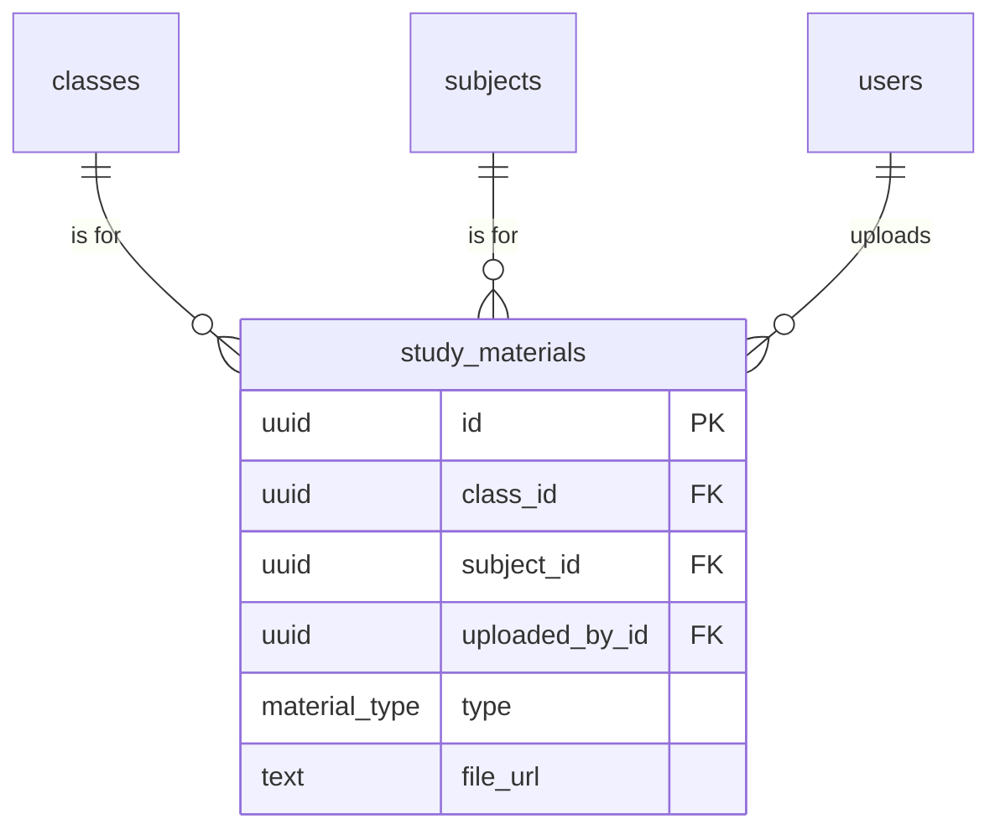
```mermaid
erDiagram
  classes ||--o{ study_materials : "is for"
  subjects ||--o{ study_materials : "is for"
  users ||--o{ study_materials : "uploads"
  study_materials {
    uuid id PK
    uuid class_id FK
    uuid subject_id FK
    uuid uploaded_by_id FK
    material_type type
    text file_url
  }
```

## 8. Timetable

<!-- table: timetables · module: TimetablesModule · phase: none · tenant: yes · soft-delete: no -->

### `timetables`

One row per class per weekday per academic year — the demo has 20 classes × 6 weekdays = 120 rows. A day's periods hang beneath it; the parent row is the conflict-detection boundary.

| Column          | Type        | Null | Default | Notes          |
| --------------- | ----------- | ---- | ------- | -------------- |
| `id`            | uuid        | no   | —       | PK             |
| `school_id`     | uuid        | no   | —       | → `schools.id` |
| `class_id`      | uuid        | no   | —       | → `classes.id` |
| `academic_year` | text        | no   | —       |                |
| `day`           | `weekday`   | no   | —       | `MON`…`SUN`    |
| `created_at`    | timestamptz | no   | `now()` |                |
| `updated_at`    | timestamptz | no   | —       |                |

**Keys** — PK `id` · FK `school_id` → `schools.id` (restrict), `class_id` → `classes.id` (cascade — periods belong to the class's timetable) · `unique (class_id, day, academic_year)`.

**Indexes** — `idx_timetables_class_id_day_academic_year` (`unique`), `idx_timetables_school_id`.

**Constraints** — one timetable per class per day per year. The mock's `dayTimetableOf(classId, day)` looks a row up by exactly `(classId, day)` and creates it if missing, which is the unique key in practice. Teacher double-booking is validated in the service before save (it spans rows, so it is not expressible as a constraint).

**Mock id format** — `tt_{classIndex}_{DAY}`, e.g. `tt_1_MON`. A seed convenience; the real PK is a uuid.

**Diagram**

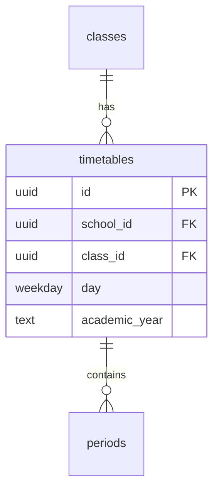
```mermaid
erDiagram
  classes ||--o{ timetables : "has"
  timetables ||--o{ periods : "contains"
  timetables {
    uuid id PK
    uuid school_id FK
    uuid class_id FK
    weekday day
    text academic_year
  }
```

<!-- table: periods · module: TimetablesModule · phase: none · tenant: yes · soft-delete: no -->

### `periods`

A single slot inside a day. Break rows carry `is_break = true` with no subject or teacher. Rows are managed **class-wide**: adding or removing one writes it to every day's timetable in a single transaction and it is addressed by its `order_index`, so the week keeps one period structure.

| Column         | Type    | Null | Default | Notes                    |
| -------------- | ------- | ---- | ------- | ------------------------ |
| `id`           | uuid    | no   | —       | PK                       |
| `school_id`    | uuid    | no   | —       | → `schools.id`           |
| `timetable_id` | uuid    | no   | —       | → `timetables.id`        |
| `subject_id`   | uuid    | yes  | —       | → `subjects.id`          |
| `teacher_id`   | uuid    | yes  | —       | → `teachers.id`          |
| `start_time`   | time    | no   | —       | `HH:mm`                  |
| `end_time`     | time    | no   | —       | `HH:mm`                  |
| `is_break`     | boolean | no   | `false` |                          |
| `order_index`  | integer | no   | —       | display order within day |
| `room`         | text    | yes  | —       |                          |
| `label`        | text    | yes  | —       | label; else `Period n`   |

**Keys** — PK `id` · FK `school_id` → `schools.id` (restrict), `timetable_id` → `timetables.id` (cascade), `subject_id` → `subjects.id` (set null), `teacher_id` → `teachers.id` (set null).

**Indexes** — `idx_periods_timetable_id_order_index` (`unique`), `idx_periods_school_id`, `idx_periods_teacher_id` (the teacher's weekly view).

**Constraints** — `subject_id` / `teacher_id` are required unless `is_break`; `check (end_time > start_time)` — the mock refuses `endTime <= startTime` with 400 `TIMETABLE_INVALID`. A null `label` on a teaching row is exposed as `Period n`, counted over teaching rows only, so the first period after a break keeps its number rather than skipping it. Break rows always carry a `label` ("Short Break", "Lunch Break"), since there is no number to derive.

**Mock id format** — `per_{timetableId}_{rowN}`, e.g. `per_tt_1_MON_1`. A seed convenience; the real PK is a uuid.

**Diagram**

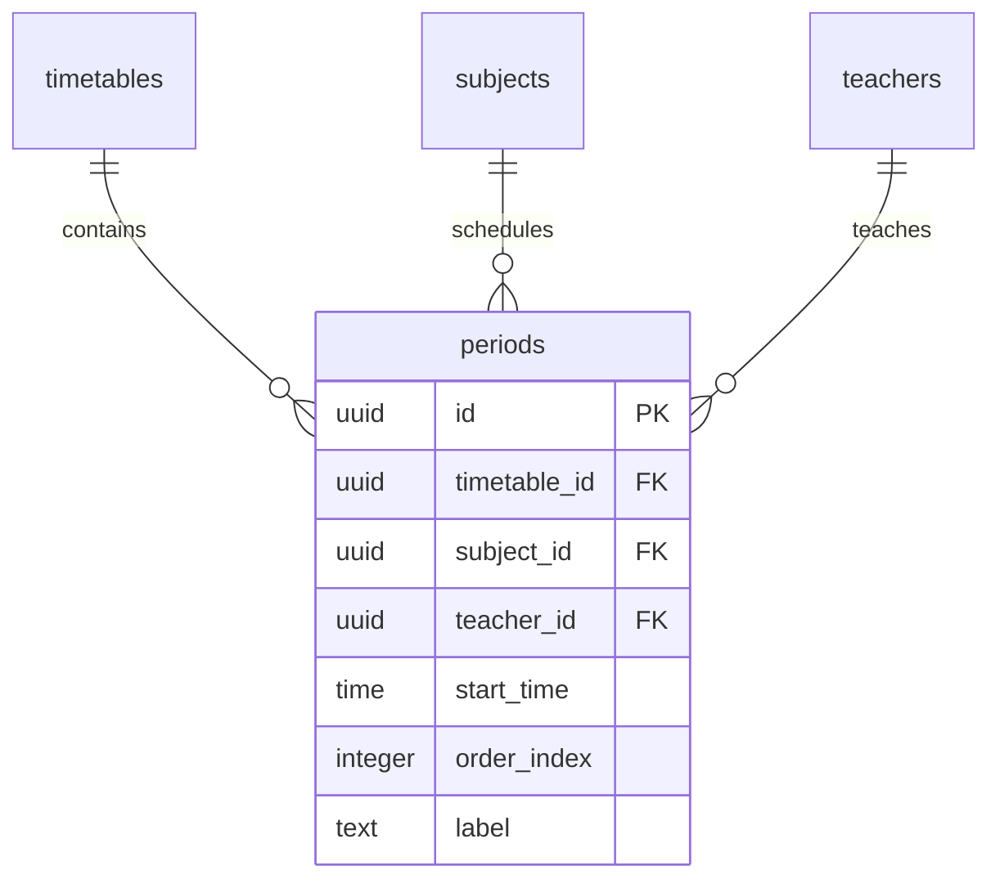
```mermaid
erDiagram
  timetables ||--o{ periods : "contains"
  subjects ||--o{ periods : "schedules"
  teachers ||--o{ periods : "teaches"
  periods {
    uuid id PK
    uuid timetable_id FK
    uuid subject_id FK
    uuid teacher_id FK
    time start_time
    integer order_index
    text label
  }
```

## 9. Fees

<!-- table: fee_structures · module: FeesModule · phase: 4 · tenant: yes · soft-delete: no -->

### `fee_structures`

A named fee plan for one class in one academic year ("Class 5-A — 2026"). Its heads define what is charged; invoices are raised from it per student. One structure per class — 20 in the demo.

| Column          | Type        | Null | Default | Notes          |
| --------------- | ----------- | ---- | ------- | -------------- |
| `id`            | uuid        | no   | —       | PK             |
| `school_id`     | uuid        | no   | —       | → `schools.id` |
| `class_id`      | uuid        | no   | —       | → `classes.id` |
| `academic_year` | text        | no   | —       |                |
| `name`          | text        | no   | —       |                |
| `created_at`    | timestamptz | no   | `now()` |                |
| `updated_at`    | timestamptz | no   | —       |                |

**Keys** — PK `id` · FK `school_id` → `schools.id` (restrict), `class_id` → `classes.id` (restrict) · `unique (school_id, class_id, academic_year, name)`.

**Indexes** — `idx_fee_structures_school_id_class_id_academic_year_name` (`unique`), `idx_fee_structures_class_id`.

**Constraints** — a structure may not be deleted while invoices reference it (restrict). The mock resolves a student's structure from their class via `structureForClass(student.classId)`.

**Mock id format** — `fst_1`…`fst_20`. A seed convenience; the real PK is a uuid.

**Diagram**

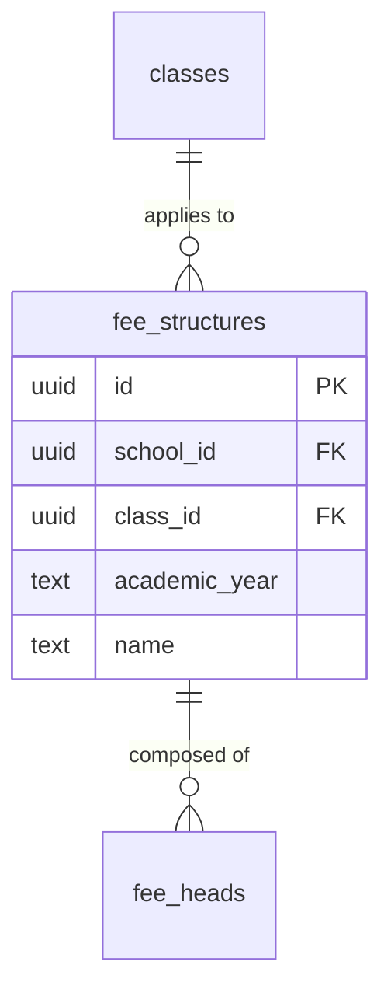
```mermaid
erDiagram
  classes ||--o{ fee_structures : "applies to"
  fee_structures ||--o{ fee_heads : "composed of"
  fee_structures {
    uuid id PK
    uuid school_id FK
    uuid class_id FK
    text academic_year
    text name
  }
```

<!-- table: fee_heads · module: FeesModule · phase: 4 · tenant: yes · soft-delete: no -->

### `fee_heads`

A line item inside a structure — admission, tuition, examination, etc. A **child table** rather than a JSONB array, so collection reports can group by head. The head owns the **due date** the class is charged against; the invoice it raises may carry a later, per-student date. The demo seeds four heads per structure.

| Column             | Type            | Null | Default | Notes                 |
| ------------------ | --------------- | ---- | ------- | --------------------- |
| `id`               | uuid            | no   | —       | PK                    |
| `school_id`        | uuid            | no   | —       | → `schools.id`        |
| `fee_structure_id` | uuid            | no   | —       | → `fee_structures.id` |
| `name`             | text            | no   | —       |                       |
| `amount_paise`     | integer         | no   | —       | minor units (§1)      |
| `frequency`        | `fee_frequency` | no   | —       | `MONTHLY`…`ONE_TIME`  |
| `due_date`         | date            | no   | —       | ISO `YYYY-MM-DD`      |
| `description`      | text            | yes  | —       |                       |
| `created_at`       | timestamptz     | no   | `now()` |                       |

**Keys** — PK `id` · FK `school_id` → `schools.id` (restrict), `fee_structure_id` → `fee_structures.id` (cascade) · `unique (fee_structure_id, name)`.

**Indexes** — `idx_fee_heads_fee_structure_id_name` (`unique`), `idx_fee_heads_school_id`, `idx_fee_heads_fee_structure_id`.

**Constraints** — `check (amount_paise >= 0)`; a head is deleted with its structure. Raising an invoice copies the head's `due_date` onto `fee_invoices.due_date`, which the collect flow may override per student.

**Mock id format** — `fhd_{structureIndex}_{headIndex}`, e.g. `fhd_1_1`. A seed convenience; the real PK is a uuid.

**Diagram**

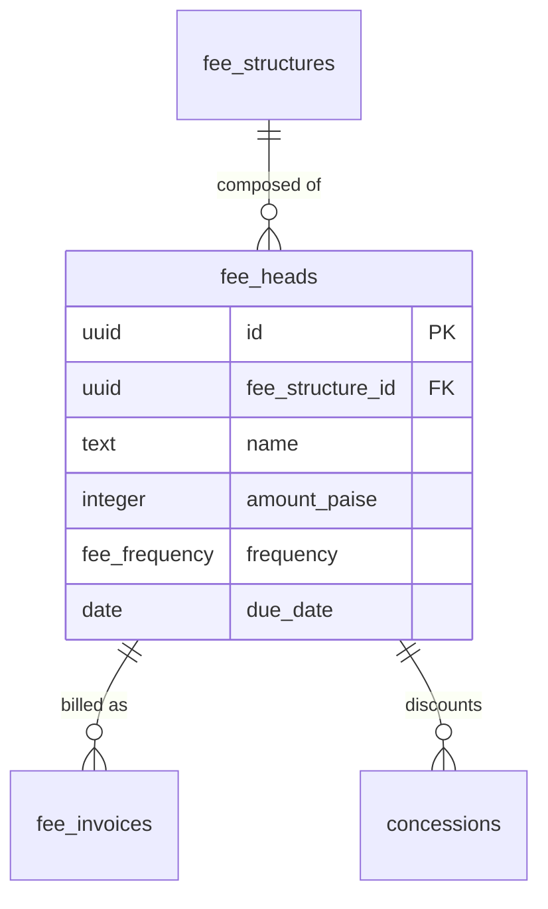
```mermaid
erDiagram
  fee_structures ||--o{ fee_heads : "composed of"
  fee_heads ||--o{ fee_invoices : "billed as"
  fee_heads ||--o{ concessions : "discounts"
  fee_heads {
    uuid id PK
    uuid fee_structure_id FK
    text name
    integer amount_paise
    fee_frequency frequency
    date due_date
  }
```

<!-- table: fee_invoices · module: FeesModule · phase: 4 · tenant: yes · soft-delete: no -->

### `fee_invoices`

A billable demand for one student, one per `(student × head)`. `paid_paise` accumulates across payments so `PARTIAL` can be topped up; `receipt_no` is assigned on the first successful payment. `fee_head_id` records which head the demand was raised from and is null for a lump-sum demand.

| Column             | Type             | Null | Default   | Notes                    |
| ------------------ | ---------------- | ---- | --------- | ------------------------ |
| `id`               | uuid             | no   | —         | PK                       |
| `school_id`        | uuid             | no   | —         | → `schools.id`           |
| `student_id`       | uuid             | no   | —         | → `students.id`          |
| `fee_structure_id` | uuid             | no   | —         | → `fee_structures.id`    |
| `fee_head_id`      | uuid             | yes  | —         | → `fee_heads.id`         |
| `amount_paise`     | integer          | no   | —         | gross, before concession |
| `discount_paise`   | integer          | no   | `0`       | concession applied       |
| `paid_paise`       | integer          | no   | `0`       | accumulated settlements  |
| `due_date`         | date             | no   | —         |                          |
| `status`           | `invoice_status` | no   | `PENDING` |                          |
| `receipt_no`       | text             | yes  | —         | null until first payment |
| `issued_at`        | timestamptz      | yes  | —         |                          |
| `notes`            | text             | yes  | —         |                          |
| `created_at`       | timestamptz      | no   | `now()`   |                          |
| `updated_at`       | timestamptz      | no   | —         |                          |

**Keys** — PK `id` · FK `school_id` → `schools.id` (restrict), `student_id` → `students.id` (restrict), `fee_structure_id` → `fee_structures.id` (restrict), `fee_head_id` → `fee_heads.id` (set null) · `unique (school_id, receipt_no)` (partial, `where receipt_no is not null`), `unique (student_id, fee_head_id)` (partial, `where fee_head_id is not null`).

**Indexes** — `idx_fee_invoices_student_id_fee_head_id` (`unique`, partial), `idx_fee_invoices_school_id_receipt_no` (`unique`, partial), `idx_fee_invoices_student_id_status`, `idx_fee_invoices_school_id_status_due_date`, `idx_fee_invoices_fee_structure_id`, `idx_fee_invoices_fee_head_id`.

**Constraints** — `check (paid_paise <= amount_paise - discount_paise)`. **The mock refuses a second invoice for the same head** with 409 `FEE_INVOICE_EXISTS` (`POST /fees/invoices` checks `studentId` + `feeHeadId`) — the partial unique above. The head must belong to the student's own structure, else 400 `FEE_VALIDATION`. Invoices are never deleted — they are financial records. The collect flow writes `status = 'PAID'` when the balance reaches 0, else `'PARTIAL'`.

**Mock id format** — `inv_{studentId}_{headN}` in the seed (`inv_std_1_1`); a created invoice is `inv_{studentId}_{feeHeadId}`. A seed convenience; the real PK is a uuid.

**Diagram**

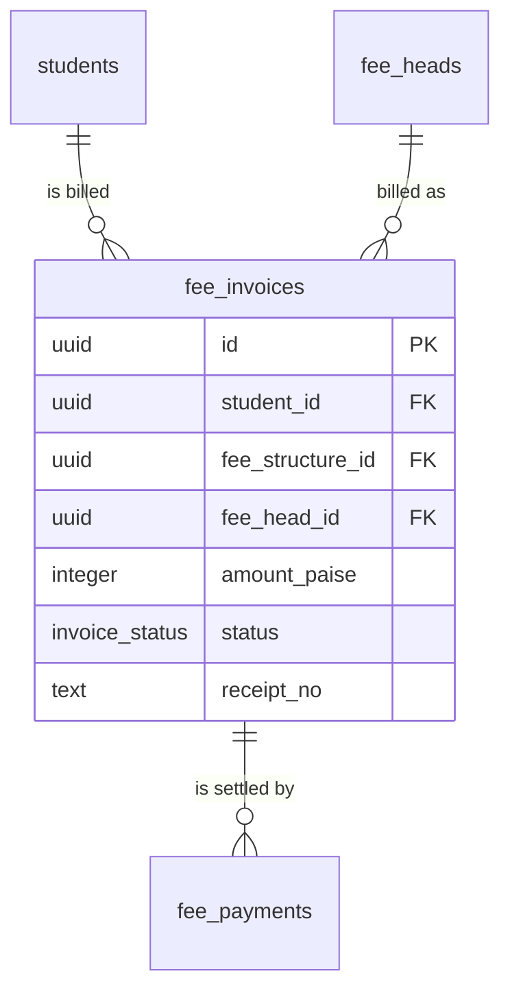
```mermaid
erDiagram
  students ||--o{ fee_invoices : "is billed"
  fee_heads ||--o{ fee_invoices : "billed as"
  fee_invoices ||--o{ fee_payments : "is settled by"
  fee_invoices {
    uuid id PK
    uuid student_id FK
    uuid fee_structure_id FK
    uuid fee_head_id FK
    integer amount_paise
    invoice_status status
    text receipt_no
  }
```

<!-- table: fee_payments · module: FeesModule · phase: 4 · tenant: yes · soft-delete: no -->

### `fee_payments`

A settlement against an invoice — online via Stripe/SSLCommerz, or offline recorded by an admin (`MANUAL`, with `recorded_by_id`). A webhook confirmation updates the invoice in one transaction.

| Column              | Type               | Null | Default   | Notes                     |
| ------------------- | ------------------ | ---- | --------- | ------------------------- |
| `id`                | uuid               | no   | —         | PK                        |
| `school_id`         | uuid               | no   | —         | → `schools.id`            |
| `invoice_id`        | uuid               | no   | —         | → `fee_invoices.id`       |
| `student_id`        | uuid               | no   | —         | → `students.id`           |
| `recorded_by_id`    | uuid               | yes  | —         | → `users.id`, manual only |
| `amount_paise`      | integer            | no   | —         |                           |
| `provider`          | `payment_provider` | no   | —         | `STRIPE`…`MANUAL`         |
| `method`            | `payment_method`   | no   | —         | `CARD`…`ONLINE`           |
| `provider_order_id` | text               | yes  | —         | checkout session/order    |
| `provider_txn_id`   | text               | yes  | —         | webhook transaction id    |
| `status`            | `payment_status`   | no   | `PENDING` |                           |
| `paid_at`           | timestamptz        | yes  | —         |                           |
| `remarks`           | text               | yes  | —         | cheque/DD reference       |
| `created_at`        | timestamptz        | no   | `now()`   |                           |
| `updated_at`        | timestamptz        | no   | —         |                           |

**Keys** — PK `id` · FK `school_id` → `schools.id` (restrict), `invoice_id` → `fee_invoices.id` (restrict), `student_id` → `students.id` (restrict), `recorded_by_id` → `users.id` (set null) · `unique (provider, provider_txn_id)` (partial, `where provider_txn_id is not null`).

**Indexes** — `idx_fee_payments_provider_provider_txn_id` (`unique`, partial), `idx_fee_payments_invoice_id`, `idx_fee_payments_provider_order_id`, `idx_fee_payments_school_id_paid_at`.

**Constraints** — `check (amount_paise > 0)`; the partial unique key is the **webhook idempotency guard** (a replayed event must not double-credit). **A child row's `student_id` must equal its parent row's** — the mock writes `student_id` as `invoice.studentId`, and a payment may not exceed the invoice's outstanding balance (400 `FEE_VALIDATION` otherwise). The mock's manual path (`POST /fees/payments/manual`) stores the counter reference in `remarks`; a self-service `UTR` is stored on `provider_txn_id` (`POST /fees/me/payments`), which the manual path otherwise leaves null.

**Mock id format** — `pay_{invoiceId}` in the seed (`pay_inv_std_1_1`); a collected payment is `pay_{invoiceId}_{n}`. A seed convenience; the real PK is a uuid.

**Diagram**

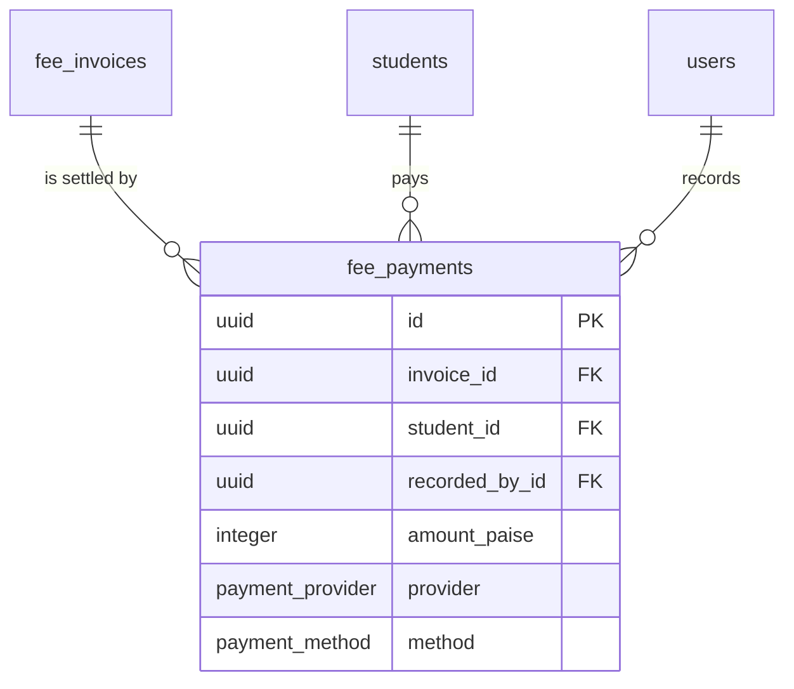
```mermaid
erDiagram
  fee_invoices ||--o{ fee_payments : "is settled by"
  students ||--o{ fee_payments : "pays"
  users ||--o{ fee_payments : "records"
  fee_payments {
    uuid id PK
    uuid invoice_id FK
    uuid student_id FK
    uuid recorded_by_id FK
    integer amount_paise
    payment_provider provider
    payment_method method
  }
```

<!-- table: concessions · module: FeesModule · phase: 4 · tenant: yes · soft-delete: no -->

### `concessions`

A discount or scholarship for a student, scoped to one fee head, with an admin approval flow. Applied as `fee_invoices.discount_paise` when the invoice is raised. `category` records **why** the concession was granted; `fee_head_id` records **what** it discounts, null meaning every head in the student's structure. The demo seeds eight, covering every category and both discount types.

| Column           | Type                  | Null | Default   | Notes                  |
| ---------------- | --------------------- | ---- | --------- | ---------------------- |
| `id`             | uuid                  | no   | —         | PK                     |
| `school_id`      | uuid                  | no   | —         | → `schools.id`         |
| `student_id`     | uuid                  | no   | —         | → `students.id`        |
| `fee_head_id`    | uuid                  | yes  | —         | → `fee_heads.id`       |
| `category`       | `concession_category` | no   | —         | `SIBLING`…`STAFF_WARD` |
| `type`           | `concession_type`     | no   | —         | `PERCENTAGE`/`FIXED`   |
| `percentage`     | numeric               | yes  | —         | 0–100, 2dp             |
| `amount_paise`   | integer               | yes  | —         | when `FIXED`           |
| `reason`         | text                  | yes  | —         |                        |
| `status`         | `concession_status`   | no   | `PENDING` |                        |
| `approved_by_id` | uuid                  | yes  | —         | → `users.id`           |
| `approved_at`    | timestamptz           | yes  | —         |                        |
| `created_at`     | timestamptz           | no   | `now()`   |                        |
| `updated_at`     | timestamptz           | no   | —         |                        |

**Keys** — PK `id` · FK `school_id` → `schools.id` (restrict), `student_id` → `students.id` (restrict), `fee_head_id` → `fee_heads.id` (set null), `approved_by_id` → `users.id` (set null).

**Indexes** — `idx_concessions_student_id_status` (the approval queue), `idx_concessions_school_id_status`, `idx_concessions_fee_head_id`.

**Constraints** — a `check` enforces exactly one of `percentage` / `amount_paise`, matching `type`. `category` is required — it is the reporting dimension. `approved_by_id` / `approved_at` are null while `status = 'PENDING'`. No unique key — a student may hold several concessions. The mock only applies an **`APPROVED`** concession when computing a discount (`concessionAmountFor`).

**Mock id format** — `con_1`…`con_8`. A seed convenience; the real PK is a uuid.

**Diagram**

```mermaid
erDiagram
  students ||--o{ concessions : "is granted"
  fee_heads ||--o{ concessions : "discounts"
  users ||--o{ concessions : "approves"
  concessions {
    uuid id PK
    uuid student_id FK
    uuid fee_head_id FK
    uuid approved_by_id FK
    concession_category category
    concession_status status
  }
```

## 10. Exams

Tests and exams **share one table** (`exams`), told apart by `kind`: a `TEST` is one subject sat on one date, an `EXAM` is a multi-subject window, and only an `EXAM` produces report cards.

<!-- table: exams · module: ExamsModule · phase: 4 · tenant: yes · soft-delete: no -->

### `exams`

A test or exam window for one class, told apart by `kind`. `is_published` is the lock: once true, results are read-only and report cards exist. Publishing is one transaction (results → report cards → notifications).

| Column         | Type        | Null | Default | Notes                         |
| -------------- | ----------- | ---- | ------- | ----------------------------- |
| `id`           | uuid        | no   | —       | PK                            |
| `school_id`    | uuid        | no   | —       | → `schools.id`                |
| `class_id`     | uuid        | no   | —       | → `classes.id`                |
| `name`         | text        | no   | —       |                               |
| `kind`         | `exam_kind` | no   | —       | `TEST`/`EXAM`                 |
| `type`         | `exam_type` | no   | —       | `UNIT`/`MID`/`FINAL`/`ANNUAL` |
| `start_date`   | date        | no   | —       |                               |
| `end_date`     | date        | no   | —       |                               |
| `description`  | text        | yes  | —       |                               |
| `is_published` | boolean     | no   | `false` |                               |
| `published_at` | timestamptz | yes  | —       |                               |
| `created_at`   | timestamptz | no   | `now()` |                               |
| `updated_at`   | timestamptz | no   | —       |                               |

**Keys** — PK `id` · FK `school_id` → `schools.id` (restrict), `class_id` → `classes.id` (restrict).

**Indexes** — `idx_exams_school_id_class_id_type_start_date`, `idx_exams_class_id_start_date`.

**Constraints** — `check (end_date >= start_date)`; no unique key, since a class may run two exams with the same name in one year. A `TEST` has `start_date = end_date`. Editing marks on a published exam is refused with 409 `EXAM_PUBLISHED`.

**Mock id format** — `exam_1`…`exam_20` (mid terms), `exam_unit_1`…`exam_unit_20` (unit tests), `test_1`…`test_20` (single-subject tests). A seed convenience; the real PK is a uuid.

**Diagram**

```mermaid
erDiagram
  classes ||--o{ exams : "sits"
  exams ||--o{ exam_subjects : "schedules"
  exams ||--o{ results : "records"
  exams ||--o{ report_cards : "issues"
  exams {
    uuid id PK
    uuid school_id FK
    uuid class_id FK
    exam_kind kind
    exam_type type
    boolean is_published
  }
```

<!-- table: exam_subjects · module: ExamsModule · phase: 4 · tenant: yes · soft-delete: no -->

### `exam_subjects`

Which subjects are examined, when, and for how many marks. `max_marks` bounds `results.obtained_marks` and feeds percentage computation.

| Column         | Type    | Null | Default | Notes                 |
| -------------- | ------- | ---- | ------- | --------------------- |
| `id`           | uuid    | no   | —       | PK                    |
| `school_id`    | uuid    | no   | —       | → `schools.id`        |
| `exam_id`      | uuid    | no   | —       | → `exams.id`          |
| `subject_id`   | uuid    | no   | —       | → `subjects.id`       |
| `exam_date`    | date    | no   | —       |                       |
| `max_marks`    | integer | no   | —       |                       |
| `pass_marks`   | integer | yes  | —       | default from scheme   |
| `duration_min` | integer | no   | —       | minutes, default `60` |

**Keys** — PK `id` · FK `school_id` → `schools.id` (restrict), `exam_id` → `exams.id` (cascade), `subject_id` → `subjects.id` (restrict) · `unique (exam_id, subject_id)`.

**Indexes** — `idx_exam_subjects_exam_id_subject_id` (`unique`), `idx_exam_subjects_school_id`, `idx_exam_subjects_subject_id`.

**Constraints** — `check (pass_marks <= max_marks)`, `check (max_marks > 0)`, `check (duration_min > 0)`. The `(exam_id, subject_id)` pair is the key the marks sheet resolves a paper by: an entry for a subject not on the exam is refused with 400 `EXAM_INVALID`.

**Mock id format** — `exs_{examIndex}_{subjectIndex}` for exam papers and `exs_test_{n}` for a test's single paper. A seed convenience; the real PK is a uuid.

**Diagram**

```mermaid
erDiagram
  exams ||--o{ exam_subjects : "schedules"
  subjects ||--o{ exam_subjects : "is examined"
  exam_subjects {
    uuid id PK
    uuid exam_id FK
    uuid subject_id FK
    date exam_date
    integer max_marks
    integer duration_min
  }
```

<!-- table: results · module: ExamsModule · phase: 4 · tenant: yes · soft-delete: no -->

### `results`

One student's mark in one subject of one exam. Bulk marks entry **upserts** on the unique key; a null entry is stored as `is_absent = true` with `obtained_marks = 0`.

| Column           | Type        | Null | Default | Notes                       |
| ---------------- | ----------- | ---- | ------- | --------------------------- |
| `id`             | uuid        | no   | —       | PK                          |
| `school_id`      | uuid        | no   | —       | → `schools.id`              |
| `exam_id`        | uuid        | no   | —       | → `exams.id`                |
| `student_id`     | uuid        | no   | —       | → `students.id`             |
| `subject_id`     | uuid        | no   | —       | → `subjects.id`             |
| `obtained_marks` | numeric     | no   | —       | ≤ `exam_subjects.max_marks` |
| `is_absent`      | boolean     | no   | `false` |                             |
| `remarks`        | text        | yes  | —       | teacher's note              |
| `entered_by_id`  | uuid        | yes  | —       | → `users.id`                |
| `created_at`     | timestamptz | no   | `now()` |                             |
| `updated_at`     | timestamptz | no   | —       |                             |

**Keys** — PK `id` · FK `school_id` → `schools.id` (restrict), `exam_id` → `exams.id` (restrict), `student_id` → `students.id` (restrict), `subject_id` → `subjects.id` (restrict), `entered_by_id` → `users.id` (set null) · `unique (exam_id, student_id, subject_id)`.

**Indexes** — `idx_results_exam_id_student_id_subject_id` (`unique`, the upsert key), `idx_results_school_id`, `idx_results_student_id_exam_id`.

**Constraints** — `check (obtained_marks >= 0)`; the upper bound against `max_marks` is validated in the service because it spans tables — the mock refuses `raw > paper.maxMarks` with 400 `EXAM_INVALID`. **`POST /exams/:id/marks` upserts on `(exam_id, student_id, subject_id)`.** Marks are frozen once published; they are never deleted.

**Mock id format** — `res_{examId}_{studentId}_{subjectN}`, e.g. `res_exam_1_std_1_1`. A seed convenience; the real PK is a uuid.

**Diagram**

```mermaid
erDiagram
  exams ||--o{ results : "records"
  students ||--o{ results : "achieves"
  subjects ||--o{ results : "is scored in"
  results {
    uuid id PK
    uuid exam_id FK
    uuid student_id FK
    uuid subject_id FK
    numeric obtained_marks
    boolean is_absent
  }
```

<!-- table: report_cards · module: ExamsModule · phase: 4 · tenant: yes · soft-delete: no -->

### `report_cards`

The computed summary per student per exam — totals, percentage, grade and class rank — plus `ai_comment`. Written at **publish** time, not on every mark edit, and only for an `EXAM` (never a single-subject `TEST`).

| Column           | Type        | Null | Default | Notes                   |
| ---------------- | ----------- | ---- | ------- | ----------------------- |
| `id`             | uuid        | no   | —       | PK                      |
| `school_id`      | uuid        | no   | —       | → `schools.id`          |
| `exam_id`        | uuid        | no   | —       | → `exams.id`            |
| `student_id`     | uuid        | no   | —       | → `students.id`         |
| `total_marks`    | numeric     | no   | —       | sum of max marks taken  |
| `obtained_marks` | numeric     | no   | —       | sum of results          |
| `percentage`     | numeric     | no   | —       | 0–100, 2dp              |
| `grade`          | text        | no   | —       | from `schools.settings` |
| `rank`           | integer     | yes  | —       | within class            |
| `ai_comment`     | text        | yes  | —       | AI-generated            |
| `published_at`   | timestamptz | yes  | —       |                         |
| `created_at`     | timestamptz | no   | `now()` |                         |
| `updated_at`     | timestamptz | no   | —       |                         |

**Keys** — PK `id` · FK `school_id` → `schools.id` (restrict), `exam_id` → `exams.id` (cascade), `student_id` → `students.id` (restrict) · `unique (exam_id, student_id)`.

**Indexes** — `idx_report_cards_exam_id_student_id` (`unique`), `idx_report_cards_school_id`, `idx_report_cards_student_id_exam_id`.

**Constraints** — `check (percentage between 0 and 100)`. **A child row's `student_id` must equal its parent row's** — a report card is rolled up from the `results` of the same student and exam, so the two must agree. Grade bands come from `schools.settings` (JSONB), so `grade` is `text` — each school configures its own scheme. Unpublishing the exam withdraws the report cards (the mock's `rebuildReportCards`).

**Mock id format** — `rc_{examId}_{studentId}`, e.g. `rc_exam_1_std_1`. A seed convenience; the real PK is a uuid.

**Diagram**

```mermaid
erDiagram
  exams ||--o{ report_cards : "issues"
  students ||--o{ report_cards : "receives"
  report_cards {
    uuid id PK
    uuid exam_id FK
    uuid student_id FK
    numeric percentage
    text grade
    integer rank
  }
```

## 11. Chat

<!-- table: conversations · module: ChatModule · phase: 5 · tenant: yes · soft-delete: no -->

### `conversations`

A 1:1 thread between two users of permitted role pairs. `last_message_at` is denormalised so the conversation list sorts without touching `messages`. **The mock stores the members as an embedded array** — `participant_ids` — rather than a `conversation_participants` table (§16).

| Column            | Type        | Null | Default | Notes           |
| ----------------- | ----------- | ---- | ------- | --------------- |
| `id`              | uuid        | no   | —       | PK              |
| `school_id`       | uuid        | no   | —       | → `schools.id`  |
| `participant_ids` | uuid[]      | no   | `'{}'`  | two user ids    |
| `last_message_at` | timestamptz | yes  | —       | updated on send |
| `created_at`      | timestamptz | no   | `now()` |                 |
| `updated_at`      | timestamptz | no   | —       |                 |

**Keys** — PK `id` · FK `school_id` → `schools.id` (restrict) · no FK on `participant_ids` (it is an array; see the dotted link below).

**Indexes** — `idx_conversations_school_id_last_message_at_desc` (the inbox), `idx_conversations_participant_ids` (GIN).

**Constraints** — allowed pairs (admin↔teacher, teacher↔student, teacher↔parent) are enforced in the service; a DB `check` cannot express a cross-table rule. There is no unique key preventing two conversations between the same pair. `participant_ids` having exactly two members is a service-level invariant.

**Mock id format** — `cnv_1`…`cnv_4`. A seed convenience; the real PK is a uuid.

**Diagram**

```mermaid
erDiagram
  conversations ||--o{ messages : "contains"
  conversations ||..o{ users : "includes"
  conversations {
    uuid id PK
    uuid school_id FK
    uuid participant_ids
    timestamptz last_message_at
  }
  users {
    uuid id PK
  }
  messages {
    uuid id PK
    uuid conversation_id FK
  }
```

<!-- table: messages · module: ChatModule · phase: 5 · tenant: yes · soft-delete: yes -->

### `messages`

One persisted chat message. `read_at` is the receipt for the single recipient; the caller's unread badge is derived from the other participant's read state. Ordering is by `created_at` within a conversation.

| Column            | Type        | Null | Default | Notes                |
| ----------------- | ----------- | ---- | ------- | -------------------- |
| `id`              | uuid        | no   | —       | PK                   |
| `conversation_id` | uuid        | no   | —       | → `conversations.id` |
| `sender_id`       | uuid        | no   | —       | → `users.id`         |
| `body`            | text        | no   | —       |                      |
| `read_at`         | timestamptz | yes  | —       | receipt              |
| `created_at`      | timestamptz | no   | `now()` |                      |
| `updated_at`      | timestamptz | no   | —       |                      |
| `deleted_at`      | timestamptz | yes  | —       | soft delete          |

**Keys** — PK `id` · FK `conversation_id` → `conversations.id` (cascade), `sender_id` → `users.id` (restrict).

**Indexes** — `idx_messages_conversation_id_created_at_desc` (the pagination path), `idx_messages_sender_id`.

**Constraints** — `check (char_length(body) > 0)`. Like the mock's `ChatMessage`, this table carries **no `school_id`**: it inherits the tenant through `conversation_id`. `sender_id` must be one of the conversation's `participant_ids`.

**Mock id format** — `msg_1`…`msg_8`. A seed convenience; the real PK is a uuid.

**Diagram**

```mermaid
erDiagram
  conversations ||--o{ messages : "contains"
  users ||--o{ messages : "sends"
  messages {
    uuid id PK
    uuid conversation_id FK
    uuid sender_id FK
    text body
    timestamptz read_at
  }
```

## 12. Notices & Events

<!-- table: notices · module: NoticesModule · phase: 5 · tenant: yes · soft-delete: yes -->

### `notices`

An announcement. `audience` selects role groups; class narrowing is an **embedded array** — `class_ids` — rather than the `notice_classes` join of the design target (§16). Publishing stamps `published_at` and fans out; a null `published_at` is a draft.

| Column            | Type                | Null | Default   | Notes           |
| ----------------- | ------------------- | ---- | --------- | --------------- |
| `id`              | uuid                | no   | —         | PK              |
| `school_id`       | uuid                | no   | —         | → `schools.id`  |
| `published_by_id` | uuid                | no   | —         | → `users.id`    |
| `title`           | text                | no   | —         |                 |
| `body`            | text                | no   | —         |                 |
| `priority`        | `notice_priority`   | no   | `MEDIUM`  |                 |
| `audience`        | `notice_audience[]` | no   | `'{ALL}'` |                 |
| `class_ids`       | uuid[]              | no   | `'{}'`    | class narrowing |
| `author_name`     | text                | no   | —         | byline          |
| `published_at`    | timestamptz         | yes  | —         | null = draft    |
| `expires_at`      | timestamptz         | yes  | —         | auto-hide       |
| `created_at`      | timestamptz         | no   | `now()`   |                 |
| `updated_at`      | timestamptz         | no   | —         |                 |
| `deleted_at`      | timestamptz         | yes  | —         | soft delete     |

**Keys** — PK `id` · FK `school_id` → `schools.id` (restrict), `published_by_id` → `users.id` (restrict — a notice keeps its author) · no FK on `class_ids` (see the dotted link).

**Indexes** — `idx_notices_school_id_published_at_desc`, `idx_notices_published_by_id`, `idx_notices_class_ids` (GIN), `idx_notices_audience` (GIN).

**Constraints** — `audience` is an enum array. **An empty `class_ids` means every class matching `audience`** (this is the mock's "Empty means every class matching audience" rule). `author_name` is a denormalised byline the form may supply, falling back to the author's own name.

**Mock id format** — `not_1`…`not_6`. A seed convenience; the real PK is a uuid.

**Diagram**

```mermaid
erDiagram
  users ||--o{ notices : "authors"
  notices ||..o{ classes : "targets"
  notices {
    uuid id PK
    uuid school_id FK
    uuid published_by_id FK
    notice_priority priority
    uuid class_ids
    timestamptz published_at
  }
  classes {
    uuid id PK
  }
```

<!-- table: events · module: NoticesModule · phase: 5 · tenant: yes · soft-delete: yes -->

### `events`

Calendar entries (exam week, sports day, holidays) with the same audience model as notices and an optional time window.

| Column          | Type                | Null | Default   | Notes          |
| --------------- | ------------------- | ---- | --------- | -------------- |
| `id`            | uuid                | no   | —         | PK             |
| `school_id`     | uuid                | no   | —         | → `schools.id` |
| `created_by_id` | uuid                | no   | —         | → `users.id`   |
| `title`         | text                | no   | —         |                |
| `description`   | text                | yes  | —         |                |
| `event_date`    | date                | no   | —         |                |
| `start_time`    | time                | yes  | —         |                |
| `end_time`      | time                | yes  | —         |                |
| `audience`      | `notice_audience[]` | no   | `'{ALL}'` |                |
| `created_at`    | timestamptz         | no   | `now()`   |                |
| `updated_at`    | timestamptz         | no   | —         |                |
| `deleted_at`    | timestamptz         | yes  | —         | soft delete    |

**Keys** — PK `id` · FK `school_id` → `schools.id` (restrict), `created_by_id` → `users.id` (restrict).

**Indexes** — `idx_events_school_id_event_date`, `idx_events_created_by_id`.

**Constraints** — `check (end_time > start_time)` when both times are present; both are nullable so an all-day event is valid. Events have no class-scoping column — unlike notices, an event is audience-only.

**Mock id format** — `evt_1`…`evt_4`. A seed convenience; the real PK is a uuid.

**Diagram**

```mermaid
erDiagram
  users ||--o{ events : "creates"
  schools ||--o{ events : "hosts"
  events {
    uuid id PK
    uuid school_id FK
    uuid created_by_id FK
    date event_date
    text title
  }
```

## 13. AI

<!-- table: ai_conversations · module: AiModule · phase: 5 · tenant: yes · soft-delete: no -->

### `ai_conversations`

History per user per AI feature. `messages` is a JSONB array of `{ role, content }` turns. For the five tool screens (chat, quiz, homework helper, event planner, notice) a row **is** a generation: `prompt_args` keeps the form's own fields so a past generation can be reopened with its inputs, and the reply is the text the panel renders.

| Column        | Type         | Null | Default | Notes                  |
| ------------- | ------------ | ---- | ------- | ---------------------- |
| `id`          | uuid         | no   | —       | PK                     |
| `school_id`   | uuid         | no   | —       | → `schools.id`         |
| `user_id`     | uuid         | no   | —       | → `users.id`           |
| `feature`     | `ai_feature` | no   | —       | one of the 7 features  |
| `title`       | text         | yes  | —       | derived label          |
| `prompt_args` | jsonb        | no   | `'{}'`  | the tool form's fields |
| `messages`    | jsonb        | no   | `'[]'`  | `{ role, content }[]`  |
| `created_at`  | timestamptz  | no   | `now()` |                        |
| `updated_at`  | timestamptz  | no   | —       |                        |

**Keys** — PK `id` · FK `school_id` → `schools.id` (restrict), `user_id` → `users.id` (cascade).

**Indexes** — `idx_ai_conversations_user_id_feature_created_at_desc` (per-feature history), `idx_ai_conversations_school_id`.

**Constraints** — rate limits are per user, not a column. `prompt_args` is validated against the feature's template in the service, since its keys differ per tool. The mock's `AiMessageTurn` is `{ role: 'user' | 'assistant', content }` — a view-only union that does not become an enum.

**Mock id format** — `aic_1`…`aic_7`. A seed convenience; the real PK is a uuid.

**Diagram**

```mermaid
erDiagram
  users ||--o{ ai_conversations : "starts"
  schools ||--o{ ai_conversations : "scopes"
  ai_conversations {
    uuid id PK
    uuid school_id FK
    uuid user_id FK
    ai_feature feature
    jsonb prompt_args
    jsonb messages
  }
```

## 14. Permissions

<!-- table: permissions · module: AuthModule · phase: 1 · tenant: no · soft-delete: no -->

### `permissions`

The platform-wide catalogue of assignable permissions. Rows are seeded, not user-edited: `key` is what a route checks, and `group`/`label`/`sort_order` are what the Roles & Permissions editor renders. There is deliberately **no `school_id`** — the catalogue is identical for every school. The demo seeds 23 permissions.

| Column       | Type               | Null | Default | Notes                  |
| ------------ | ------------------ | ---- | ------- | ---------------------- |
| `id`         | uuid               | no   | —       | PK                     |
| `key`        | text               | no   | —       | e.g. `students.edit`   |
| `group`      | `permission_group` | no   | —       | the editor's heading   |
| `label`      | text               | no   | —       | human label            |
| `sort_order` | integer            | no   | —       | order within the group |
| `created_at` | timestamptz        | no   | `now()` |                        |

**Keys** — PK `id` · no foreign keys · `unique (key)`.

**Indexes** — `idx_permissions_key` (`unique`), `idx_permissions_group_sort_order`.

**Constraints** — `check (key ~ '^[a-z_]+(\.[a-z_]+)+$')` — a dotted `resource.action` key, so a typo cannot create a permission no route ever checks. The second table (with `schools`) that carries no `school_id`.

**Mock id format** — `prm_1`…`prm_23`. A seed convenience; the real PK is a uuid.

**Diagram**

```mermaid
erDiagram
  permissions ||--o{ user_permissions : "granted as"
  permissions {
    uuid id PK
    text key UK
    permission_group group
    integer sort_order
  }
```

<!-- table: user_permissions · module: AuthModule · phase: 1 · tenant: yes · soft-delete: no -->

### `user_permissions` — junction

One granted permission for one account — the **effective** set. A new account is seeded from the role matrix at creation, and this table is authoritative afterwards, which is what lets the editor turn a role default **off**: the `PUT` replaces the set rather than merging into it. The demo grants the teacher default set to every `TEACHER` account, plus a deterministic spread of extras.

| Column          | Type        | Null | Default | Notes                      |
| --------------- | ----------- | ---- | ------- | -------------------------- |
| `id`            | uuid        | no   | —       | PK                         |
| `school_id`     | uuid        | no   | —       | → `schools.id`             |
| `user_id`       | uuid        | no   | —       | → `users.id`               |
| `permission_id` | uuid        | no   | —       | → `permissions.id`         |
| `granted_by_id` | uuid        | yes  | —       | → `users.id`, who saved it |
| `created_at`    | timestamptz | no   | `now()` |                            |

**Keys** — PK `id` · FK `school_id` → `schools.id` (restrict), `user_id` → `users.id` (cascade), `permission_id` → `permissions.id` (cascade — retiring a catalogue row drops its grants), `granted_by_id` → `users.id` (set null) · `unique (user_id, permission_id)`.

**Indexes** — `idx_user_permissions_user_id_permission_id` (`unique`), `idx_user_permissions_school_id`, `idx_user_permissions_permission_id`.

**Constraints** — none beyond the unique. **`PUT /users/:userId/permissions` replaces** the user's rows with the submitted set (the mock splices the old rows out, then writes the new); an unknown key is refused with 400 `PERMISSION_INVALID`. A grant is removed, never soft-deleted, so there is no `deleted_at`.

**Mock id format** — `upm_{userId}_{permissionId}`, e.g. `upm_usr_tch_1_prm_1`. A seed convenience; the real PK is a uuid.

**Diagram**

```mermaid
erDiagram
  users ||--o{ user_permissions : "holds"
  permissions ||--o{ user_permissions : "granted as"
  user_permissions {
    uuid id PK
    uuid school_id FK
    uuid user_id FK
    uuid permission_id FK
    uuid granted_by_id FK
  }
```

## 15. Table Inventory

Every table the mock persists, by module, with its kind. **32 tables** — **28 non-junction tables** and **4 junction tables** (`parent_students`, `teacher_classes`, `class_subjects`, `user_permissions`). **84 enforced foreign keys**, plus **2 logical links** — the embedded arrays on `conversations` and `notices`.

| Table                  | Module           | Group                | Kind     |
| ---------------------- | ---------------- | -------------------- | -------- |
| `schools`              | SchoolsModule    | Foundation & Auth    | table    |
| `users`                | AuthModule       | Foundation & Auth    | table    |
| `teachers`             | UsersModule      | People               | table    |
| `students`             | UsersModule      | People               | table    |
| `parents`              | UsersModule      | People               | table    |
| `parent_students`      | UsersModule      | People               | junction |
| `classes`              | ClassesModule    | Classes & Subjects   | table    |
| `subjects`             | ClassesModule    | Classes & Subjects   | table    |
| `class_subjects`       | ClassesModule    | Classes & Subjects   | junction |
| `teacher_classes`      | UsersModule      | Classes & Subjects   | junction |
| `attendance`           | AttendanceModule | Attendance           | table    |
| `homework`             | HomeworkModule   | Homework & Materials | table    |
| `homework_submissions` | HomeworkModule   | Homework & Materials | table    |
| `study_materials`      | MaterialsModule  | Homework & Materials | table    |
| `timetables`           | TimetablesModule | Timetable            | table    |
| `periods`              | TimetablesModule | Timetable            | table    |
| `fee_structures`       | FeesModule       | Fees                 | table    |
| `fee_heads`            | FeesModule       | Fees                 | table    |
| `fee_invoices`         | FeesModule       | Fees                 | table    |
| `fee_payments`         | FeesModule       | Fees                 | table    |
| `concessions`          | FeesModule       | Fees                 | table    |
| `exams`                | ExamsModule      | Exams                | table    |
| `exam_subjects`        | ExamsModule      | Exams                | table    |
| `results`              | ExamsModule      | Exams                | table    |
| `report_cards`         | ExamsModule      | Exams                | table    |
| `conversations`        | ChatModule       | Chat                 | table    |
| `messages`             | ChatModule       | Chat                 | table    |
| `notices`              | NoticesModule    | Notices & Events     | table    |
| `events`               | NoticesModule    | Notices & Events     | table    |
| `ai_conversations`     | AiModule         | AI                   | table    |
| `permissions`          | AuthModule       | Permissions          | table    |
| `user_permissions`     | AuthModule       | Permissions          | junction |

## 16. Planned, not yet in the mock

Five tables the real backend needs but the mock has never had. Each either amplifies a stored table or replaces an embedded array.

### `otps`

One-time codes for registration and password reset, stored bcrypt-hashed: ten-minute expiry, max five attempts, sixty-second resend cooldown, rows purged once expired. The mock simulates the flow in memory only — the demo accepts any code and never writes a row. The real backend needs the table because a registration code must precede the admin's first login, so `otps` matches by `email` rather than by an FK to `users`, and `school_id` is nullable (a reset code can be issued before the linkage is confirmed). Replaces nothing embedded; it is new state the mock keeps in `sessionStorage`.

### `refresh_tokens`

Server-side storage for refresh tokens — only the hash is persisted, and rotation revokes the old row and inserts a new one, so a replayed token fails. The mock mints an in-memory access token (`AuthSession.expiresAt` is fifteen minutes) but stores no refresh row. Tenant scope is inherited through `users`, so it needs no `school_id` column. Replaces nothing embedded; it is the credential store the demo deliberately skips.

### `receipt_sequences`

A per-school receipt counter, locked with `select … for update` inside the payment transaction so receipt numbers never collide. The mock instead keeps a module-level `receiptCounter` (`data/fees.ts`) and `manualReceiptSeq` (`mockAdapter.ts`), which is exactly the non-durable state this table makes transactional. It numbers `fee_invoices.receipt_no`; there is no FK — the link is logical (invoices are numbered _from_ the counter).

### `notice_classes`

Class-scoped targeting for a notice, as a join table with the composite primary key `(notice_id, class_id)`. It **replaces the embedded `notices.class_ids[]` array** (§12): the mock keeps the class ids inline, where a `(notice_id, class_id)` row is the normalised form a "notices for my class" query can index on directly.

### `conversation_participants`

Membership and read state for a conversation — one row per participant, with `last_read_at` as the authority for the caller's unread badge. It **replaces the embedded `conversations.participant_ids[]` array** (§11): the mock stores the pair inline and derives read state from `messages.read_at`, whereas the table makes membership addressable and lets the unread count be stamped per member rather than recomputed from the message log.
